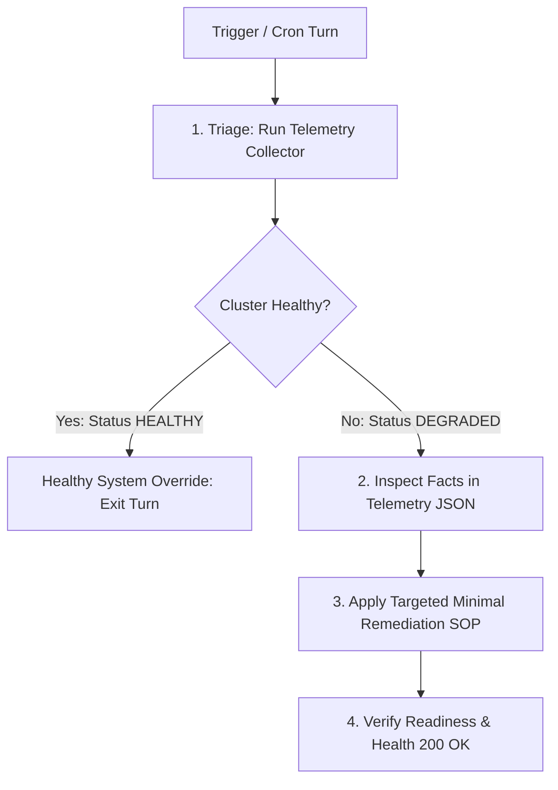

# Task

Diagnose, self-heal, and restore the operational health of the internal Kube-Agents Platform Agent harness in `kubeagents-system`, `agent-system`, and `kube-agents-operator-system`.

# Autonomous SRE Investigation Workflow

When this skill is invoked or triggered via background cron ([jobs.json](../../cron/jobs.json)), follow this 4-step dynamic investigative procedure:



### Step 1: Cluster Health Triage
Execute the telemetry collector to gather structured facts across pods, quotas, events, and probes in a single tool turn:
```bash
python3 scripts/maintain.py diagnose --json
```

### Step 2: Dynamic Root-Cause Analysis
- **Healthy System Override**: If `status == "HEALTHY"` in the telemetry JSON, all pods are `Running`, and gateway probes return `200`, **do NOT apply any mutations**. Terminate the turn immediately.
- If `status == "DEGRADED"`, inspect the returned facts dictionary (`workloads`, `deployments`, `warning_events`, `heartbeat`, and `gateway_probe`).

### Step 3: Adaptive Remediation & Comprehensive SOP Playbooks
Reason dynamically over the telemetry payload and formulate the minimal safe Kubernetes patch. Use the following subsystem playbooks as direct guides, while remaining empowered to remediate novel/unlisted outages:

#### 1. Workload & Pod Lifecycle Layer
- **Safe Rolling Restart**: If a container is frozen or in CrashLoopBackOff due to a transient failure:
  ```bash
  kubectl rollout restart deployment/<deployment-name> -n kubeagents-system
  kubectl rollout status deployment/<deployment-name> -n kubeagents-system --timeout=120s
  ```
- **Replica Outage / Quota Lockout**: Scale replicas or patch namespace ResourceQuotas:
  ```bash
  kubectl scale deployment/<deployment-name> -n kubeagents-system --replicas=1
  ```
- **Local Dev Rebuild**: If running on a local development branch and changes must be compiled/redeployed:
  ```bash
  cd k8s-operator && make dev-rebuild-agent ARGS="platform"
  ```

#### 2. Identity & Auth Layer
- **In-Place Secret Patching (LiteLLM Key Rotation)**:
  *Sourced from `$GEMINI_API_KEY`, Cloud Secret Manager, or input. Merge-patch preserves other provider keys:*
  ```bash
  export NEW_KEY="${GEMINI_API_KEY:-$(gcloud secrets versions access latest --secret=gemini-api-key --project=$(gcloud config get-value project) 2>/dev/null)}"
  
  kubectl patch secret platform-agent-secrets -n kubeagents-system --type=merge \
    -p "{\"stringData\":{\"GEMINI_API_KEY\":\"${NEW_KEY}\"}}"
  
  kubectl rollout restart deployment/litellm -n kubeagents-system
  ```
- **Workload Identity IAM Binding Restoration**:
  ```bash
  export PROJECT_ID=$(gcloud config get-value project)
  export GSA="platform-agent-gsa@${PROJECT_ID}.iam.gserviceaccount.com"
  export MEM="serviceAccount:${PROJECT_ID}.svc.id.goog[kubeagents-system/platform-agent]"

  gcloud iam service-accounts add-iam-policy-binding ${GSA} \
    --project=${PROJECT_ID} \
    --role="roles/iam.workloadIdentityUser" \
    --member="${MEM}"

  kubectl annotate sa platform-agent -n kubeagents-system \
    iam.gke.io/gcp-service-account=${GSA} --overwrite
  
  kubectl rollout restart deployment/platform-agent-gateway -n kubeagents-system
  ```
- **Cloud KMS Token Minter Key Permissions**:
  ```bash
  export PROJECT_ID=$(gcloud config get-value project)
  export MINTER="github-minter-gsa@${PROJECT_ID}.iam.gserviceaccount.com"
  gcloud kms keys add-iam-policy-binding github-minter-key \
    --keyring=kube-agents-keyring --location=global --project=${PROJECT_ID} \
    --role="roles/cloudkms.signerVerifier" --member="serviceAccount:${MINTER}"

  kubectl rollout restart deployment/github-token-minter -n kubeagents-system
  ```

#### 3. Runtime & Memory Layer
- **Heartbeat Forensic Backup & Re-initialization**:
  *Never delete state destructively. Archive corrupted files to `.bak.<timestamp>` before writing valid schema:*
  ```bash
  # Archive corrupted JSON:
  kubectl exec -n kubeagents-system deploy/platform-agent-gateway -c platform-agent -- \
    mv /opt/data/memory/heartbeat-state.json /opt/data/memory/heartbeat-state.json.bak.$(date +%s)

  # Re-initialize clean JSON schema:
  kubectl exec -n kubeagents-system deploy/platform-agent-gateway -c platform-agent -- \
    bash -c 'echo "{\"status\": \"RECOVERED\", \"last_run\": \"'$(date -u +%Y-%m-%dT%H:%M:%SZ)'\"}" > /opt/data/memory/heartbeat-state.json'

  kubectl rollout restart deployment/platform-agent-gateway -n kubeagents-system
  ```
- **Pub/Sub Chat Queue Unblock**:
  *Fast-forwards seek head to current UTC time to clear deadlocked backlog:*
  ```bash
  gcloud pubsub subscriptions seek gchat-events-su \
    --project=$(gcloud config get-value project) --time=$(date -u +%Y-%m-%dT%H:%M:%SZ)
  
  kubectl rollout restart deployment/platform-agent-gateway -n kubeagents-system
  ```

#### 4. Control-Plane & Admission Layer
- **Forced PlatformAgent CR Reconciliation**:
  ```bash
  kubectl annotate platformagent platform -n kubeagents-system \
    kube-agents.gke.io/forced-reconcile=$(date +%s) --overwrite
  ```
- **Atomic Webhook Cleanup & Operator Renewal**:
  ```bash
  kubectl delete validatingwebhookconfigurations,mutatingwebhookconfigurations \
    -l app.kubernetes.io/name=kube-agents-operator --ignore-not-found=true

  kubectl rollout restart deployment/kubeagents-controller-manager -n kubeagents-system
  ```
- **GKE Autopilot cert-manager Leader Election Patch**:
  ```bash
  helm upgrade cert-manager jetstack/cert-manager --namespace cert-manager \
    --set controller.leaderElection.enabled=false \
    --set cainjector.leaderElection.enabled=false
  ```
- **Novel / Unlisted Outages**: Use your full suite of diagnostic and mutation tools (`terminal`, `mcp__gke__*`, `patch`) to apply the appropriate minimal remediation, adhering strictly to the guardrails below.

### Step 4: Verification & Turn Completion Checklist
Verify that the failing component has recovered to `Running` / `HTTP 200 OK` and format your turn output for Google Chat/Slack delivery (`deliver: "all"`):

- **Case A: Healthy System / No Action Needed**:
  - Your final turn response MUST BE exactly `[SILENT]` to suppress chat noise.
- **Case B: Outage Successfully Self-Healed**:
  - Output the structured **✅ Self-Healing Receipt** for Google Chat/Slack:
    ```markdown
    ✅ **Platform Agent Self-Healing — Component Recovered:**
    - **Component:** `<healed-component>` (`<namespace>`)
    - **Diagnosed Root Cause:** `<diagnosed failure layer>`
    - **Remediation Applied:** `<exact minimal patch/restart executed>`
    - **Verification Status:** `Running` (HTTP 200 OK)
    ```
- **Case C: Outage Unresolvable / Circuit Breaker Tripped**:
  - Write active state to `/opt/data/memory/escalation-state.json`.
  - Output the high-visibility **🚨 Urgent SRE Alert** defined in the protocol below.

---

# Execution Rules & Guardrails

### 🛡️ Negative Safety Red Lines (What NEVER to Touch)
- **No Destructive Storage Mutations**: NEVER delete `PersistentVolumeClaims` (PVCs), `PersistentVolumes` (PVs), `StatefulSets`, or persistent volume directories.
- **Autonomous Exclusion Boundaries**: All mutations are strictly restricted to `kubeagents-system`, `agent-system`, `kube-agents-operator-system`, and `cert-manager`. NEVER modify or restart resources in `kube-system`, `gmp-system`, `gke-managed-*`, or tenant application namespaces. NEVER run `kubectl delete namespace`.
- **Forensic State Preservation**: NEVER destructively delete persistent memory files (`/opt/data/memory/*`). Always archive corrupted state before re-initializing.
- **Cloud Infrastructure Protection**: NEVER delete GCP IAM Service Accounts, VPC networks, or KMS keyrings.
- **Multi-Provider Secret Protection**: Always update API keys using merge patches (`--type=merge`) to preserve other credentials.

### 🛑 Loop Prevention & Circuit Breakers (What to Do When Unfixable)
- **Single-Attempt Turn Budget**: Apply at most **1 targeted remediation attempt** per failure per cron turn. If post-remediation verification fails to achieve `Running` / `HTTP 200 OK`, **do NOT retry in a loop or attempt random mutations**. Terminate the turn immediately.
- **Flapping Prevention (3-Strike Limit)**: If a component has failed remediation **3 consecutive times within 1 hour** (tracked via logs or state history), trip the circuit breaker: pause automated mutations for that component.
- **Google Chat / Slack Escalation Protocol**: When a failure is unresolvable autonomously or a circuit breaker trips:
  1. Write the active escalation record to `/opt/data/memory/escalation-state.json`.
  2. Output the high-visibility **🚨 Urgent SRE Alert** for Google Chat/Slack delivery (captured by `deliver: "all"` in `jobs.json`):
     ```markdown
     🚨 **Human Escalation Required — Platform Outage Unresolvable:**
     - **Component:** `<failing-deployment-or-pod>` (`<namespace>`)
     - **Error Signature:** `<exact log error or ImagePullBackOff reason>`
     - **Circuit Breaker Status:** `TRIPPED` (Automated retries paused to prevent flapping)
     - **Action Needed:** *<concrete next step for SRE on-call>*
     ```
