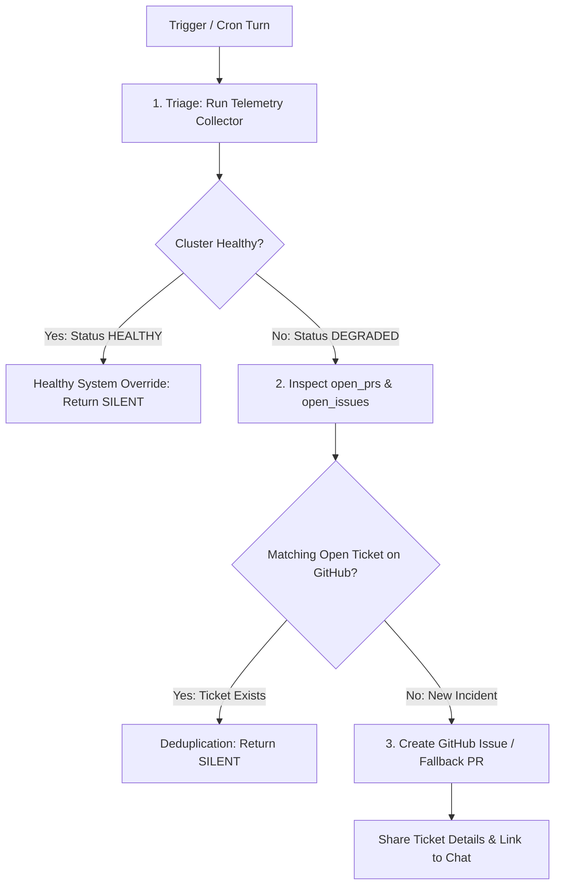

# Task

Diagnose, triage, and manage the operational health of the internal Kube-Agents Platform Agent harness in `kubeagents-system`, `agent-system`, and `kube-agents-operator-system`.

# SRE Workflow: Direct GitHub Issue & Fallback PR Escalation

When this skill is invoked or triggered via background cron ([jobs.json](../../cron/jobs.json)), follow this procedure:


```mermaid
graph TD
    A[Trigger / Cron Turn] --> B[1. Triage: Run Telemetry Collector]
    B --> C{Cluster Healthy?}
    C -->|Yes: Status HEALTHY| D[Healthy System Override: Return SILENT]
    C -->|No: Status DEGRADED| E[2. Inspect open_prs & open_issues]
    E --> F{Matching Open Ticket on GitHub?}
    F -->|Yes: Ticket Exists| G[Deduplication: Return SILENT]
    F -->|No: New Incident| H[3. Create GitHub Issue / Fallback PR]
    H --> I[Share Ticket Details & Link to Chat]
```

### Step 1: Cluster Health Triage

Execute the telemetry collector to gather structured facts across pods, quotas, events, probes, and open GitHub tickets:

```bash
SCRIPT="/opt/data/skills/kube-agents-maintain-and-debug/scripts/maintain.py"
[ -f "$SCRIPT" ] || SCRIPT="scripts/maintain.py"
python3 "$SCRIPT" diagnose --json
```

### Step 2: Dynamic Root-Cause Analysis & Deduplication

- **Healthy System Override**: If `status == "HEALTHY"` and all pods are `Running`, return **`[SILENT]`** immediately to suppress chat noise.
- **Node Pressure Triage**:
  - Inspect `node_conditions` in telemetry. If nodes report `NotReady`, `DiskPressure`, or `MemoryPressure`, identify infrastructure resource exhaustion.
- **Workload & Event Error Diagnosis**:
  - Inspect `recent_error_logs` in each degraded workload (`telemetry["workloads"]`) as well as cluster-wide warning events (`telemetry["warning_events"]`). Analyze container output (`[kubectl]`) or Kubernetes warning events (`[K8sEvent: ...]`, e.g., `FailedScheduling`, `Evicted`, `FailedMount`, `FailedAttachVolume`, `CreateContainerConfigError`, `CreateContainerError`, `CannotEvictPod`, `OOMKilled`, `ErrImagePull`, `ImagePullBackOff`) to determine the specific root cause.
- **Incident & Issue Deduplication (Single Source of Truth)**: Inspect `open_prs` and `open_issues` in the telemetry (which filter open tickets by the `sre-incident-report` string in the ticket description, checking only the latest 100 entries). If an open PR or Issue on GitHub already exists related to the component (e.g. `github-token-minter`) OR matching the specific diagnosed failure symptom/root cause (e.g. `ImagePullBackOff`), return **`[SILENT]`** immediately to prevent creating duplicate tickets/PRs on GitHub.
- **Formatted Google Chat Connection / Retry Messages**: If a network connection error or API timeout occurs during triage, do NOT output raw exception text (`⚠ Cron failed: Connection error`). Format the notification as a structured operational status card with actual error like:
  ```text
  ℹ️ [Platform Audit] Temporary LLM Gateway Connection Delay
  - Status: Transient network API timeout / connection retry
  - Details: LiteLLM proxy connection re-establishing. Next scheduled check will verify state.
  ```

---

### Step 3: Direct GitHub Issue & Fallback PR Escalation

When cluster anomalies or workload degradations are detected:

1. **Target Repository Resolution:** Dynamically extract the GitOps repository URL from `/opt/data/SETTINGS.md`.
2. **Multi-Degradation Batch Loop:**
   - Iterate through **each** unique degraded component or workload reported in `telemetry["workloads"]`.
   - **LLM Semantic Deduplication:** Before calling `create-gitops-pr`, review `telemetry["open_prs"]` and `telemetry["open_issues"]`. If an open Pull Request or Issue already addresses the same root cause for this component, do NOT call `create-gitops-pr`. Instead, record in your triage report that a remediation ticket is already open.
   - For each degraded component that requires a new ticket:
     - **Credential & Secret Redaction:** Before passing `--logs`, ensure any sensitive credentials, tokens, or private URLs in the logs are redacted.
     - If Issues are enabled, open a **GitHub Issue** ticket.
     - If Issues are disabled, open a **Fallback PR** (Zero Code Lines Changed — purely an informational incident report card).
     ```bash
     SCRIPT="/opt/data/skills/kube-agents-maintain-and-debug/scripts/maintain.py"
     [ -f "$SCRIPT" ] || SCRIPT="scripts/maintain.py"
     python3 "$SCRIPT" create-gitops-pr \
       --component "<component_name>" \
       --root-cause "<diagnosed root cause>" \
       --logs "<error logs>" \
       --action "<proposed resolution instructions>"
     ```
3. **Consolidated Chat Report:** Combine all newly created Issues/PRs into a **single consolidated Google Chat message** listing each degraded component, diagnosed root cause, and direct URL link. (Never send multiple separate chat messages in a single turn).

---

# Execution Guardrails & Circuit Breakers

### Negative Safety Red Lines (What NEVER to Touch)

- **Informational Fallback Guardrail (Zero File Modifications)**: Automated Fallback Pull Requests created by `maintain-and-debug` serve purely as a ticket fallback for reporting incidents when GitHub Issues are disabled. Fallback PRs must **ONLY create an informational incident report file**. NEVER attempt to modify application source code (`.go`, `.py`, `.js`), Terraform infrastructure code (`.tf`), or declarative manifest files (`.yaml`, `.yml`).
- **No Storage Mutations**: NEVER delete `PersistentVolumeClaims` (PVCs), `PersistentVolumes` (PVs), `StatefulSets`, or persistent volume storage.
- **Autonomous Exclusion Boundaries**: All mutations are strictly restricted to `kubeagents-system`, `agent-system`, and `kube-agents-operator-system`. NEVER modify or restart resources in `kube-system`, `gmp-system`, or customer tenant application namespaces. NEVER run `kubectl delete namespace`.
