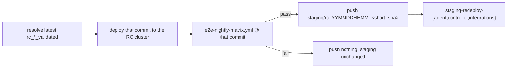
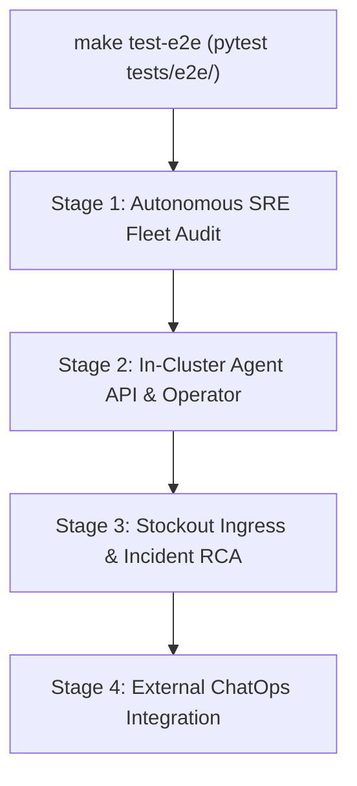

# E2E Testing Harness & Multi-Stage Promotion Gate

> **STATUS — design of record; implemented.** This document defines the architecture, execution model, and scenario matrix of the automated End-to-End (E2E) testing harness across PR CI, Release Candidate (RC) promotion gates, and nightly evaluation pipelines.

---

## 1. Overview and Pipeline Tiers

The `kube-agents` test execution model partitions tests across three distinct automation tiers:

| Tier                            | Trigger                                                                                                                  | Purpose                                                                                               | Execution Target                                                         |
| :------------------------------ | :----------------------------------------------------------------------------------------------------------------------- | :---------------------------------------------------------------------------------------------------- | :----------------------------------------------------------------------- |
| **Tier 1: PR CI**               | Pull Request (`pull_request`)                                                                                            | Fast, offline unit and structural validation on every change                                          | `make test-python`, `make validate`, `make docs-check`                   |
| **Tier 2: RC Promotion Gate**   | Release Candidate build (`rc-release-pipeline.yml`)                                                                      | Validates candidate container images on a freshly provisioned GKE cluster before tagging `_validated` | `make test-e2e` (`scripts/release/execute_e2e_tests.py`)                 |
| **Tier 3: Nightly & On-Demand** | Nightly staging promotion (`staging-promote.yml`) or manual dispatch (`e2e-nightly-matrix.yml`, `e2e-manual-runner.yml`) | Full matrix across multi-cluster environments, audit streams, and GPU/scarcity stockout scenarios     | `make test-e2e` with `FLEET_AUDIT_STREAMS=all`, `STOCKOUT_SCENARIOS=all` |

### Tier 3 as the staging promotion gate

`e2e-nightly-matrix.yml` holds no schedule of its own. The nightly cron lives on
`staging-promote.yml`, which calls it as a reusable workflow and treats the result as the gate on
promoting a validated candidate to the staging environment:



Two properties make the gate mean something. The candidate is **deployed before it is tested**,
because the three-hourly RC pipeline deploys a candidate before it tests one and so leaves a failed
candidate installed until the next run — testing that and promoting the last known-good tag would
validate one artifact and ship another. And the matrix run **asserts the deployed image matches the
commit under test** (`wait_for_gke_readiness.sh` with `COMMIT_SHA`), so an RC deploy that lands
between the two steps fails the run rather than quietly redirecting it.

The promotion tag drops the `_validated` suffix: `rc_2608241820_b35543c_validated` promotes as
`staging/rc_2608241820_b35543c`.

Only the tag push is conditional. When the newest validated candidate already carries its
`staging/**` tag the deploy and the matrix still run, for two reasons. This pipeline owns the only
_scheduled_ run the `nightly-e2e` matrix has, and `operator/agentplugins_e2e_test.py` and
`gchat_agent_test.py` have no other scheduled caller — they sit in the `agent-plugin-e2e` and
`gchat-e2e` environments too, but nothing but a hand-started dispatch reaches those, so skipping the
matrix on nights with nothing new to promote would leave both unexercised on exactly the nights the
RC pipeline validated nothing. And the deploy cannot be skipped separately: the RC cluster is
redeployed every three hours, so on such a night it is almost certainly running a newer candidate,
and the `COMMIT_SHA` assertion would fail rather than test the intended commit.

`staging-promote.yml` itself takes only its own `staging-promotion` group. The singleton
`rc-environment` group is taken by the two jobs it calls — `rc-deploy-environment.yml`'s deploy and
the matrix job — which is what serializes them against the RC pipeline, and which means the lock is
released between the deploy and the test. That gap is why the `COMMIT_SHA` assertion above is
load-bearing rather than belt-and-braces.

The gap has a second consequence, and it is a known cost rather than an oversight. Taking the group
twice with a release in between is one more acquisition than the matrix needed when it ran on its own
schedule, and GitHub cancels the pending entry in a group when a second one arrives. So a promotion
overlapping the `17 */3 * * *` RC schedule can cost either side its slot, and which side loses
depends on whether the reprovision finishes before the RC run arrives.

Neither ordering is clearly the one to prefer, which is why this is documented rather than designed
around. Losing the promotion costs a night: the next run picks the same candidate up. Losing the RC
run costs the candidate permanently — `rc-release-pipeline.yml` pushes the `rc_*` tag in step 1,
before the jobs that take the lock, so `is_commit_already_attempted` sees that tag and every later
scheduled run skips the commit as already evaluated, until a newer one lands on `main`. That is the
forgotten-candidate gap [#740](https://github.com/gke-labs/kube-agents/issues/740) describes, reached
by a second route. Holding `rc-environment` across the whole promotion — an input-driven group on the
two called workflows, so the caller can take it at workflow level without deadlocking against its own
jobs — would close the gap at the cost of making the permanent-loss side more likely, so it waits on
#740 being fixed first.

---

## 2. The 4-Stage E2E Test Pipeline

The end-to-end test suite in `tests/e2e/` runs as a sequential, multi-stage pipeline against a running GKE cluster:



### Stage 1: Autonomous SRE Fleet Audit (`test_agent_fleet_audit.py`)

Validates credential isolation, GitHub authentication, and audit watchdog capabilities:

- **GitHub Token Minter Credential Isolation**: Verifies that raw GitHub App private keys (`github-app-credentials`, `github-app-private-key`) are never mounted or injected into container deployment specs in the agent namespace.
- **In-Pod GitHub Authentication & Connectivity**: Executes read-only token refresh via the credential proxy broker inside the agent pod and verifies repository access (`gh api repos/<target_repo>`).
- **Fleet Audit Stream Dispatch**: Exercises fleet audit stream ledger rendering, schema validation, and GitHub API lifecycle across configured streams (`FLEET_AUDIT_STREAMS=all`).

### Stage 2: In-Cluster Agent API & Operator Reconciliation (`test_agent_api_health.py`, `operator/agentplugins_e2e_test.py`)

Verifies core platform agent responsiveness and Kubernetes operator controller reconciliation:

- **Direct Agent API Health**: Sends a REST probe to `/v1/responses` via port-forwarding to verify agent process readiness and JSON schema response handling.
- **Operator Plugin Reconciliation**: Deploys `AgentPlugin` Custom Resources to verify the Kubebuilder operator controller mounts plugin volumes into `platform-agent` pods and cleanly cleans up on CR deletion.

### Stage 3: Stockout Ingress & Incident Scenarios (`test_stockout_investigation.py`)

Validates the full incident investigation loop from alert ingestion to GitOps PR creation:

- **Pub/Sub Alert Ingress**: Emits synthetic autoscaler stockout alerts to Pub/Sub to confirm agent ingress and deduplication.
- **Live CPU Stockout Investigation (Scenario 04)**: Deploys an unschedulable CPU workload, triggers root-cause investigation, and asserts the agent identifies the missing zone and proposes the correct GitOps remediation PR (Executed in RC promotion gate).
- **The Other Nine Failure Modes (Scenarios 01-03, 05-10)**: Exercises regional scarcity, quota limits, volume incompatibility, and false signals. Reached through the nightly and manual matrices, which set `STOCKOUT_SCENARIOS: "all"` and so run scenario 04 alongside them rather than instead of them.

### Stage 4: External ChatOps Integration (`gchat_agent_test.py`)

Exercises bidirectional communication through Google Chat:

- Posts a structured test message to the configured Google Chat Space via GCP Pub/Sub and verifies the agent returns the expected calculation or status response.
- Automatically skips if Google Chat credentials are unconfigured in the execution environment.

---

## 3. Stockout Scenarios Matrix

The stockout investigator test harness in `agentplugins/gke-stockout-investigator/scenarios/` covers 10 failure modes:

| Scenario                          | Mode / Failure Condition                                 |      Scope in RC Gate       | Scope in Nightly / Manual Matrix |
| :-------------------------------- | :------------------------------------------------------- | :-------------------------: | :------------------------------: |
| `01-gpu-regional-scarcity`        | L4 GPUs exhausted in workload's permitted zone           | Skipped (requires GPU pool) |   ✅ (`STOCKOUT_SCENARIOS=01`)   |
| `02-gpu-quota-exceeded`           | GPUs requested against smaller regional quota            | Skipped (requires GPU pool) |   ✅ (`STOCKOUT_SCENARIOS=02`)   |
| `03-large-vm-shape-scarcity`      | Pinned to c3-standard-176 shape                          |  Skipped (heavy resource)   |   ✅ (`STOCKOUT_SCENARIOS=03`)   |
| `04-missing-zone-fallback`        | Pod unschedulable due to single-zone compute constraints |    ✅ **Executed in RC**    |                ✅                |
| `05-missing-ondemand-floor`       | ComputeClass priority is Spot with no on-demand floor    |           Skipped           |   ✅ (`STOCKOUT_SCENARIOS=05`)   |
| `06-stateful-disk-generation-mix` | Volume type attaches on some generations, not others     |           Skipped           |   ✅ (`STOCKOUT_SCENARIOS=06`)   |
| `07-hyperdisk-incompatibility`    | Hyperdisk on class offering only pre-Hyperdisk families  |           Skipped           |   ✅ (`STOCKOUT_SCENARIOS=07`)   |
| `08-ccc-priority-starvation`      | Over-granular priority list causing autoscaler loop      |           Skipped           |   ✅ (`STOCKOUT_SCENARIOS=08`)   |
| `09-duplicate-signal`             | Same alert three times: dedup & duplicate-PR suppression |           Skipped           |   ✅ (`STOCKOUT_SCENARIOS=09`)   |
| `10-false-signal`                 | Alert for healthy workload; agent stands down            |           Skipped           |   ✅ (`STOCKOUT_SCENARIOS=10`)   |

---

## 4. Test Execution & Environment Contract

The test runner `scripts/release/execute_e2e_tests.py` reads configuration from `tests/e2e/e2e_config.yaml` and environment variables:

| Variable              | Description                               | Default              |
| :-------------------- | :---------------------------------------- | :------------------- |
| `GCP_PROJECT_ID`      | Target Google Cloud Project ID            | None (required)      |
| `GKE_CLUSTER_NAME`    | Target GKE cluster name                   | None (required)      |
| `GCP_REGION`          | Target cluster region                     | `us-east4`           |
| `STOCKOUT_SCENARIOS`  | Comma-separated scenario numbers or `all` | `04`                 |
| `FLEET_AUDIT_STREAMS` | Specific audit stream names or `all`      | `all`                |
| `E2E_ENV`             | Target environment selector               | `investigations-e2e` |

### Test Environments

The test harness provides modular and composite environments configured in `tests/e2e/e2e_config.yaml`:

| Environment          | Description                                                                                            | Included Test Suites                                                                                                                                  |
| :------------------- | :----------------------------------------------------------------------------------------------------- | :---------------------------------------------------------------------------------------------------------------------------------------------------- |
| `rc-e2e`             | Release Candidate promotion gate: Agent API health, audit ledger, and fast stockout RCA (Scenario 04)  | `test_agent_api_health.py`, `test_agent_fleet_audit.py`, `test_stockout_investigation.py`                                                             |
| `nightly-e2e`        | Full Nightly Matrix: all audit streams, all stockout scenarios, operator plugins, and chat integration | `test_agent_api_health.py`, `test_agent_fleet_audit.py`, `test_stockout_investigation.py`, `operator/agentplugins_e2e_test.py`, `gchat_agent_test.py` |
| `investigations-e2e` | In-cluster Agent API health and stockout alert investigation scenarios                                 | `test_agent_api_health.py`, `test_stockout_investigation.py`                                                                                          |
| `audit-e2e`          | Fleet SRE audit ledger generation, credential isolation, and stream evaluation                         | `test_agent_api_health.py`, `test_agent_fleet_audit.py`                                                                                               |
| `agent-plugin-e2e`   | Operator AgentPlugin CR lifecycle and Hermes overlay reconciliation                                    | `operator/agentplugins_e2e_test.py`                                                                                                                   |
| `gchat-e2e`          | Live Google Chat integration and Pub/Sub messaging                                                     | `gchat_agent_test.py`                                                                                                                                 |

### Running Locally

```bash
# Set cluster context and run default investigation E2E suite
export GCP_PROJECT_ID="my-gcp-project"
export GKE_CLUSTER_NAME="my-cluster"
make test-e2e
```
