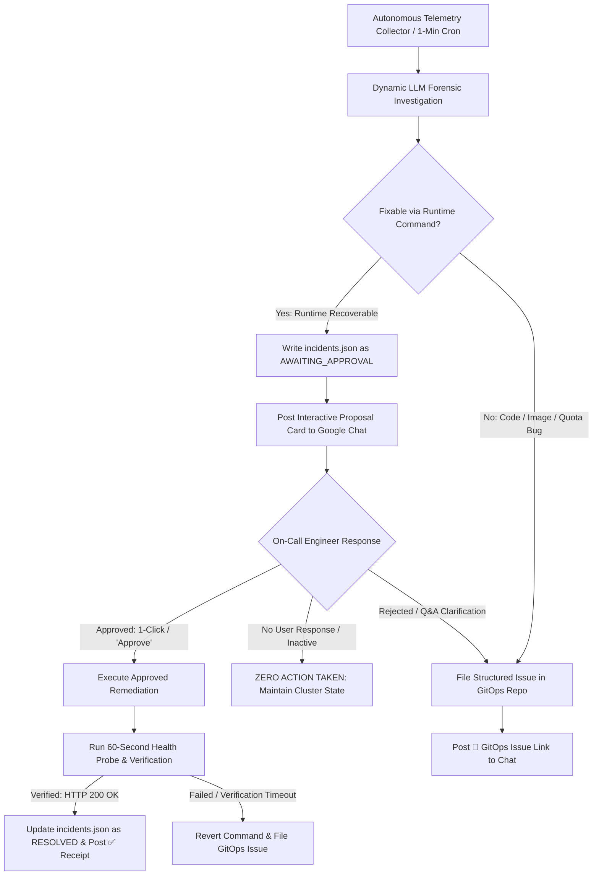

# Design: Autonomous SRE Maintenance, Interactive Approvals, and GitOps Escalation

**Status:** Ready for Review  
**Priority:** P0 — Core Platform SRE Framework, Noise Suppression, and Interactive Self-Healing  
**Target Systems:** Google Chat / Slack Approval Gateway, GitOps Repository Sync (`SETTINGS.md`), and Persistent Incident Memory (`incidents.json`)  

---

## TL;DR

The `kube-agents` platform currently lacks an autonomous SRE maintenance and self-healing subsystem to patrol cluster health, detect anomalies, and remediate runtime failures. When cluster outages occur (such as broken deployment rollouts, LiteLLM auth key drift, Workload Identity permission loss, or deadlocked container pods), platform agents freeze or fail until a human engineer manually discovers the outage and executes ad-hoc `kubectl` or `gcloud` commands.

This design introduces **`kube-agents-maintain-and-debug`** from scratch as a foundational SRE skill built on a **"Zero-Surprise Autonomous SRE"** framework:
1. **Dynamic Investigation (Zero Rigid Rules):** The AI Agent investigates cluster anomalies autonomously using standard Kubernetes diagnostic tools (`kubectl logs`, `kubectl describe`, synthetic HTTP probes, and warning events) without hardcoded or brittle debugging decision trees in code.
2. **Interactive Human Approval (Zero Auto-Mutations):** The agent **never auto-applies cluster mutations**. It investigates the failure, synthesizes the forensic evidence, and posts an **Interactive Action Proposal Card** to Google Chat / Slack. If the user does not respond or take action, **the agent takes zero action and makes zero cluster changes**.
3. **Clean Two-Way Routing:**
   - **Runtime Recoverable Outages** ➔ Routed to **Google Chat / Slack** for 1-click human approval.
   - **Declarative Code / Image / Infra Bugs** ➔ Routed to the **GitOps Repository** (dynamically resolved from `/opt/data/SETTINGS.md`) as structured GitHub Issues.
4. **Persistent Incident Memory (Option 3 Selected):** All detected, proposed, approved, and delivery-failed incidents are permanently logged to local disk at `/opt/data/memory/incidents.json`.

---

## 1. Problem Statement & Motivation

### Current Operational Gaps
- **Manual SRE Overhead:** Currently, any platform failure (such as a bad deployment argument, a rotated Secret, or a stale admission webhook) requires human engineers to manually run diagnostic CLI commands and restore cluster health.
- **Risk of Blind Autonomous Mutations:** An AI agent that executes unreviewed terminal commands risks compounding outages or making unverified changes in production clusters.
- **Alert Noise & Flapping:** Without structured incident state locking, recurring background health checks can repeatedly spam on-call chat channels for the same persistent outage.
- **Lack of GitOps Separation:** Platform failures cannot all be solved via the terminal; code bugs, missing Docker images, or quota limits require declarative repository issues and pull requests.

### Goals & Non-Negotiable SRE Principles
- **Zero Unapproved Mutations:** Require on-call confirmation via Google Chat / Slack before any cluster mutation is applied. If the human is inactive, **no mutation is performed**.
- **Dynamic Diagnostics:** Rely on LLM reasoning over raw container logs and Kubernetes events rather than hardcoded regex scripts.
- **Noise Suppression:** Prevent duplicate chat alerts during ongoing incidents by locking active incident states in `/opt/data/memory/incidents.json`.
- **GitOps Synchronization:** Automatically open structured GitHub Issues in the target repository parsed from `/opt/data/SETTINGS.md` when issues require source code, Docker image, or manifest changes.

### Non-Goals
- Auto-applying mutations when the user does not respond.
- Modifying resources in `kube-system`, Google-managed control planes (`gke-managed-*`), or customer tenant application namespaces.
- Deleting `PersistentVolumeClaims` (PVCs), `PersistentVolumes` (PVs), or persistent storage directories.

---

## 2. End-to-End System Architecture



---

## 3. Issue Classification & Routing Boundary Matrix

The agent routes issues strictly based on **where the remediation must occur**:

| Failure Category | Technical Signature | Destination | Action Taken by Agent |
| :--- | :--- | :--- | :--- |
| **Breaking Rollout** | Pod `CrashLoopBackOff` (bad argument/flag) | **Google Chat** | Proposes `kubectl rollout undo` for 1-click approval |
| **Container Hang** | Health probe timeout / socket deadlock | **Google Chat** | Proposes `kubectl rollout restart` for 1-click approval |
| **Secret Key Drift** | Probe `401 Unauthorized` / `invalid_api_key` | **Google Chat** | Proposes Secret merge-patch for 1-click approval |
| **IAM Annotation Loss** | Probe `403 PermissionDenied` | **Google Chat** | Proposes `kubectl annotate sa` for 1-click approval |
| **Stale Webhook Block** | K8s Warning `WebhookTimeout` / `x509` | **Google Chat** | Proposes Webhook deletion for 1-click approval |
| **Corrupted Memory File** | `heartbeat-state.json` syntax error | **Google Chat** | Proposes archiving bad JSON to `.bak` & valid reinit |
| **Missing Docker Image** | K8s Event `ImagePullBackOff` | **GitOps Repo** | Files structured GitHub Issue in `SETTINGS.md` repo |
| **Code Panic / Bug** | Container stderr stack trace / Python panic | **GitOps Repo** | Files structured GitHub Issue with log snippet |
| **Quota Ceiling** | K8s Event `FailedCreate: exceeded quota` | **GitOps Repo** | Files structured GitHub Issue to scale quota in Terraform |
| **NetworkPolicy Block** | Egress connection timeout to external APIs | **GitOps Repo** | Files structured GitHub Issue with proposed YAML |

---

## 4. End-User Chat Message Formats & Multi-Issue Consolidation

### 4.1 Format for a Single Issue (The 1-Click Action Card)
When 1 actionable anomaly is detected in the cluster:

```markdown
⚠️ **[P0 SRE PROPOSAL] Actionable Cluster Incident Detected**
━━━━━━━━━━━━━━━━━━━━━━━━━━━━━━━━━━━━━━━━━━━━━━━━━
📌 **Component:** `deployment/github-token-minter` (`kubeagents-system`)
🔍 **Diagnosed Root Cause:** Container startup crash (CrashLoopBackOff)
📋 **Forensic Log Proof:** `stderr: minty: error: unrecognized option '--invalid-flag'`
🛠️ **Proposed Fix:** `kubectl rollout undo deployment/github-token-minter -n kubeagents-system`
🛡️ **Safety Guardrail:** 60s Verification + Auto-Revert on failure

👉 **Reply `Approve` to execute.**
👉 **Reply `Reject` to escalate to GitOps.**
━━━━━━━━━━━━━━━━━━━━━━━━━━━━━━━━━━━━━━━━━━━━━━━━━
```

---

### 4.2 Format When Multiple Issues Are Found (Consolidated Batch Card)
**Anti-Noise Rule:** The agent **never sends multiple separate messages** during cascading or compound failures. All issues are merged into a single consolidated digest:

```markdown
⚠️ **[SRE BATCH PROPOSAL] 3 Incidents Detected Across Cluster**
━━━━━━━━━━━━━━━━━━━━━━━━━━━━━━━━━━━━━━━━━━━━━━━━━
🟢 **Interactive Runtime Approvals (Fixable via Terminal):**

1. **`deployment/github-token-minter` (`kubeagents-system`)**
   • **Cause:** CrashLoopBackOff (Bad startup argument in revision #5)
   • **Fix:** `kubectl rollout undo deployment/github-token-minter -n kubeagents-system`

2. **`Secret/platform-agent-secrets` (`kubeagents-system`)**
   • **Cause:** LiteLLM Auth 401 (`invalid_api_key`)
   • **Fix:** Merge-patch valid key from GCP Secret Manager & rollout proxy

─────────────────────────────────────────────────
🔴 **Declarative GitOps Escalations (Cannot be fixed via terminal):**

3. **`pod/custom-collector` (`agent-system`)**
   • **Cause:** `ImagePullBackOff` (Docker image tag `v99` does not exist)
   • **Action:** 🐙 Auto-created GitHub Issue [#142](https://github.com/owner/repo/issues/142) in GitOps repo
━━━━━━━━━━━━━━━━━━━━━━━━━━━━━━━━━━━━━━━━━━━━━━━━━
👉 **Reply `Approve All` to execute all runtime fixes (#1 and #2).**
👉 **Reply `Approve 1` to execute only item #1.**
━━━━━━━━━━━━━━━━━━━━━━━━━━━━━━━━━━━━━━━━━━━━━━━━━
```

---

## 5. Notification Failure & Human Inactivity Strategy

### 5.1 When the User Does Not Respond
If the proposal notification is delivered to Google Chat, but the user does not respond or take action:
- **Absolute Inaction Rule:** **The agent takes ZERO action and makes ZERO cluster mutations.**
- **Incident State:** The incident remains locked in `/opt/data/memory/incidents.json` with status `"AWAITING_APPROVAL"`.
- **Chat Suppression:** Subsequent 1-minute cron ticks return `[SILENT]` to avoid spamming the chat channel.

---

### 5.2 Architectural Decision: Notification Delivery Failure Fallback

If Google Chat webhook delivery fails or encounters an HTTP network error:

#### ✅ Selected: Option 3 — Persistent Local Incident State (`incidents.json`)
* **Mechanism:** The agent records the failure state and full diagnostic report to local persistent disk at `/opt/data/memory/incidents.json` with status `"NOTIFICATION_DELIVERY_FAILED"`.
* **Why Selected (Pros):**
  1. **100% Reliable:** Zero external network dependencies (local filesystem write).
  2. **Audit Ready:** Instantly available whenever an engineer connects to the cluster or runs `diagnose`.
  3. **Zero Noise:** Completely non-invasive; creates no external alert storms.

---

#### ❌ Rejected: Option 1 — Emitting Kubernetes Cluster Warning Events (`kubectl create event`)
* **Cons & Reasons for Rejection:**
  1. **Ephemeral Retention:** Kubernetes API server garbage-collects events after **1 hour** (`--event-ttl=1h0m0s`), so alerts vanish if not seen immediately.
  2. **Cluster Event Bus Flooding:** Creating ad-hoc warning events pollutes `kubectl get events` and triggers false-positive alarms in external cluster monitoring tools (e.g. Datadog, Prometheus Kube-State-Metrics).
  3. **RBAC Privilege Expansion:** Requires adding create/write permissions on cluster-wide `events` objects to the agent ServiceAccount.

---

#### ❌ Rejected: Option 2 — Out-of-Band GitHub Issue Creation for Chat Delivery Failures
* **Cons & Reasons for Rejection:**
  1. **Issue Tracker Spam:** A transient network glitch to Google Chat would flood the GitHub repository with redundant issues for runtime problems that don't need GitOps PRs.
  2. **API Rate Limiting:** Creates a hard dependency on the GitHub REST API (`gh issue create`), which can hit rate limits (HTTP 403 / 429) during major outages.
  3. **Violates Separation of Concerns:** Opening GitHub issues for non-GitOps runtime problems generates unwanted repository notifications for maintainers.

---

## 6. Dynamic Flapping Triage & Chronic Outage Circuit Breaker

Rather than enforcing rigid integer thresholds (which can misjudge long-running pods that accumulated restarts over months of node upgrades), the agent **dynamically evaluates recent crash frequency**:

* **Actionable / First-Time Outage:** If the container failure is a recent, actionable regression (e.g., a newly applied bad rollout or secret drift), the agent generates the **Interactive Proposal Card** for Google Chat.
* **Chronic / Flapping Crash Loop:** If the LLM observes that the container is stuck in a chronic crash loop where runtime rollbacks or restarts have failed to stabilize the pod, it trips the circuit breaker:
  1. It pauses interactive chat cards to prevent human alert fatigue.
  2. It marks the incident state as `"FLAPPING_CIRCUIT_BREAKER_TRIPPED"` in `incidents.json`.
  3. It escalates the chronic failure directly to the **GitOps Repository** as an infrastructure/code bug.

---

## 7. Technical Implementation Specifications

### 7.1 Telemetry Collector Engine (`maintain.py`)
`maintain.py` is introduced as a pure, unopinionated read-only telemetry scraper executed via standard subprocess calls:
* **Invocation:** `python3 scripts/maintain.py diagnose --json`
* **Telemetry Streams:**
  1. **Workloads:** Queries `kubectl get pods -n <ns> -o json` for `phase`, container `waiting.reason` (`CrashLoopBackOff`), native `restartCount`, and extracts recent log stderr traces.
  2. **Deployments:** Queries `kubectl get deployments -n <ns> -o json` for replica counts and `ReplicaFailure` conditions.
  3. **Cluster Warning Events:** Queries `kubectl get events --field-selector type=Warning -o json`.
  4. **Probes:** Synthetic `curl` probes against LiteLLM port `80` and port `4000` (`/health`).
  5. **Heartbeat State:** Validates `/opt/data/memory/heartbeat-state.json`.

---

### 7.2 Persistent Incident State Machine (`/opt/data/memory/incidents.json`)
The active cluster state is stored on persistent disk at `/opt/data/memory/incidents.json`.

#### State Transitions:
```text
[DETECTED] ──> [AWAITING_APPROVAL] ──┬──> [APPROVED] ──> [VERIFYING] ──> [RESOLVED]
                                     │
                                     ├──> [USER_INACTIVE] ──> [NO_ACTION_TAKEN]
                                     └──> [NOTIFICATION_DELIVERY_FAILED] (Logged to Disk)
```

#### JSON Schema:
```json
{
  "incidents": [
    {
      "incident_id": "INC-20260722-113000",
      "timestamp": "2026-07-22T11:30:00Z",
      "severity": "P0",
      "component": "github-token-minter",
      "namespace": "kubeagents-system",
      "symptom": "CrashLoopBackOff",
      "restart_count": 1,
      "root_cause": "Unrecognized startup flag in revision #5",
      "proposed_action": "kubectl rollout undo deployment/github-token-minter -n kubeagents-system",
      "approval_state": "AWAITING_APPROVAL",
      "approved_by": "user@google.com",
      "remediation_status": "PENDING",
      "delivery_status": "SUCCESS",
      "gitops_issue_url": null
    }
  ]
}
```

---

## 8. Security Constraints & Negative Safety Red Lines

The agent is bound by strict, non-negotiable security guardrails:
* **No Storage Mutations:** Strictly forbidden from deleting `PersistentVolumeClaims` (PVCs), `PersistentVolumes` (PVs), or persistent volume files.
* **No Control-Plane / Namespace Deletion:** Strictly forbidden from running `kubectl delete namespace` or modifying resources in `kube-system` or `gke-managed-*`.
* **Scoped Namespace Boundary:** All mutations are restricted to `kubeagents-system`, `agent-system`, and `kube-agents-operator-system`.
