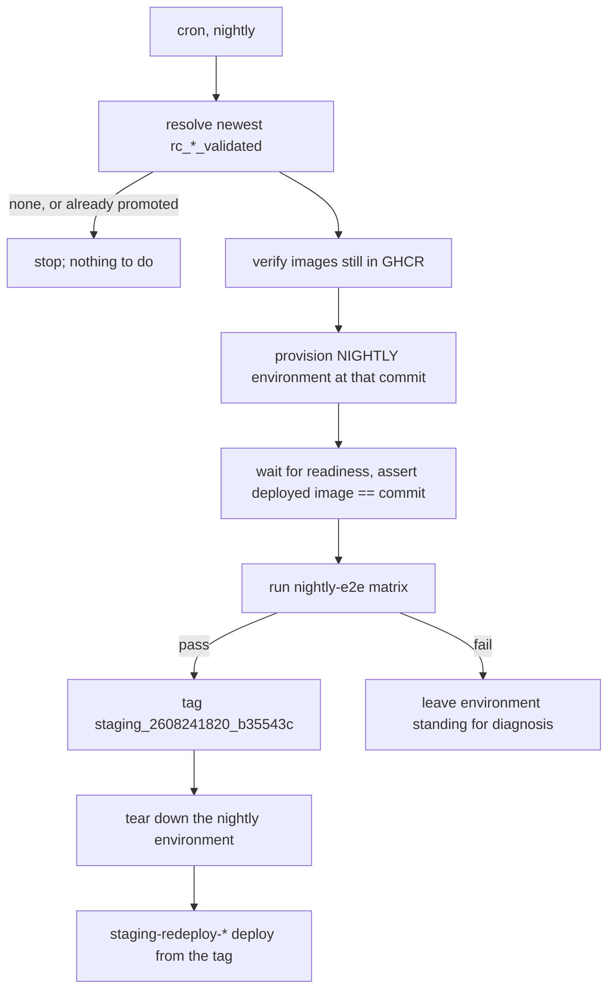

# Nightly environment and staging promotion

> **STATUS — plan, not implemented.** This document describes what exists today, the state we want,
> and the order to build it in. It is written to be handed to someone with no prior context on the
> work; everything it asserts about the current tree was verified against `main` at `65a6d1dd`
> (2026-08-26) and is cited so it can be re-checked rather than trusted.

## 1. What we are trying to achieve

Two outcomes, in this order:

1. **The nightly E2E matrix runs on its own environment**, built from nothing and destroyed after,
   so it never collides with the three-hourly release-candidate pipeline over a shared cluster.
2. **Staging is promoted automatically**: when the nightly run passes, the validated candidate it
   tested is tagged for staging, and the existing `staging-redeploy-*.yml` workflows deploy it. A
   failed nightly promotes nothing and leaves staging where it is.

A third, running through both: **one vocabulary**. The word "environment" currently means three
unrelated things (§2.5), and the workflow, script, and tag names have drifted apart.

[`testing-strategy.md`](testing-strategy.md) §4.4 is the governing decision and already calls for
"its own project and concurrency group, so it never queues behind the release pipeline". This
document is the implementation design for that sentence, not a competing proposal. Where the two
disagree, the strategy wins and this file should be corrected.

The rung above this one — promoting a staging-gated commit to a GA release on a weekly cadence — is
[`weekly-release-promotion.md`](weekly-release-promotion.md). It depends on the staging tag this
document produces, and it owns everything about the release stage.

## 2. Current state

### 2.1 The release-candidate pipeline

`rc-release-pipeline.yml`, `cron: "17 */3 * * *"`, five jobs, each a `uses:` call to its own
reusable workflow:

| Step | Workflow                                       | What it does                                                                                                                                                                          |
| ---- | ---------------------------------------------- | ------------------------------------------------------------------------------------------------------------------------------------------------------------------------------------- |
| 1    | `rc-create-tag.yml`                            | Finds the newest commit on `main` with all four images in GHCR; tags it `rc_YYMMDDHHMM_<short_sha>`. Skips the run when the commit already carries an `rc_*` or `*_validated` tag.    |
| 2    | `rc-deploy-environment.yml`                    | `provision_rc_environment.sh`: `uninstall.sh`, then `install.sh` at the candidate commit.                                                                                             |
| 3    | _(inline in the pipeline, no file of its own)_ | `wait_for_gke_readiness.sh`, then `make test-e2e` with `E2E_ENV=rc-e2e`.                                                                                                              |
| 4    | `rc-tag-validated.yml`                         | Tags the commit `<rc_tag>_validated`.                                                                                                                                                 |
| 5    | `rc-teardown-environment.yml`                  | `teardown_rc_environment.sh`: destroys the environment. Gated by the implicit `success()` on its `needs`, so **a failed run deliberately leaves its cluster standing** for diagnosis. |

Consequences worth holding on to:

- **The RC environment is ephemeral.** After a passing run there is no cluster. Anything that
  assumes it can test "whatever is on the RC cluster" is wrong most of the time, and when a cluster
  _is_ there it is there because a run failed on it.
- **An evicted or failed candidate is never retried.** Step 1 tags before step 2 takes the cluster
  lock, so `is_commit_already_attempted` sees the `rc_*` tag on the next scheduled run and skips the
  commit permanently. 23 of 68 `rc_*` tags have no `_validated` sibling. Filed as
  [#740](https://github.com/gke-labs/kube-agents/issues/740) §1.
- **Observed timings** (last 40 scheduled runs): starts drift 7–19 min after `:17`; a skipped run
  finishes in 11–25 s; a real run takes 6–15 min, with one 58 min outlier.

### 2.2 The nightly matrix

`e2e-nightly-matrix.yml`, `cron: "0 2 * * *"`, one job, `E2E_ENV=nightly-e2e`,
`STOCKOUT_SCENARIOS=all`, `FLEET_AUDIT_STREAMS=all`.

**It has never succeeded, and cannot.** The job declares no `environment:`, so `vars.*` resolve
against the repository scope, which holds **zero** variables — every `GCP_*` value lives on the `rc`
environment. `google-github-actions/auth` therefore fails with
`must specify exactly one of "workload_identity_provider" or "credentials_json"`. Its only scheduled
run, `32923009352` (2026-08-26 02:31Z), died there in 15 seconds with every later step skipped.

`e2e-manual-runner.yml` has the identical defect and **zero runs** in its history.

Two further problems even once auth is fixed:

- It **deploys nothing** and asserts nothing about what is deployed, so it would test whatever
  happened to be on the cluster — which, per §2.1, is usually nothing.
- It takes `concurrency: rc-environment` at workflow level, i.e. it contends with the RC pipeline
  for the same cluster. That is the collision this work removes.

### 2.3 Staging

Deployed by three workflows — `staging-redeploy-agent.yml`, `-controller.yml`, `-integrations.yml` —
all triggered by `push:` on `tags: staging/**`, all using `github.sha` as both the image tag and the
checkout ref.

- **One `staging/**` tag has ever been pushed**: `staging/2026-07-23`. Staging has been on that
  commit since.
- That deploy **failed**, on a 180 s `kubectl rollout status` timeout while the pod was still
  `ContainerCreating`. The timeout is now 900 s (`reusable-deploy-agent.yml`), but nothing has
  re-tested it, so the first automated promotion is also the first test of that fix.
- Verified: an **annotated** tag still yields the commit SHA in `github.sha`, not the tag-object SHA.
  `staging/2026-07-23` is annotated (object `e3a2e7aa`, commit `7ca4915d`) and its run
  `30024250378` recorded `headSha: 7ca4915d`. Annotated tags are safe here.
- **A tag pushed with the default `GITHUB_TOKEN` triggers no workflow.** Any automated push must use
  a PAT (`RELEASE_BOT_TOKEN`) or the promotion will go green and deploy nothing.

### 2.4 Where configuration lives

Repository-level Actions variables: **none** (`total_count: 0`). Everything is environment-scoped.

| GitHub environment | GCP project            | Region        | Cluster               | Notes                                                            |
| ------------------ | ---------------------- | ------------- | --------------------- | ---------------------------------------------------------------- |
| `rc`               | `kube-agents-rc`       | `us-east4`    | `platform-agent-host` | 20 vars. Branch policy: `main` only. Holds `RC_TEARDOWN_STRICT`. |
| `staging`          | `kube-agents-gkedemos` | `us-central1` | `platform-agent-host` | Deploy target only; nothing tests here.                          |
| `autopush`         | —                      | —             | —                     | Tracks `main` via `workflow_run` on "Publish to GHCR".           |

The cluster is named `platform-agent-host` in **both** projects. `RELEASE_BOT_TOKEN` is a
**repository** secret; the `rc` environment holds `GEMINI_API_KEY` and the four `E2E_CHAT_*` secrets.

### 2.5 "Environment" means three different things

This is the main source of confusion and the naming work should start here.

| Sense                                                                                 | Where                                                                 | Example values                           |
| ------------------------------------------------------------------------------------- | --------------------------------------------------------------------- | ---------------------------------------- |
| A GitHub Actions environment — a scope for `vars` and `secrets`, plus a branch policy | `environment:` in a workflow job                                      | `rc`, `staging`, `autopush`              |
| A GCP project + region + GKE cluster — the actual infrastructure                      | `GCP_PROJECT_ID`, `GKE_CLUSTER_NAME`                                  | `kube-agents-rc` / `platform-agent-host` |
| A **selection of test suites** — no infrastructure at all                             | `environments:` in `tests/e2e/e2e_config.yaml`, exported as `E2E_ENV` | `rc-e2e`, `nightly-e2e`, `audit-e2e`     |

The third is not an environment in either of the other senses. `e2e_config.yaml`'s
`environments:` blocks are lists of test files plus env vars; they carry a `region` and `namespace`
key that no longer selects anything.

### 2.6 Naming inventory as it stands

Workflows mix three conventions:

- `rc-*.yml` named `RC Step N - Thing` — but there is **no step 3 file**; step 3 is inline.
- `e2e-*.yml` named variously `E2E Nightly Full Matrix`, `Manual E2E Runner`, `Google Chat Agent E2E Test`.
- `staging-redeploy-*.yml` / `autopush-redeploy-*.yml` named `Staging Redeploy Agent` etc.

Scripts in `scripts/release/` are `<verb>_rc_<noun>.sh` where they touch the RC environment
(`provision_rc_environment.sh`, `teardown_rc_environment.sh`, `rc_teardown_common.sh`,
`resolve_rc_tag.sh`) and `<verb>_<noun>.sh` otherwise.

Tag namespaces: `rc_<ts>_<sha>`, `rc_<ts>_<sha>_validated`, `staging/<name>`, and bare `X.Y.Z` for
GA. Two separator styles and two nesting styles.

### 2.7 The critical thing the scripts already get right

**`provision_rc_environment.sh` and `teardown_rc_environment.sh` contain nothing RC-specific.** They
read `GCP_PROJECT_ID`, `GCP_REGION`, `GKE_CLUSTER_NAME` and `IMAGE_TAG` from the environment and pass
them to `install.sh` / `uninstall.sh`. The same is true of `wait_for_gke_readiness.sh`,
`verify_candidate_images.sh` and `validate_and_log_deploy_summary.sh`.

Only the **names**, the **prose**, and the workflows' hardcoded `environment: rc` tie them to RC.
Making them generic is therefore a rename plus a workflow input — not a rewrite. Budget accordingly:
the risk in this work is in the GCP project and IAM setup, not the bash.

## 3. Goal state

### 3.1 The nightly pipeline

A single scheduled pipeline that owns its infrastructure end to end:



Properties it must have:

- **A new GCP project of its own, and its own concurrency group.** No `rc-environment` lock anywhere
  in it. The project is created for this; it does not share `kube-agents-rc`.
- **Teardown on success, standing environment on failure** — the same contract as RC step 5, for the
  same reason, and it must be as loud when teardown itself fails.
- **Deterministic input**: the newest `rc_*_validated` tag, resolved once and passed to every job by
  commit SHA.
- **It runs every night**, whether or not the candidate is new. The matrix is the only scheduled
  coverage `operator/agentplugins_e2e_test.py` and `gchat_agent_test.py` have, and skipping it on
  quiet nights would silence both on exactly the nights the RC pipeline validated nothing.
- **Idempotent**: the tag push is the only step gated on promotion eligibility, so a night whose
  candidate is already promoted still deploys and tests, and simply pushes nothing.
- **It promotes on the first green run.** There is no soak period: a passing matrix tags immediately.

### 3.2 What "generic" means concretely

Three changes, none of them to the bodies of the scripts:

1. **Rename** the RC-specific scripts to environment-neutral names, keeping the logic:
   `provision_rc_environment.sh` → `provision_environment.sh`, `teardown_rc_environment.sh` →
   `teardown_environment.sh`, `rc_teardown_common.sh` → `teardown_common.sh`. The
   `RC_TEARDOWN_STRICT` variable and `rc_teardown_*` function names go with them.
2. **Parameterise the workflows** on the GitHub environment: give `rc-deploy-environment.yml` and
   `rc-teardown-environment.yml` a `target_environment` input (default `rc`) and set
   `environment: ${{ inputs.target_environment }}`. This is the same pattern
   `reusable-deploy-agent.yml` already uses.
3. **Create a `nightly` GitHub environment** holding its own `GCP_PROJECT_ID`, `GKE_CLUSTER_NAME`,
   `GCP_WORKLOAD_IDENTITY_PROVIDER` and `GCP_SERVICE_ACCOUNT`, plus copies of the model and chat
   values the install needs. Mirror `rc`'s 20 variables rather than trimming them: a missing one
   surfaces as an install failure deep in Terraform, not as a clear error.

### 3.3 Naming scheme

Split the work by cost. Cheap and safe:

- **Retire `E2E_ENV` as a word.** Rename `e2e_config.yaml`'s `environments:` to `suites:` and the
  variable to `E2E_SUITE`, with the values losing their `-e2e` suffix (`rc`, `nightly`, `audit`,
  `gchat`, `investigations`, `agent-plugin`). Reserve "environment" for infrastructure. Keep
  `E2E_ENV` working as a deprecated alias for one release so nothing breaks mid-flight.
- **One workflow naming convention.** `<pipeline>-<action>.yml`, display name `<Pipeline>: <Action>`.
  Drop the `Step N` numbering, which is already wrong (no step 3) and breaks whenever a step is
  inserted. Put the ordering in the pipeline file, where it is real.
- **Give step 3 a file** (`e2e-run.yml` or similar) so every step of the RC pipeline is a reusable
  workflow and the nightly pipeline can call the same one.
- **Move the staging tag into the `rc_*` family**, below.

Expensive, and **recommended against for now**:

- **Do not change the `rc_*` tag shape.** `calculate_next_version.sh`, `verify_release_eligibility.sh`
  and `get_latest_validated_rc_tag` all parse it, 113 tags already exist, and the sort order
  (`--sort=-v:refname`) depends on the timestamp position. The inconsistency is cosmetic; the
  breakage would not be. Document the convention instead.

#### The staging tag

Derive it from the candidate, so a promotion is traceable back to what passed and re-running the
pipeline on the same candidate is a no-op rather than a second tag. Swap the prefix, drop the
suffix:

```
rc_2608241820_b35543c_validated   →   staging_2608241820_b35543c
```

Flat and underscore-separated, matching `rc_*` rather than the current nested `staging/**`. Three
reasons beyond consistency:

- It **sorts**. `git tag -l --sort=-v:refname 'staging_*'` orders by timestamp because the timestamp
  comes first after the prefix — the same property the `rc_*` lookups depend on. A nested
  `staging/rc_...` sorts on the literal `rc` instead.
- The transform is mechanical **in both directions**, so a staging tag can be read back to its
  candidate without a lookup.
- One separator style across `rc_*`, `staging_*` and bare `X.Y.Z`.

**Do not carry the `_validated` suffix into it.** `is_commit_already_validated` in `common.sh` globs
`"*_validated"` **unanchored**, so `staging_..._validated` would match and be read as an RC
validation marker. That gates `resolve_rc_tag.sh`'s skip decision: a staging tag pushed by hand at a
commit the RC pipeline never validated would make the next scheduled run skip that commit as already
validated. The other two consumers are anchored to `^rc_` and unaffected
(`verify_release_eligibility.sh:145`, `get_latest_validated_rc_tag`). The suffix also labels the
wrong event — it records that the RC gate passed, not that the promotion did.

Renaming the namespace costs four edits and no migration. The one tag that exists,
`staging/2026-07-23`, is historical and never re-triggers; it simply stops matching.

| Where                                                  | Change                                                                              |
| ------------------------------------------------------ | ----------------------------------------------------------------------------------- |
| `staging-redeploy-{agent,controller,integrations}.yml` | `tags: - "staging/**"` → `- "staging_*"`                                            |
| `common.sh`                                            | `STAGING_TAG_PREFIX`, and `staging_tag_for_rc` strips `rc_` as well as `_validated` |
| `tag_staging_promotion.sh`                             | the namespace guard that currently rejects anything outside `staging/`              |
| `tests/testing/release.py`                             | the promotion fixtures                                                              |

One consequence to accept deliberately: `staging_*` is a looser trigger than `staging/**`, so any tag
beginning `staging_` deploys staging. Nothing else in the repository uses that prefix and the trigger
is still explicit, but it is marginally easier to fire by accident than a namespaced one.

### 3.4 Making a failure visible

A scheduled pipeline nobody is told about is one that stops and is not noticed. Two mechanisms, both
cheap, and neither needs infrastructure this repository does not have:

- **Status badges in `README.md`**, which is what renders on the repository's landing page:
  ``. The badge
  tracks the default branch's most recent run, so a failed night shows red on the front page until a
  later one passes. There are no badges there today; add one for this pipeline and one for the
  release pipeline together.
- **Failures fail, skips do not.** Keep that distinction sharp or the badge stops meaning anything.
  A night with no new candidate is a **green** run that pushed no tag. An infrastructure failure, a
  red matrix, or a teardown that leaves a cluster running is a **red** run.

## 4. Plan

Each phase is independently shippable and leaves the tree working.

**Phase 1 — fix what is broken, change no behaviour.** Add `environment: rc` to
`e2e-nightly-matrix.yml` and `e2e-manual-runner.yml`. Both are one line, both are currently incapable
of authenticating, and Phase 3 depends on the matrix working at all. Ship this on its own; it is the
only phase with no design risk.

**Phase 2 — provision the nightly infrastructure.** Create the GCP project, the Workload Identity
Federation pool and provider, and the deploy service account, mirroring `kube-agents-rc`. Create the
`nightly` GitHub environment and populate its variables. No repository code changes. This is the
long-pole item and the one that needs someone with GCP admin rights — start it first even though it
lands second.

**Phase 3 — make the environment workflows generic.** The renames and the `target_environment` input
from §3.2. `rc-release-pipeline.yml` keeps passing `rc` and its behaviour must not change; prove that
with the existing tests in `tests/test_provision_rc_environment.py` and
`tests/test_teardown_rc_environment.py`, renamed alongside.

**Phase 4 — build the nightly pipeline, promotion included.** A new workflow calling the now-generic
deploy, the extracted E2E runner, and the generic teardown, all with `target_environment: nightly`,
plus the tag-push job gated on the matrix passing and the candidate not already being promoted.
Checkout with `RELEASE_BOT_TOKEN`, or the tag will push and deploy nothing. There is no soak period:
the first green run promotes.

**Phase 5 — make it visible.** The two `README.md` badges from §3.4, and a pass over the pipeline
confirming that every genuine failure is red and every "nothing to do" is green.

**Phase 6 — the naming sweep.** The `E2E_SUITE` rename and the workflow-name convention, once
nothing is in flight. Doing this earlier means rebasing every other phase through it.

### 4.1 What this falsifies in `testing-strategy.md`

That document currently records Nightly as **deferred** in four places, and building it makes all
four untrue. They are not optional follow-ups: the strategy is the design of record, and a reader who
believes it will conclude this pipeline does not exist. Update all four in Phase 4, which is the
phase that makes them false.

| Location                | What it says now                                                                             |
| ----------------------- | -------------------------------------------------------------------------------------------- |
| STATUS banner, line 3   | "Nightly is **deferred** (§4.4)"                                                             |
| §4 tier diagram         | The `Nightly` node reads "deferred / own clusters"                                           |
| §4.4 heading and banner | "Nightly: deferred" / "**Deferred, not cancelled.** Nothing here is being built this cycle." |
| §4.5 tier table         | The `Nightly` row is `_Deferred_` in all three columns                                       |

The §4.5 row is the one that needs a decision rather than an edit. Its columns are Authority,
Correctness and Drift, and every cell must say **blocks**, **records**, or nothing looks at it. The
nightly matrix runs merged code on a schedule, which per §4.5 is the precondition for feeding Drift —
so there is a real answer to work out with whoever owns the strategy, not a box to tick.

## 5. Traps

Each of these has already cost time once.

- **`vars.*` silently resolve to empty** when a job declares no `environment:`, and the workflow then
  fails somewhere unrelated-looking. This is §2.2's bug. Any new job that reads `vars.GCP_*` needs an
  `environment:`.
- **A tag pushed with `GITHUB_TOKEN` triggers nothing.** Use `RELEASE_BOT_TOKEN`.
- **GitHub keeps only one run pending per concurrency group** and cancels the waiting one when a
  third arrives. Taking a group twice in one pipeline, with a gap, is what lets an outsider in
  between. Prefer one acquisition per run.
- **`uses:` jobs cannot declare an `environment:`**, so any secret mapped explicitly in a caller job
  is evaluated outside that environment and arrives empty. Use `secrets: inherit` and let the called
  job's `environment:` resolve them.
- **The RC pipeline's step 5 does not run on failure, by design.** Copying it means copying that, and
  it means a failed nightly leaves a cluster billing until someone looks.
- **Scheduled workflows only run from the default branch**, and `workflow_dispatch` only appears once
  the file is on the default branch. Neither can be tested from a PR branch. Plan for the first real
  run to be after merge.

## 6. New components

Four things do not exist yet. Everything else in the plan is a rename, an input, or a GCP resource.

**`scripts/release/resolve_promotion_candidate.sh`** — picks the candidate and decides whether to
tag. Reads the newest `rc_*_validated` tag, resolves its commit, and refuses a commit carrying no
`*_validated` tag even when a tag is passed in by hand, so the gate cannot be talked into promoting
something the RC pipeline never validated. Emits `commit_sha`, `rc_tag`, `staging_tag` and
`skip_promotion`, the last set when a `staging_*` tag already points at that commit. Every skip is
exit 0; the only exit 1 is a tag that does not resolve.

**`scripts/release/tag_staging_promotion.sh`** — creates and pushes the tag, idempotently, refusing
any name outside the `staging_` prefix so the deploy trigger cannot be fired by a typo. Reuses
`ensure_git_tag`, which already no-ops when the tag exists on the same commit and fails when it
exists on a different one.

**Two helpers in `common.sh`** — `staging_tag_for_rc` (the §3.3 transform) and
`get_existing_staging_tag` (`git tag --points-at <sha> 'staging_*'`).

**The pipeline workflow itself** — §3.1, four jobs, calling the now-generic deploy, the extracted E2E
runner, and the generic teardown with `target_environment: nightly`.

All four want unit tests in the style of `tests/test_release_common.py`: bash driven from Python
against a throwaway git repository, one case per branch. The branches worth covering are candidate
selection with several validated tags present, the validated-only refusal, the already-promoted skip,
a `staging_` tag on a _different_ commit not blocking the current one, the namespace guard, and
re-tagging the same commit versus a different one.
