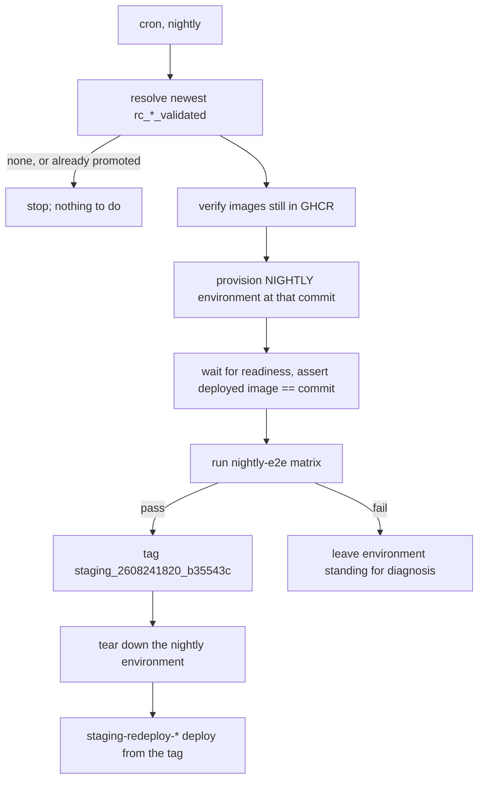

# Nightly environment and staging promotion

> **STATUS — plan, not implemented.** This document describes what exists today, the state we want,
> and the order to build it in. It is written to be handed to someone with no prior context on the
> work; everything it asserts about the current tree was verified against `main` at `65a6d1dd`
> (2026-08-26) and is cited so it can be re-checked rather than trusted.

## 1. What we are trying to achieve

Two outcomes, in this order:

1. **The nightly E2E matrix runs on its own environment**, built from nothing and destroyed after,
   so it never collides with the three-hourly release-candidate pipeline over a shared cluster.
2. **Staging is promoted automatically**: when the nightly run passes, the validated candidate it
   tested is tagged for staging, and the existing `staging-redeploy-*.yml` workflows deploy it. A
   failed nightly promotes nothing and leaves staging where it is.

A third, running through both: **one vocabulary**. The word "environment" currently means three
unrelated things (§2.5), and the workflow, script, and tag names have drifted apart.

[`testing-strategy.md`](testing-strategy.md) §4.4 is the governing decision and already calls for
"its own project and concurrency group, so it never queues behind the release pipeline". This
document is the implementation design for that sentence, not a competing proposal. Where the two
disagree, the strategy wins and this file should be corrected.

The rung above this one — promoting a validated commit to a GA release on a weekly cadence — is
[`weekly-release-promotion.md`](weekly-release-promotion.md), which owns everything about the
release stage.

**That rung does not block on this one.** Automating the release is two separable changes — _when_ a
release happens (a cron rather than someone clicking a button) and _what gates it_ (`rc_*_validated`
today, the staging tag eventually) — and only the second needs anything here. The release cron ships
first, against the gate that already exists, so releases keep going out on their own whatever
happens to the work below. Retargeting it to the staging tag is a later step in that document, taken
once this pipeline is producing staging tags reliably.

## 2. Current state

### 2.1 The release-candidate pipeline

`rc-release-pipeline.yml`, `cron: "17 */3 * * *"`, five jobs, each a `uses:` call to its own
reusable workflow:

| Step | Workflow                                       | What it does                                                                                                                                                                          |
| ---- | ---------------------------------------------- | ------------------------------------------------------------------------------------------------------------------------------------------------------------------------------------- |
| 1    | `rc-create-tag.yml`                            | Finds the newest commit on `main` with all four images in GHCR; tags it `rc_YYMMDDHHMM_<short_sha>`. Skips the run when the commit already carries an `rc_*` or `*_validated` tag.    |
| 2    | `rc-deploy-environment.yml`                    | `provision_rc_environment.sh`: `uninstall.sh`, then `install.sh` at the candidate commit.                                                                                             |
| 3    | _(inline in the pipeline, no file of its own)_ | `wait_for_gke_readiness.sh`, then `make test-e2e` with `E2E_ENV=rc-e2e`.                                                                                                              |
| 4    | `rc-tag-validated.yml`                         | Tags the commit `<rc_tag>_validated`.                                                                                                                                                 |
| 5    | `rc-teardown-environment.yml`                  | `teardown_rc_environment.sh`: destroys the environment. Gated by the implicit `success()` on its `needs`, so **a failed run deliberately leaves its cluster standing** for diagnosis. |

Consequences worth holding on to:

- **The RC environment is ephemeral.** After a passing run there is no cluster. Anything that
  assumes it can test "whatever is on the RC cluster" is wrong most of the time, and when a cluster
  _is_ there it is there because a run failed on it.
- **An evicted or failed candidate is never retried.** Step 1 tags before step 2 takes the cluster
  lock, so `is_commit_already_attempted` sees the `rc_*` tag on the next scheduled run and skips the
  commit permanently. 23 of 68 `rc_*` tags have no `_validated` sibling. Filed as
  [#740](https://github.com/gke-labs/kube-agents/issues/740) §1.
- **Observed timings** (last 40 scheduled runs): starts drift 7–19 min after `:17`; a skipped run
  finishes in 11–25 s; a real run takes 6–15 min, with one 58 min outlier.

### 2.2 The nightly matrix

`e2e-nightly-matrix.yml`, `cron: "0 2 * * *"`, one job, `E2E_ENV=nightly-e2e`,
`STOCKOUT_SCENARIOS=all`, `FLEET_AUDIT_STREAMS=all`.

**It has never succeeded, and cannot.** The job declares no `environment:`, so `vars.*` resolve
against the repository scope, which holds **zero** variables — every `GCP_*` value lives on the `rc`
environment. `google-github-actions/auth` therefore fails with
`must specify exactly one of "workload_identity_provider" or "credentials_json"`. Its only scheduled
run, `32923009352` (2026-08-26 02:31Z), died there in 15 seconds with every later step skipped.

`e2e-manual-runner.yml` has the identical defect and **zero runs** in its history.

Two further problems even once auth is fixed:

- It **deploys nothing** and asserts nothing about what is deployed, so it would test whatever
  happened to be on the cluster — which, per §2.1, is usually nothing.
- It takes `concurrency: rc-environment` at workflow level, i.e. it contends with the RC pipeline
  for the same cluster. That is the collision this work removes.

### 2.3 Staging

Deployed by three workflows — `staging-redeploy-agent.yml`, `-controller.yml`, `-integrations.yml` —
all triggered by `push:` on `tags: staging/**`, all using `github.sha` as both the image tag and the
checkout ref.

- **One `staging/**` tag has ever been pushed**: `staging/2026-07-23`. Staging has been on that
  commit since.
- That deploy **failed**, on a 180 s `kubectl rollout status` timeout while the pod was still
  `ContainerCreating`. The timeout is now 900 s (`reusable-deploy-agent.yml`), but nothing has
  re-tested it, so the first automated promotion is also the first test of that fix.
- Verified: an **annotated** tag still yields the commit SHA in `github.sha`, not the tag-object SHA.
  `staging/2026-07-23` is annotated (object `e3a2e7aa`, commit `7ca4915d`) and its run
  `30024250378` recorded `headSha: 7ca4915d`. Annotated tags are safe here.
- **A tag pushed with the default `GITHUB_TOKEN` triggers no workflow.** Any automated push must use
  a PAT (`RELEASE_BOT_TOKEN`) or the promotion will go green and deploy nothing. Whether a native
  token can replace the PAT is under investigation and has an owner; until that lands, the PAT is
  the requirement rather than a preference.

### 2.4 Where configuration lives

Repository-level Actions variables: **none** (`total_count: 0`). Everything is environment-scoped.

| GitHub environment | GCP project            | Region        | Cluster               | Notes                                                            |
| ------------------ | ---------------------- | ------------- | --------------------- | ---------------------------------------------------------------- |
| `rc`               | `kube-agents-rc`       | `us-east4`    | `platform-agent-host` | 20 vars. Branch policy: `main` only. Holds `RC_TEARDOWN_STRICT`. |
| `staging`          | `kube-agents-gkedemos` | `us-central1` | `platform-agent-host` | Deploy target only; nothing tests here.                          |
| `autopush`         | —                      | —             | —                     | Tracks `main` via `workflow_run` on "Publish to GHCR".           |

The cluster is named `platform-agent-host` in **both** projects. `RELEASE_BOT_TOKEN` is a
**repository** secret; the `rc` environment holds `GEMINI_API_KEY` and the four `E2E_CHAT_*` secrets.

### 2.5 "Environment" means three different things

This is the main source of confusion and the naming work should start here.

| Sense                                                                                 | Where                                                                 | Example values                           |
| ------------------------------------------------------------------------------------- | --------------------------------------------------------------------- | ---------------------------------------- |
| A GitHub Actions environment — a scope for `vars` and `secrets`, plus a branch policy | `environment:` in a workflow job                                      | `rc`, `staging`, `autopush`              |
| A GCP project + region + GKE cluster — the actual infrastructure                      | `GCP_PROJECT_ID`, `GKE_CLUSTER_NAME`                                  | `kube-agents-rc` / `platform-agent-host` |
| A **selection of test suites** — no infrastructure at all                             | `environments:` in `tests/e2e/e2e_config.yaml`, exported as `E2E_ENV` | `rc-e2e`, `nightly-e2e`, `audit-e2e`     |

The third is not an environment in either of the other senses. `e2e_config.yaml`'s
`environments:` blocks are lists of test files plus env vars; they carry a `region` and `namespace`
key that no longer selects anything.

### 2.6 Naming inventory as it stands

Workflows mix three conventions:

- `rc-*.yml` named `RC Step N - Thing` — but there is **no step 3 file**; step 3 is inline.
- `e2e-*.yml` named variously `E2E Nightly Full Matrix`, `Manual E2E Runner`, `Google Chat Agent E2E Test`.
- `staging-redeploy-*.yml` / `autopush-redeploy-*.yml` named `Staging Redeploy Agent` etc.

Scripts in `scripts/release/` are `<verb>_rc_<noun>.sh` where they touch the RC environment
(`provision_rc_environment.sh`, `teardown_rc_environment.sh`, `rc_teardown_common.sh`,
`resolve_rc_tag.sh`) and `<verb>_<noun>.sh` otherwise.

Tag namespaces: `rc_<ts>_<sha>`, `rc_<ts>_<sha>_validated`, `staging/<name>`, and bare `X.Y.Z` for
GA. Two separator styles and two nesting styles.

### 2.7 The critical thing the scripts already get right

**`provision_rc_environment.sh` and `teardown_rc_environment.sh` contain nothing RC-specific.** They
read `GCP_PROJECT_ID`, `GCP_REGION`, `GKE_CLUSTER_NAME` and `IMAGE_TAG` from the environment and pass
them to `install.sh` / `uninstall.sh`. The same is true of `wait_for_gke_readiness.sh`,
`verify_candidate_images.sh` and `validate_and_log_deploy_summary.sh`.

Only the **names**, the **prose**, and the workflows' hardcoded `environment: rc` tie them to RC.
Making them generic is therefore a rename plus a workflow input — not a rewrite. Budget accordingly:
the risk in this work is in the GCP project and IAM setup, not the bash.

## 3. Goal state

### 3.1 The nightly pipeline

A single scheduled pipeline that owns its infrastructure end to end:



Properties it must have:

- **A new GCP project of its own, and its own concurrency group** (`nightly-environment`). No
  `rc-environment` lock anywhere in it — §3.2 item 4 lists the five files that hold that group
  today. The project is created for this; it does not share `kube-agents-rc`.
- **Teardown on success, standing environment on failure** — the same contract as RC step 5, for the
  same reason, and it must be as loud when teardown itself fails. Copying the contract means copying
  its cost: teardown is gated by the implicit `success()` on its `needs`, so a failed nightly leaves
  a GKE cluster running and billing until someone looks at it. Unlike RC, nothing else reclaims it
  for 24 hours rather than 3.
- **Deterministic input**: the newest `rc_*_validated` tag, resolved once and passed to every job by
  commit SHA. This is RC's existing pattern, not a new one — `rc-deploy-environment.yml` and
  `rc-teardown-environment.yml` each take a single `rc_tag` input documented as "Release Candidate
  Tag or Commit SHA", `resolve_rc_tag.sh` normalises it to a commit SHA in the first step, and every
  step after that uses the SHA for the checkout ref and `IMAGE_TAG` alike. Nightly takes the same
  input in the same shape.
- **It runs every night**, whether or not the candidate is new. The matrix is the only scheduled
  coverage `operator/agentplugins_e2e_test.py` and `gchat_agent_test.py` have, and skipping it on
  quiet nights would silence both on exactly the nights the RC pipeline validated nothing.
- **Idempotent**: the tag push is the only step gated on promotion eligibility, so a night whose
  candidate is already promoted still deploys and tests, and simply pushes nothing.
- **It promotes on the first green run.** There is no soak period: a passing matrix tags immediately.

#### What this reuses, and what is actually new

Almost none of it is new code, and reading the plan as though it were is the main way to
over-estimate the work. Reused **unchanged apart from their names**:
`provision_rc_environment.sh`, `teardown_rc_environment.sh`, `rc_teardown_common.sh`,
`wait_for_gke_readiness.sh`, `verify_candidate_images.sh` and `validate_and_log_deploy_summary.sh`,
plus the deploy and teardown workflows themselves.

Concretely, because "fully reusable" is a claim worth spelling out rather than asserting:
`teardown_rc_environment.sh` sources `rc_teardown_common.sh` and runs the canonical `uninstall.sh`
against `GCP_PROJECT_ID`, `GCP_REGION` and `GKE_CLUSTER_NAME` read from the environment;
`provision_rc_environment.sh` runs `uninstall.sh` then `install.sh` the same way. Nothing in either
body names RC except the `RC_TEARDOWN_STRICT` variable and the `rc_teardown_*` function prefix. So
the nightly pipeline calls the same two reusable workflows with `github_environment: nightly`, the
`nightly` environment supplies different `GCP_*` values, and both scripts execute byte-identical to
the way they execute for RC.

Genuinely new, and the whole of §6: the promotion resolver, the staging tagger, two `common.sh`
helpers, and the pipeline file that wires the existing pieces together.

### 3.2 What "generic" means concretely

**No script body changes.** That is the constraint the rest of this section works within: every item
below is a rename, a workflow input, or a GitHub setting, and any proposal that requires editing the
logic inside `provision_rc_environment.sh` or `teardown_rc_environment.sh` has gone wrong somewhere.

1. **Rename** the RC-specific scripts to environment-neutral names, keeping the logic:
   `provision_rc_environment.sh` → `provision_environment.sh`, `teardown_rc_environment.sh` →
   `teardown_environment.sh`, `rc_teardown_common.sh` → `teardown_common.sh`. The
   `RC_TEARDOWN_STRICT` variable and `rc_teardown_*` function names go with them — see §5 for why
   the variable's rename is not purely mechanical.
2. **Parameterise the workflows** on the GitHub environment: give `rc-deploy-environment.yml` and
   `rc-teardown-environment.yml` a `github_environment` input and set
   `environment: ${{ inputs.github_environment }}`. This is the same pattern
   `reusable-deploy-agent.yml` already uses.

   The input is **`required: true` with no default**. A `default: rc` would mean a nightly caller
   that omits the input silently deploys to the RC environment — the one failure mode worth making
   impossible, and the reason to spend an explicit argument at each of the two call sites.

   It is named `github_environment` rather than `target_environment` because `test_environment`
   already exists as an input on `e2e-nightly-matrix.yml` and `e2e-manual-runner.yml`, where it
   names the E2E _suite_ (`rc-e2e`, `nightly-e2e`, …). Two of §2.5's three meanings, one letter
   apart, is how that confusion propagates. This input is the GitHub Actions environment and
   nothing else: it renders directly into a job's `environment:` key, and its values are `rc` and
   `nightly`.

3. **Create a `nightly` GitHub environment** holding its own `GCP_PROJECT_ID`, `GKE_CLUSTER_NAME`,
   `GCP_WORKLOAD_IDENTITY_PROVIDER` and `GCP_SERVICE_ACCOUNT`, plus copies of the model and chat
   values the install needs. Mirror `rc`'s 20 variables rather than trimming them: a missing one
   surfaces as an install failure deep in Terraform, not as a clear error.
4. **Take the `rc-environment` concurrency group off the workflows that should not hold it.** §3.1
   states the new pipeline holds no such lock, which says nothing about the files that hold one
   today. Five do:

   | File                               | Line | Change                                          |
   | ---------------------------------- | ---- | ----------------------------------------------- |
   | `rc-deploy-environment.yml`        | 33   | unchanged — this is the RC environment          |
   | `rc-release-pipeline.yml` (step 3) | 68   | unchanged — same                                |
   | `rc-teardown-environment.yml`      | 32   | unchanged — same                                |
   | `e2e-nightly-matrix.yml`           | 35   | → `nightly-environment`                         |
   | `e2e-manual-runner.yml`            | 42   | follow the environment it is dispatched against |

   The last two are the collision: both contend with the RC pipeline for a cluster neither of them
   deploys to. Dropping the matrix's hardcoded environment without also dropping its concurrency
   group would leave the contention exactly where it is, which is why this pairs with Phase 1
   rather than trailing it.

### 3.3 Naming scheme

Split the work by cost. Cheap and safe:

- **Retire `E2E_ENV` as a word.** Rename `e2e_config.yaml`'s `environments:` to `suites:` and the
  variable to `E2E_SUITE`, with the values losing their `-e2e` suffix (`rc`, `nightly`, `audit`,
  `gchat`, `investigations`, `agent-plugin`). Reserve "environment" for infrastructure. Keep
  `E2E_ENV` working as a deprecated alias for one release so nothing breaks mid-flight.
- **One workflow naming convention.** `<pipeline>-<action>.yml`, display name `<Pipeline>: <Action>`.
  Drop the `Step N` numbering, which is already wrong (no step 3) and breaks whenever a step is
  inserted. Put the ordering in the pipeline file, where it is real.
- **Give step 3 a file** (`e2e-run.yml` or similar) so every step of the RC pipeline is a reusable
  workflow and the nightly pipeline can call the same one.
- **Move the staging tag into the `rc_*` family**, below.

Expensive, and **recommended against for now**:

- **Do not change the `rc_*` tag shape.** `calculate_next_version.sh`, `verify_release_eligibility.sh`
  and `get_latest_validated_rc_tag` all parse it, 113 tags already exist, and the sort order
  (`--sort=-v:refname`) depends on the timestamp position. The inconsistency is cosmetic; the
  breakage would not be. Document the convention instead.

#### The staging tag

Derive it from the candidate, so a promotion is traceable back to what passed and re-running the
pipeline on the same candidate is a no-op rather than a second tag. Swap the prefix, drop the
suffix:

```
rc_2608241820_b35543c_validated   →   staging_2608241820_b35543c
```

Flat and underscore-separated, matching `rc_*` rather than the current nested `staging/**`. Three
reasons beyond consistency:

- It **sorts**. `git tag -l --sort=-v:refname 'staging_*'` orders by timestamp because the timestamp
  comes first after the prefix — the same property the `rc_*` lookups depend on. A nested
  `staging/rc_...` sorts on the literal `rc` instead.
- The transform is mechanical **in both directions**, so a staging tag can be read back to its
  candidate without a lookup.
- One separator style across `rc_*`, `staging_*` and bare `X.Y.Z`.

**Do not carry the `_validated` suffix into it**, because it labels the wrong event: the suffix
records that the RC gate passed, not that the promotion did, and a reader who sees it on a
`staging_*` tag learns something untrue about where the tag came from.

That is a naming argument, and it is deliberately the only one left. It used to rest on a bug —
`is_commit_already_validated` in `common.sh:152-156` globs `"*_validated"` **unanchored**, so a
`staging_..._validated` tag would match and be read as an RC validation marker, and that function
gates `resolve_rc_tag.sh`'s skip decision. Rather than route the tag shape around that, **fix the
glob**:

- rename `is_commit_already_validated` → `is_rc_candidate_commit_already_validated`, so the name
  says which tag family it speaks for;
- tighten the pattern from `"*_validated"` to `"rc_*_validated"`;
- update the call in `resolve_rc_tag.sh`.

Behaviour-preserving for every `rc_*_validated` tag that exists, and it removes the hazard for any
future tag family rather than for this one alone. The other two consumers are already anchored to
`^rc_` and unaffected (`verify_release_eligibility.sh:145`, `get_latest_validated_rc_tag`). Small
enough to ship in Phase 1.

Renaming the namespace costs four edits and no migration. The one tag that exists,
`staging/2026-07-23`, is historical and never re-triggers; it simply stops matching.

| Where                                                  | Change                                                                              |
| ------------------------------------------------------ | ----------------------------------------------------------------------------------- |
| `staging-redeploy-{agent,controller,integrations}.yml` | `tags: - "staging/**"` → `- "staging_*"`                                            |
| `common.sh`                                            | `STAGING_TAG_PREFIX`, and `staging_tag_for_rc` strips `rc_` as well as `_validated` |
| `tag_staging_promotion.sh`                             | the namespace guard that currently rejects anything outside `staging/`              |
| `tests/testing/release.py`                             | the promotion fixtures                                                              |

One consequence to accept deliberately: `staging_*` is a looser trigger than `staging/**`, so any tag
beginning `staging_` deploys staging. Nothing else in the repository uses that prefix and the trigger
is still explicit, but it is marginally easier to fire by accident than a namespaced one.

### 3.4 Making a failure visible

A scheduled pipeline nobody is told about is one that stops and is not noticed. The obvious answer
is a status badge in `README.md`, and that is **out of scope here** — it is worth doing, it is worth
doing for the RC and release pipelines at the same time, and it belongs in a change of its own.

What belongs here is the thing that has to be true first, because a badge over the current run
semantics would be worse than no badge:

**A skipped run and a passing run are indistinguishable, and the skip wins.** A badge renders the
most recent run's conclusion. When the RC pipeline finds no new candidate, step 1 sets
`skip_rc=true`, every later job is skipped by the `needs.step-1-create-tag.outputs.skip_rc != 'true'`
guard, and skipped jobs do not fail a run — so the run concludes **success**. Three quiet hours after
a genuine failure therefore paint the badge green while the last real run is still red. Nothing
alerts, and the signal reads exactly backwards.

This is not hypothetical for the pipelines in play:

| Pipeline           | Exposed?                                                                                      |
| ------------------ | --------------------------------------------------------------------------------------------- |
| Nightly (this doc) | **No**, by construction — §3.1 runs it every night whether or not the candidate is new        |
| RC (three-hourly)  | **Yes** — skips are the common case, at 23 of 68 candidates                                   |
| Release cron       | **Yes** — skip-green is the design (see the release document), so most weeks conclude success |

So the work is to make "nothing to do" distinguishable from "passed" at the run level rather than
letting both collapse into the same green: a run that did nothing should not be able to overwrite
the last run that did something and failed. Nightly needs nothing, having no skip path; RC and the
release cron both do. Getting this right is what makes the deferred badges mean something when
somebody adds them.

The distinction the pipelines must keep sharp either way: a night with no new candidate pushes no
tag and is not a failure, while an infrastructure failure, a red matrix, or a teardown that leaves a
cluster running is a **red** run.

## 4. Plan

Each phase is independently shippable and leaves the tree working.

**Phase 1 — fix what is broken, change no behaviour.** Two unrelated small things, both
behaviour-preserving:

- **`e2e-manual-runner.yml` gets an environment.** It is dispatch-only, it has never once been able
  to authenticate, and it legitimately wants to target an environment that already exists — so give
  it a `github_environment` **input** rather than a hardcoded `rc`, and let whoever dispatches it
  choose. Its concurrency group follows that input (§3.2 item 4).
- **The `is_commit_already_validated` fix** from §3.3 — rename, anchor the glob to `rc_*_validated`,
  update `resolve_rc_tag.sh`.

**`e2e-nightly-matrix.yml` is deliberately left broken here.** Wiring it to `environment: rc` would
make it authenticate, and would also point a nightly cron at the RC cluster while it still holds
`concurrency: rc-environment` — making the collision this work exists to remove worse for however
long Phases 2 and 3 take, to buy a few weeks of a signal nobody is waiting on. It goes straight to
`nightly` in Phase 4. Until then, proof that the matrix runs at all comes from dispatching the
manual runner, not from a schedule.

**Phase 2 — provision the nightly infrastructure.** Create the GCP project, then run
`k8s-operator/scripts/dev/setup-gcp-github-wif.sh --admin` against it: that is the repository's own
tool for this and it creates the Workload Identity pool, the provider (with the
`assertion.repository` attribute condition), the deploy service account and the full autonomous-E2E
role set. Do not hand-roll the equivalent `gcloud` calls.

What the script does not do, and so is the rest of this phase: creating the project itself, and
creating the `nightly` GitHub environment with its variables (§3.2 item 3). No repository code
changes. This is the long-pole item and the one that needs someone with GCP admin rights — start it
first even though it lands second.

**Phase 3 — make the environment workflows generic.** The renames and the `github_environment` input
from §3.2. `rc-release-pipeline.yml` keeps passing `rc` and its behaviour must not change; prove that
with the existing tests in `tests/test_provision_rc_environment.py` and
`tests/test_teardown_rc_environment.py`, renamed alongside.

Renaming `RC_TEARDOWN_STRICT` is a **two-part step that must land together**: the code change, and
the variable rename in the `rc` environment's settings plus its creation on `nightly`. Doing only
the first silently turns strict teardown off (§5). Nothing in CI catches that, because the failure
mode is a default rather than an error.

**Phase 4 — build the nightly pipeline, promotion included.** A new workflow calling the now-generic
deploy, the extracted E2E runner, and the generic teardown, all with `github_environment: nightly`,
plus the tag-push job gated on the matrix passing and the candidate not already being promoted.
Checkout with `RELEASE_BOT_TOKEN`, or the tag will push and deploy nothing. There is no soak period:
the first green run promotes.

**Land it `workflow_dispatch`-only, with no `schedule:`.** Neither a cron nor a `workflow_dispatch`
button exists until the file is on the default branch (§5), so the first real run is necessarily
after merge — and a dispatch-only workflow cannot affect anything that runs today no matter how
wrong it is. Exercise it by hand against the nightly project until it is boring, then add the cron
as a one-line follow-up. Turning the schedule on is the decision, and it deserves to be its own
reviewable change rather than a line buried in the one that introduces 200 of them.

**Phase 5 — fix the skip semantics.** §3.4: make "nothing to do" distinguishable from "passed" for
the RC pipeline and the release cron, so a skipped run cannot paint over a failed one. Nightly needs
no change, having no skip path. Badges are explicitly not part of this and not part of this
document.

**Phase 6 — the naming sweep.** The `E2E_SUITE` rename and the workflow-name convention, once
nothing is in flight. Doing this earlier means rebasing every other phase through it.

### 4.1 What this falsifies in `testing-strategy.md`

That document currently records Nightly as **deferred** in four places, and building it makes all
four untrue. They are not optional follow-ups: the strategy is the design of record, and a reader who
believes it will conclude this pipeline does not exist. Update all four in Phase 4, which is the
phase that makes them false.

| Location                | What it says now                                                                             |
| ----------------------- | -------------------------------------------------------------------------------------------- |
| STATUS banner, line 3   | "Nightly is **deferred** (§4.4)"                                                             |
| §4 tier diagram         | The `Nightly` node reads "deferred / own clusters"                                           |
| §4.4 heading and banner | "Nightly: deferred" / "**Deferred, not cancelled.** Nothing here is being built this cycle." |
| §4.5 tier table         | The `Nightly` row is `_Deferred_` in all three columns                                       |

The §4.5 row is the one that needs a decision rather than an edit. Its columns are Authority,
Correctness and Drift, and every cell must say **blocks**, **records**, or nothing looks at it. The
nightly matrix runs merged code on a schedule, which per §4.5 is the precondition for feeding Drift —
so there is a real answer to work out with whoever owns the strategy, not a box to tick.

## 5. Traps

Each of these has already cost time once.

- **`vars.*` silently resolve to empty** when a job declares no `environment:`, and the workflow then
  fails somewhere unrelated-looking. This is §2.2's bug. Any new job that reads `vars.GCP_*` needs an
  `environment:`.
- **A tag pushed with `GITHUB_TOKEN` triggers nothing.** Use `RELEASE_BOT_TOKEN`.
- **GitHub keeps only one run pending per concurrency group** and cancels the waiting one when a
  third arrives. Taking a group twice in one pipeline, with a gap, is what lets an outsider in
  between. Prefer one acquisition per run.
- **`uses:` jobs cannot declare an `environment:`** — but the _called_ job can, and that is what
  resolves environment secrets. A caller mapping `FOO: ${{ secrets.FOO }}` from a `uses:` job
  evaluates `secrets.FOO` at repository scope; if the called job declares `environment: rc`, it
  reads the `rc`-scoped secret regardless of what the caller passed.

  Worth stating positively because the tempting fix — `secrets: inherit` — is **prohibited** by
  zizmor's `secrets-inherit` rule. The two workflows that use it carry
  `# zizmor: ignore[secrets-inherit]` on the `uses:` line
  (`staging-redeploy-integrations.yml:38`, `autopush-redeploy-integrations.yml:61`), which is an
  escape hatch and not a pattern to copy. It is also unnecessary: map repository-scoped secrets
  explicitly (`RELEASE_BOT_TOKEN`, `GCP_SA_KEY`) and let the called job's `environment:` supply
  everything else.

  The RC pipeline is the worked example, and reading it wrongly is how this trap got written
  backwards in the first place. `GEMINI_API_KEY` exists **only** on the `rc` environment;
  `rc-release-pipeline.yml:56` maps it from a `uses:` job that cannot declare an environment; and
  `validate_and_log_deploy_summary.sh:21-30` runs inside the called job and hard-exits 1, naming
  the variable, when `MODEL_PROVIDER` is `gemini` — which `rc` is set to — and the key is empty.
  Forty-five `_validated` tags exist, so it has exited 0 forty-five times. The environment secret
  reaches the job.

- **Renaming a variable that lives in GitHub settings is two changes, and only one of them is in
  the diff.** `RC_TEARDOWN_STRICT` is an environment variable typed into a web form
  (`rc_teardown_common.sh:12`), and `rc_teardown_is_strict()` treats anything it does not recognise
  — empty included — as off. Rename it in bash without renaming it in the `rc` environment's
  settings and strict teardown silently stops applying: no error, no warning, just a different
  default. The code change and the settings change land together or not at all.
- **The RC pipeline's step 5 does not run on failure, by design.** Copying it means copying that, and
  it means a failed nightly leaves a cluster billing until someone looks.
- **Scheduled workflows only run from the default branch**, and `workflow_dispatch` only appears once
  the file is on the default branch. Neither can be tested from a PR branch, so the first real run
  is necessarily after merge — which is an argument for merging something that cannot do damage,
  not for merging carefully. Land new pipelines `workflow_dispatch`-only and add the cron once they
  have run by hand.

  Testing on a fork is the other option and the weaker one here: every job carries
  `if: github.repository == 'gke-labs/kube-agents'`, so a fork run skips before doing anything, and
  making it run needs both a code change and a parallel GCP project that is then thrown away.

## 6. New components

Four things do not exist yet. Everything else in the plan is a rename, an input, or a GCP resource.

Nothing here writes a helper `common.sh` already has. That is a requirement rather than an
aspiration: the shared logic is what keeps the RC gate and the promotion gate answering the same
question, and a second implementation of "is this commit validated" is how they drift apart.

**`scripts/release/resolve_promotion_candidate.sh`** — picks the candidate and decides whether to
tag. Sources `common.sh` and uses `get_latest_validated_rc_tag` for the selection, resolves its
commit, and refuses a commit carrying no validated tag even when a tag is passed in by hand — via
`is_rc_candidate_commit_already_validated` (§3.3), not its own glob — so the gate cannot be talked
into promoting something the RC pipeline never validated. Emits `commit_sha`, `rc_tag`,
`staging_tag` and `skip_promotion`, the last set when a `staging_*` tag already points at that
commit. Every skip is exit 0; the only exit 1 is a tag that does not resolve.

**A consolidated tagger, replacing four near-identical scripts with one.** The repository already
has three, and they are the same script three times: `create_release_tag.sh` (the `rc_*` tag),
`tag_validated_release.sh` (`_validated`) and `tag_ga_release.sh` (GA) each read two inputs, print a
banner, and call `ensure_git_tag`. Rather than adding a fourth copy, extract
`scripts/release/tag_commit.sh <tag> <sha> <message>` holding that body, and reduce all four —
including the new `tag_staging_promotion.sh` — to thin wrappers over it.

Each wrapper keeps only what is genuinely its own: the staging one guards the `staging_` prefix so
the deploy trigger cannot be fired by a typo, and `tag_ga_release.sh` keeps its pure-SemVer
validation and argument-swap handling. `ensure_git_tag` continues to do the idempotency — no-op when
the tag exists on the same commit, fail when it exists on a different one.

This refactors working release code to serve a caller that does not exist yet, so it lands as its
own step with the test coverage below rather than riding along inside the pipeline change. The GA
wrapper deserves the most care: a mistaken GA tag is the one rung on the ladder that cannot be
fixed by deleting a tag.

**Two helpers in `common.sh`** — `staging_tag_for_rc` (the §3.3 transform) and
`get_existing_staging_tag` (`git tag --points-at <sha> 'staging_*'`). In `common.sh` beside the
existing tag lookups, not inside the new scripts.

**The pipeline workflow itself** — §3.1, four jobs, calling the now-generic deploy, the extracted E2E
runner, and the generic teardown with `github_environment: nightly`.

All of it wants unit tests in the style of `tests/test_release_common.py`: bash driven from Python
against a throwaway git repository, one case per branch. The branches worth covering are candidate
selection with several validated tags present, the validated-only refusal, the already-promoted skip,
a `staging_` tag on a _different_ commit not blocking the current one, the namespace guard, and
re-tagging the same commit versus a different one. The consolidation adds one more obligation: each
of the four wrappers keeps its own case, so the refactor is demonstrably behaviour-preserving for
the three callers that already work.
