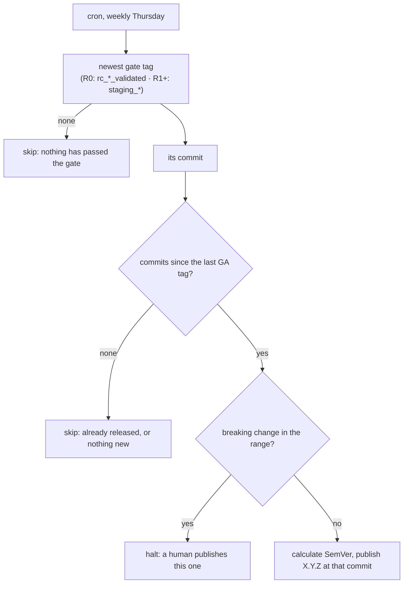

# Weekly release promotion

> **STATUS — plan, not implemented.** A GA release is promoted on a weekly cadence instead of when
> somebody remembers to click a button. Verified against `main` at `65a6d1dd`.
>
> **This does not wait for the nightly work.** Automating the release is two separable changes:
> _when_ a release happens, and _what gates it_. Only the second needs
> [`nightly-environment-and-staging-promotion.md`](nightly-environment-and-staging-promotion.md).
> The cron ships first against the `rc_*_validated` gate that exists today (Phase R0), and the gate
> moves to the staging tag later, once that pipeline is producing staging tags reliably (R1).
> Releases are already going out; making them autonomous should not be held hostage to a pipeline
> that has not been built.

## 1. The promotion ladder

Each rung is a tag, and each tag is evidence produced by the rung below it.

| Rung              | Cadence              | Produced by                     | Evidence                                                 |
| ----------------- | -------------------- | ------------------------------- | -------------------------------------------------------- |
| autopush          | every push to `main` | `autopush-redeploy-*.yml`       | none; tracks `main`                                      |
| release candidate | every 3 h            | `rc-release-pipeline.yml`       | `rc_<ts>_<sha>_validated` — passed the narrow `rc` suite |
| staging           | nightly              | `staging-promote.yml` (planned) | `staging_<ts>_<sha>` — passed the full `nightly` matrix  |
| GA                | weekly               | `release-publish.yml`           | `X.Y.Z` — this document                                  |

The tag shapes and why they look like that are §3.3 of the nightly document; do not restate them
here.

This is the end state. Until the staging rung exists, GA is promoted from the rung below it — the
`rc_*_validated` tag — on the same weekly cadence. §4 sequences the two.

## 2. Current state

**A GA release happens when a human opens `release-publish.yml` and clicks "Run workflow".** There
is no schedule. The workflow takes an optional explicit version, an optional target commit, and an
emergency `skip_rc_validation` bypass.

Left alone it resolves the newest commit carrying an `rc_*_validated` tag, computes the next SemVer
from Conventional Commits since the last GA tag (`calculate_next_version.sh`), and refuses to
publish a commit with no `rc_*_validated` tag (`verify_release_eligibility.sh`, exit 1).

Note what that means today: the release gate is the **three-hourly** suite, which is
`test_agent_api_health.py`, `test_agent_fleet_audit.py` and one stockout scenario. Nothing that ships
has been through the full matrix.

## 3. Goal state

**A cron every Thursday that releases the newest gate-passing commit and skips if that commit is
already released.**

Thursday because it leaves a working day to react to a bad release, which Friday does not. Weekly
with no rate limiter inside the resolver: the cron is the cadence, so there is no wall-clock
arithmetic anywhere in the decision.

**Which gate is a parameter, not part of the shape.** The decision below has the same three
conditions either way; only condition 1 changes as the ladder grows a rung. In R0 it reads the
newest `rc_*_validated` tag; from R1 it reads the newest `staging_<ts>_<sha>` tag, positioned after
the nightly slot. Everything else — the skip semantics, the SemVer calculation, the breaking-change
halt — is written once and does not move.

### 3.1 The decision, as three conditions

A new `scripts/release/resolve_scheduled_release.sh` answers the question a human used to answer by
choosing when to click the button. **Every condition that fails is a skip with exit 0** — nothing is
published, the run stays green, and the next run asks again. A red run must mean the machinery is
broken, not that this week had nothing to ship, or nobody will look at a red one.

1. **A candidate has passed the gate.** In R0, the newest `rc_*_validated` tag — the check
   `verify_release_eligibility.sh` already performs. From R1, the newest tag matching the
   `staging_<ts>_<sha>` **shape** — not merely the `staging_` prefix, so a hand-made
   `staging_hotfix` cannot be mistaken for a gate result. See §3.2.
2. **There is something to release.** Commits exist between the newest GA tag and that commit.
3. **Nothing in the range is a breaking change** — `feat!:`, `fix(x)!:`, `BREAKING CHANGE:`. Those
   are a human's call.

Note what is _not_ on the list. "Has this tag already been released?" needs no condition of its own:
if the newest GA tag points at the gated commit, `git log <GA>..<commit>` is empty and condition 2
already skips. The state lives in the tags, not in a clock or a bookkeeping file. Nor is there a
weekday or elapsed-time check inside the resolver — the cron is the cadence.

**A skip is green; a halt is red.** Conditions 1 and 2 failing mean there is nothing to do this
week, which is ordinary and must not be reported as a failure. Condition 3 is different: it will
recur every week until somebody publishes by hand, so it **fails the job**. A breaking change
waiting to ship is a thing somebody has to act on.

This split is why R0 is not a four-line `schedule:` block, and it is the part most likely to be cut
for being unglamorous. `verify_release_eligibility.sh` exits **1** when its gate is not satisfied
(§5), and `calculate_next_version.sh` has nothing to compute when no commits have landed since the
last GA tag. Triggered by hand those are correct, visible errors — a human asked, and got an answer.
On a cron they are a red run every week that had nothing to ship, and a workflow that is red most
weeks is one nobody reads, which costs more than the automation gains.

Note that a green skip has its own hazard, documented in the nightly document's §3.4: a run that
skipped and a run that passed both conclude `success`, so a skip overwrites the last real result.
Fixing that is a step in the nightly plan and it covers this cron too.

### 3.2 The staging tag becomes the only evidence — later

This section describes the **R1 end state**, not what R0 ships. Until R1 lands, the gate is
`rc_*_validated` and `verify_release_eligibility.sh` is unmodified.

Today `verify_release_eligibility.sh` refuses any commit without an `rc_*_validated` tag. That check
eventually **moves to the staging tag** rather than gaining a second condition beside it: the release
depends on the staging gate and on nothing else.

Nothing is lost by dropping the `rc_*_validated` requirement, because it is implied. A `staging_*`
tag is only ever created by the nightly pipeline, which only ever promotes a candidate that already
carries `rc_*_validated`. Requiring both would re-check a property the first check guarantees, and
would leave two gates to keep in step when one of them changes.

What replaces it as the defence against a fabricated tag is the **shape** match in condition 1. A
`staging_` prefix alone is a trigger anyone can type; `staging_<ts>_<sha>` with the timestamp and
short SHA in the right places is what the pipeline produces.

The emergency path is unchanged and now carries more weight: `workflow_dispatch` with
`skip_rc_validation` is the only way to publish a commit that never reached staging. Rename it with
the gate it now bypasses.

### 3.3 "After the nightly finishes"

Relevant from R1 onward; in R0 the cron reads a tag family the three-hourly pipeline maintains, so
there is nothing to be positioned after.

The cron is a **poll, not a handoff**. It does not need to know whether the nightly run has finished;
it reads the newest `staging_*` tag, and if that tag is from last week it either releases it (if
unreleased) or skips. So the schedule only needs to be far enough after the nightly slot that a tag
pushed that night is visible — a few hours is ample, and being wrong about it costs latency, never
correctness.

The alternative, `workflow_run` on the nightly pipeline filtered to one weekday, couples the two
workflows to get a property the poll already has. Not worth it.

### 3.4 What a weekly cadence costs, and why it is still right

**A Thursday that produces nothing costs a full week.** Worth knowing rather than discovering,
though how often it happens depends on which gate is in force.

Under R1 it is a real risk: a release needs a `staging_*` tag newer than the last GA tag, and a
staging tag needs a new `rc_*_validated` candidate _and_ a green matrix on the same night. Validated
candidates appeared on 4 of the 7 nights to 2026-08-26, and the matrix pass rate is not yet known,
so the interval between releases will sometimes be a fortnight rather than a week.

Under R0 it mostly is not. The gate is the `rc_*_validated` tag itself, produced by a pipeline that
runs every three hours rather than nightly, so a week with no qualifying candidate is the exception.
Shipping the cron against the existing gate therefore buys a tighter release cadence than the end
state does — one more reason not to hold it behind the nightly work.

The alternative — attempt daily, and cap releases to one per week inside the resolver — buys back
that week at the price of a weekday anchor, epoch arithmetic, and an injectable clock so the anchor
can be tested without waiting for a Thursday. That is the only wall-clock reasoning that would exist
anywhere in the design, and it exists purely to undo the cron's own cadence.

Weekly-with-no-limiter is the choice because the artifact decides, not the calendar. Latency is the
cheap failure here: a release that lands a week later is a release that landed. Revisit only if a
fortnightly floor turns out to hurt in practice.

## 4. Plan

**Only R1 depends on the nightly document.** R0 is deliberately first and deliberately standalone:
it makes releases autonomous against the gate that exists today, so the release rung keeps moving
whatever happens to the rungs below it.

**Phase R0 — turn on the schedule, on today's gate. Its own PR, no dependencies.** The Thursday cron
on `release-publish.yml`, resolving the newest `rc_*_validated` commit exactly as the manual path
already does. `verify_release_eligibility.sh` keeps its current condition and is not touched.

Not a four-line change, for the reason §3.1 gives: the eligibility check exits 1 rather than
skipping, so the run needs the skip-green/halt-red split shipped alongside it — nothing to release
skips green, a breaking change in the range fails red. That means the resolver and the gating job
below, scoped to the `rc_*_validated` condition:

- `resolve_scheduled_release.sh` with §3.1's three conditions, reusing `get_latest_validated_rc_tag`
  from `common.sh` rather than reimplementing the lookup.
- An `evaluate-schedule` job holding the verdict, so it is one condition rather than one per
  publishing step and a step appended later cannot bypass it.
- `workflow_dispatch` short-circuits the gate, leaving today's emergency path untouched.

**Phase R1 — retarget the gate to staging.** Once the nightly document's Phase 4 is producing
`staging_*` tags reliably. Move `verify_release_eligibility.sh` from `rc_*_validated` to the
`staging_<ts>_<sha>` shape per §3.2, add `get_latest_staging_tag` to `common.sh` matching the shape
rather than the prefix, point R0's resolver at it, and rename `skip_rc_validation` to name the gate
it now bypasses. Provable by hand through `workflow_dispatch` before the next cron fires.

**Phase R2 — reconcile the documentation.** §3.2, §3.3 and §3.4 above are written as the R1 end
state with R0 carve-outs; once R1 lands, the carve-outs go and the ladder in §1 is simply true.

Badges are **not** in this plan. They belong with the nightly pipeline's and with a fix to the skip
semantics that would otherwise make them lie — see the nightly document's §3.4.

## 5. Traps

- **`verify_release_eligibility.sh` exits 1**, not 0, when its gate is not satisfied. On an unattended
  run that is a red week rather than a skip, which is why the resolver checks the same condition
  first and skips green. This is the single reason R0 is not just a `schedule:` block, and it is the
  thing to re-check before anyone scopes it as one. Any new condition added to the publish path
  needs the same treatment.
- **A green skip is not the same as a green pass, but GitHub reports both as `success`.** A run that
  skipped everything overwrites the last run that did something and failed, so "the release workflow
  is green" stops meaning the last release attempt worked. Tracked in the nightly document's §3.4,
  which covers this cron alongside the RC pipeline.
- **"Breaking" is not "MAJOR".** `calculate_next_version.sh` implements SemVer clause 4, so on `0.y.z`
  a breaking change bumps MINOR and the MAJOR digit never moves. A human gate written against MAJOR
  would pass every breaking release through until `1.0.0`.
- **GA tags are immutable and published artifacts.** Unlike every other rung on the ladder, a mistake
  here cannot be fixed by deleting a tag — images are promoted in GHCR and a GitHub Release is
  created. This is the rung that most deserves the skip-rather-than-guess bias the resolver already
  has.
- **Scheduled workflows only run from the default branch**, so none of this can be tested from a
  branch. Exercise the resolver through its unit tests and `workflow_dispatch`.
