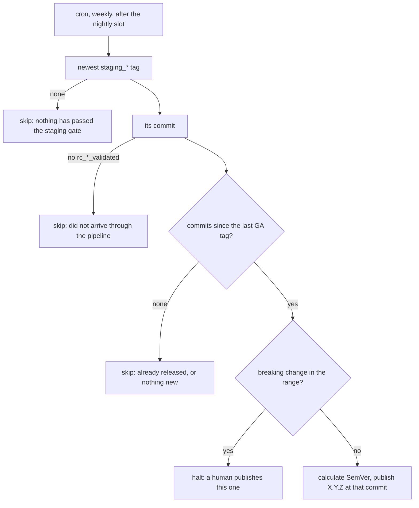

# Weekly release promotion

> **STATUS — plan, not implemented.** The stage above
> [`nightly-environment-and-staging-promotion.md`](nightly-environment-and-staging-promotion.md):
> once a staging tag means something, a GA release is promoted from it on a weekly cadence instead
> of when somebody remembers to click a button. That document is a prerequisite — without its
> staging gate there is no signal to key this off. Verified against `main` at `65a6d1dd`.

## 1. The promotion ladder

Each rung is a tag, and each tag is evidence produced by the rung below it.

| Rung              | Cadence              | Produced by                     | Evidence                                                 |
| ----------------- | -------------------- | ------------------------------- | -------------------------------------------------------- |
| autopush          | every push to `main` | `autopush-redeploy-*.yml`       | none; tracks `main`                                      |
| release candidate | every 3 h            | `rc-release-pipeline.yml`       | `rc_<ts>_<sha>_validated` — passed the narrow `rc` suite |
| staging           | nightly              | `staging-promote.yml` (planned) | `staging_<ts>_<sha>` — passed the full `nightly` matrix  |
| GA                | weekly               | `release-publish.yml`           | `X.Y.Z` — this document                                  |

The tag shapes and why they look like that are §3.3 of the nightly document; do not restate them
here.

## 2. Current state

**A GA release happens when a human opens `release-publish.yml` and clicks "Run workflow".** There
is no schedule. The workflow takes an optional explicit version, an optional target commit, and an
emergency `skip_rc_validation` bypass.

Left alone it resolves the newest commit carrying an `rc_*_validated` tag, computes the next SemVer
from Conventional Commits since the last GA tag (`calculate_next_version.sh`), and refuses to
publish a commit with no `rc_*_validated` tag (`verify_release_eligibility.sh`, exit 1).

Note what that means today: the release gate is the **three-hourly** suite, which is
`test_agent_api_health.py`, `test_agent_fleet_audit.py` and one stockout scenario. Nothing that ships
has been through the full matrix.

### 2.1 What PR #970 already builds

[PR #970](https://github.com/gke-labs/kube-agents/pull/970) is a draft stacked on #976 and is most of
this. It adds `scripts/release/resolve_scheduled_release.sh`, a nightly `schedule` on
`release-publish.yml`, and an `evaluate-schedule` job whose verdict gates publishing. Every failed
condition is a **skip with exit 0**, never a red run. Its four conditions:

1. A commit carries a staging-shaped tag, and also an `rc_*_validated` tag. Checked second so that
   `verify_release_eligibility.sh`'s hard exit 1 is unreachable from the schedule.
2. There are commits between the last GA tag and that commit.
3. A release is "due this cycle" — the last GA tag was created **before** the most recent weekday
   anchor (`RELEASE_ANCHOR_DOW`, default Friday), computed with epoch arithmetic.
4. Nothing in the range is a breaking change (`feat!:`, `fix(x)!:`, `BREAKING CHANGE:`). This one
   **halts** rather than skipping: it recurs every night until a human acts, and raises a workflow
   annotation.

Conditions 1, 2 and 4 are keepers. Condition 3 is the one this plan removes.

## 3. Goal state

**A weekly cron, positioned after the nightly run, that releases the newest staging-gated commit and
skips if that commit is already released.**

### 3.1 Why condition 3 goes

The requirement is "if a release was already made for this tag, skip and wait for next week's new
staging tag". That is **already condition 2**, and it costs nothing: if the newest GA tag points at
the staging-gated commit, `git log <GA>..<commit>` is empty and the run skips with "No commits
between…". State in the tags, not a clock.

Condition 3 exists only to rate-limit a **nightly** attempt down to a weekly release. Move the cron
to weekly and the cron is the rate limit, so the anchor arithmetic —
`NOW_EPOCH`, `RELEASE_ANCHOR_DOW`, `TARGET_OFFSET`, `DAYS_SINCE_ANCHOR`, `ANCHOR_EPOCH`, the
`creatordate:unix` lookup, and the two injectable test variables that exist to make it testable —
all delete. It is also the only part of the resolver that is coupled to wall-clock time, which is
the thing this design is trying not to be.

### 3.2 "After the nightly finishes"

The cron is a **poll, not a handoff**. It does not need to know whether the nightly run has finished;
it reads the newest `staging_*` tag, and if that tag is from last week it either releases it (if
unreleased) or skips. So the schedule only needs to be far enough after the nightly slot that a tag
pushed that night is visible — a few hours is ample, and being wrong about it costs latency, never
correctness.

The alternative, `workflow_run` on the nightly pipeline filtered to one weekday, couples the two
workflows to get a property the poll already has. Not worth it.

## 4. The cadence decision

This is the one thing to settle before writing code, because it is the difference between the
plan above and #970 as it stands.

Two knobs, and they are independent:

- **How often we attempt** — the cron.
- **How often we are allowed to release** — condition 3, or nothing.

|               | attempt | allowed       | Behaviour when the target night produces nothing                    |
| ------------- | ------- | ------------- | ------------------------------------------------------------------- |
| This plan     | weekly  | unrestricted  | Waits a full week                                                   |
| #970 as built | nightly | weekly anchor | Releases as soon as a staging tag lands, still at most once a cycle |

**The weekly-only version can slip to a fortnight, and it is worth deciding that deliberately.** A
staging tag needs two things to coincide on the same night: a new `rc_*_validated` candidate, and a
green full matrix. Validated candidates appeared on 4 of the 7 nights to 2026-08-26, and the matrix
pass rate is **unknown** because it has never run successfully. If a given night is, say, even money,
the expected interval between releases is nearer two weeks than one.

Three ways out, in ascending complexity:

1. **Accept it.** Simplest, and a fortnightly release is not obviously wrong for this project.
2. **Attempt daily, keep the weekly cap** — #970's shape. Self-heals within the week and costs the
   arithmetic §3.1 deletes.
3. **Attempt daily, cap on "days since the last GA tag"** rather than a weekday anchor. Simpler than
   the anchor, but a late release drags every later one later — which is the drift #970's comment
   says the anchor exists to avoid.

Recommendation: **(2)**, and keep condition 3. The requirement that motivated this — "don't couple to
time" — is really "don't publish on a clock without checking the artifact", and conditions 1, 2 and 4
are what deliver it. The anchor is a rate limiter, not a gate, and it is the only thing standing
between a run that attempts often (good, self-healing) and a release every single night. If the
fortnight is acceptable, take (1) and delete it.

## 5. Plan

Depends on the nightly document's Phase 5 — there must be `staging_*` tags before any of this means
anything.

**Phase R1 — retarget the gate.** `verify_release_eligibility.sh` currently requires `rc_*_validated`
on the release commit. Once the staging gate exists, the stronger evidence is the `staging_*` tag,
and the resolver should require both. No schedule yet; `workflow_dispatch` only.

**Phase R2 — land the resolver.** `resolve_scheduled_release.sh` with conditions 1, 2 and 4, and 3
only if §4 says so. Reconcile `get_latest_staging_tag` with the `staging_<ts>_<sha>` shape from the
nightly document §3.3 — #970 wrote it against `staging/`.

**Phase R3 — turn on the schedule.** Add the cron and the `evaluate-schedule` job gating publish.
`workflow_dispatch` continues to short-circuit the gate so the emergency path is unchanged.

**Phase R4 — notification.** Covered under open questions; do not skip it silently.

## 6. Open decisions

1. **The cadence**, per §4. Everything else is mechanical.
2. **Which weekday.** The request is Thursday; #970 defaults to Friday. Thursday leaves a working day
   to react to a bad release, which is the better argument.
3. **Does the release gate still accept `rc_*_validated` alone?** If the staging tag becomes
   mandatory, an emergency release from a commit that never reached staging needs the existing
   `skip_rc_validation` bypass to cover it too, and that should be deliberate rather than discovered.
4. **Nobody is told.** A skipped scheduled run is green and silent, and the breaking-change halt
   recurs nightly with only a workflow annotation. #970's own script comments call this out as an
   open gap. A release cadence nobody is notified about is one that stops and is not noticed —
   the same gap the nightly pipeline has (nightly document §5.5), and worth solving once for both.

## 7. Traps

- **`verify_release_eligibility.sh` exits 1**, not 0, on a commit with no `rc_*_validated` tag. On an
  unattended run that is a red night rather than a skip, which is why the resolver checks the same
  condition first. Any new condition added to the publish path needs the same treatment.
- **"Breaking" is not "MAJOR".** `calculate_next_version.sh` implements SemVer clause 4, so on `0.y.z`
  a breaking change bumps MINOR and the MAJOR digit never moves. A human gate written against MAJOR
  would pass every breaking release through until `1.0.0`.
- **GA tags are immutable and published artifacts.** Unlike every other rung on the ladder, a mistake
  here cannot be fixed by deleting a tag — images are promoted in GHCR and a GitHub Release is
  created. This is the rung that most deserves the skip-rather-than-guess bias the resolver already
  has.
- **Scheduled workflows only run from the default branch**, so none of this can be tested from a
  branch. Exercise the resolver through its unit tests and `workflow_dispatch`.
