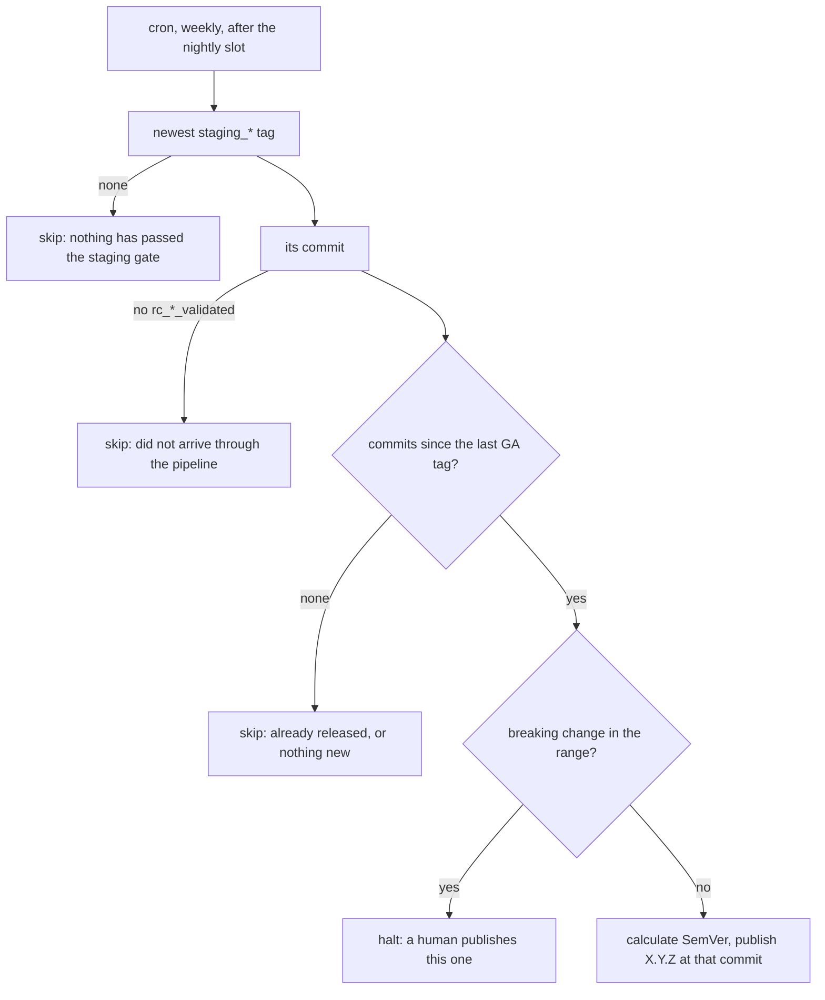

# Weekly release promotion

> **STATUS — plan, not implemented.** The stage above
> [`nightly-environment-and-staging-promotion.md`](nightly-environment-and-staging-promotion.md):
> once a staging tag means something, a GA release is promoted from it on a weekly cadence instead
> of when somebody remembers to click a button. That document is a prerequisite — without its
> staging gate there is no signal to key this off. Verified against `main` at `65a6d1dd`.

## 1. The promotion ladder

Each rung is a tag, and each tag is evidence produced by the rung below it.

| Rung              | Cadence              | Produced by                     | Evidence                                                 |
| ----------------- | -------------------- | ------------------------------- | -------------------------------------------------------- |
| autopush          | every push to `main` | `autopush-redeploy-*.yml`       | none; tracks `main`                                      |
| release candidate | every 3 h            | `rc-release-pipeline.yml`       | `rc_<ts>_<sha>_validated` — passed the narrow `rc` suite |
| staging           | nightly              | `staging-promote.yml` (planned) | `staging_<ts>_<sha>` — passed the full `nightly` matrix  |
| GA                | weekly               | `release-publish.yml`           | `X.Y.Z` — this document                                  |

The tag shapes and why they look like that are §3.3 of the nightly document; do not restate them
here.

## 2. Current state

**A GA release happens when a human opens `release-publish.yml` and clicks "Run workflow".** There
is no schedule. The workflow takes an optional explicit version, an optional target commit, and an
emergency `skip_rc_validation` bypass.

Left alone it resolves the newest commit carrying an `rc_*_validated` tag, computes the next SemVer
from Conventional Commits since the last GA tag (`calculate_next_version.sh`), and refuses to
publish a commit with no `rc_*_validated` tag (`verify_release_eligibility.sh`, exit 1).

Note what that means today: the release gate is the **three-hourly** suite, which is
`test_agent_api_health.py`, `test_agent_fleet_audit.py` and one stockout scenario. Nothing that ships
has been through the full matrix.

## 3. Goal state

**A weekly cron, positioned after the nightly run, that releases the newest staging-gated commit and
skips if that commit is already released.**

### 3.1 The decision, as three conditions

A new `scripts/release/resolve_scheduled_release.sh` answers the question a human used to answer by
choosing when to click the button. **Every condition that fails is a skip with exit 0** — nothing is
published, the run stays green, and the next run asks again. A red run must mean the machinery is
broken, not that this week had nothing to ship, or nobody will look at a red one.

1. **A candidate has passed the staging gate.** The newest `staging_*` tag, and its commit must also
   carry an `rc_*_validated` tag. The second half looks redundant and is not: it keeps
   `verify_release_eligibility.sh`'s hard exit 1 unreachable from a scheduled run, so a tag created
   outside the pipeline stops here quietly instead of going red.
2. **There is something to release.** Commits exist between the newest GA tag and that commit.
3. **Nothing in the range is a breaking change** — `feat!:`, `fix(x)!:`, `BREAKING CHANGE:`. This one
   **halts** rather than skips: it will recur every run until somebody publishes by hand, so it
   raises a workflow annotation rather than only a summary line.

Note what is _not_ on the list. "Has this tag already been released?" needs no condition of its own:
if the newest GA tag points at the staging-gated commit, `git log <GA>..<commit>` is empty and
condition 2 already skips. The state lives in the tags, not in a clock or a bookkeeping file.

Nor is there a weekday or an elapsed-time check. The cron is the rate limit — see §4 for the one case
where that choice costs something.

### 3.2 "After the nightly finishes"

The cron is a **poll, not a handoff**. It does not need to know whether the nightly run has finished;
it reads the newest `staging_*` tag, and if that tag is from last week it either releases it (if
unreleased) or skips. So the schedule only needs to be far enough after the nightly slot that a tag
pushed that night is visible — a few hours is ample, and being wrong about it costs latency, never
correctness.

The alternative, `workflow_run` on the nightly pipeline filtered to one weekday, couples the two
workflows to get a property the poll already has. Not worth it.

## 4. The cadence decision

Settle this before writing the resolver; it decides whether §3.1 has three conditions or four.

Two knobs, and they are independent:

- **How often we attempt** — the cron.
- **How often we are allowed to release** — a rate limiter inside the resolver, or nothing.

|                            | attempt | allowed        | When the target night produces nothing                              |
| -------------------------- | ------- | -------------- | ------------------------------------------------------------------- |
| Weekly cron, no limiter    | weekly  | unrestricted   | Waits a full week                                                   |
| Daily cron, weekly limiter | daily   | once per cycle | Releases as soon as a staging tag lands, still at most once a cycle |

**Weekly-only can slip to a fortnight, and that is worth choosing deliberately rather than
discovering.** A staging tag needs two things to coincide on the same night: a new `rc_*_validated`
candidate, and a green full matrix. Validated candidates appeared on 4 of the 7 nights to
2026-08-26, and the matrix pass rate is **unknown** because it has never run successfully. If a given
night is even money, the expected interval between releases is nearer two weeks than one.

Three answers, in ascending complexity:

1. **Accept it.** One cron line, three conditions, nothing to test but the conditions. A fortnightly
   release is not obviously wrong for this project.
2. **Attempt daily, cap on a weekday anchor.** Self-heals within the week: any night that produces a
   staging tag releases it, and the anchor stops a second release before the next cycle. Costs epoch
   arithmetic and an injectable clock so it can be tested without waiting for a Thursday.
3. **Attempt daily, cap on days since the last GA tag.** Simpler arithmetic than the anchor, but a
   release that lands late drags every later one later, and the drift never corrects.

Recommendation: **(1)**, unless a fortnightly floor is unacceptable. It is the only one of the three
with no clock in it, and the whole point of keying off the staging tag is that the artifact decides,
not the calendar. Take (2) if the cadence has to be dependable, and prefer the anchor to (3) because
an anchored week self-corrects after a blocked one.

## 5. Plan

Depends on the nightly document's Phase 5 — there must be `staging_*` tags before any of this means
anything.

**Phase R1 — retarget the gate.** `verify_release_eligibility.sh` currently requires `rc_*_validated`
on the release commit. Once the staging gate exists, the stronger evidence is the `staging_*` tag,
and the resolver should require both. No schedule yet; `workflow_dispatch` only.

**Phase R2 — land the resolver.** `resolve_scheduled_release.sh` with §3.1's three conditions, plus a
rate limiter only if §4 says so. It needs a `get_latest_staging_tag` in `common.sh` that matches the
`staging_<ts>_<sha>` **shape** rather than merely the prefix, so that a hand-made `staging_hotfix`
cannot be mistaken for a gate result.

**Phase R3 — turn on the schedule.** Add the cron and the `evaluate-schedule` job gating publish.
`workflow_dispatch` continues to short-circuit the gate so the emergency path is unchanged.

**Phase R4 — notification.** Covered under open questions; do not skip it silently.

## 6. Open decisions

1. **The cadence**, per §4. Everything else is mechanical.
2. **Which weekday.** Thursday, unless there is a reason otherwise: it leaves a working day to react
   to a bad release, which Friday does not.
3. **Does the release gate still accept `rc_*_validated` alone?** If the staging tag becomes
   mandatory, an emergency release from a commit that never reached staging needs the existing
   `skip_rc_validation` bypass to cover it too, and that should be deliberate rather than discovered.
4. **Nobody is told.** A skipped scheduled run is green and silent, and the breaking-change halt
   repeats on every run with only a workflow annotation to show for it. A release cadence nobody is
   notified about is one that stops and is not noticed — the same gap the nightly pipeline has
   (nightly document §5.5), and worth solving once for both.

## 7. Traps

- **`verify_release_eligibility.sh` exits 1**, not 0, on a commit with no `rc_*_validated` tag. On an
  unattended run that is a red night rather than a skip, which is why the resolver checks the same
  condition first. Any new condition added to the publish path needs the same treatment.
- **"Breaking" is not "MAJOR".** `calculate_next_version.sh` implements SemVer clause 4, so on `0.y.z`
  a breaking change bumps MINOR and the MAJOR digit never moves. A human gate written against MAJOR
  would pass every breaking release through until `1.0.0`.
- **GA tags are immutable and published artifacts.** Unlike every other rung on the ladder, a mistake
  here cannot be fixed by deleting a tag — images are promoted in GHCR and a GitHub Release is
  created. This is the rung that most deserves the skip-rather-than-guess bias the resolver already
  has.
- **Scheduled workflows only run from the default branch**, so none of this can be tested from a
  branch. Exercise the resolver through its unit tests and `workflow_dispatch`.
