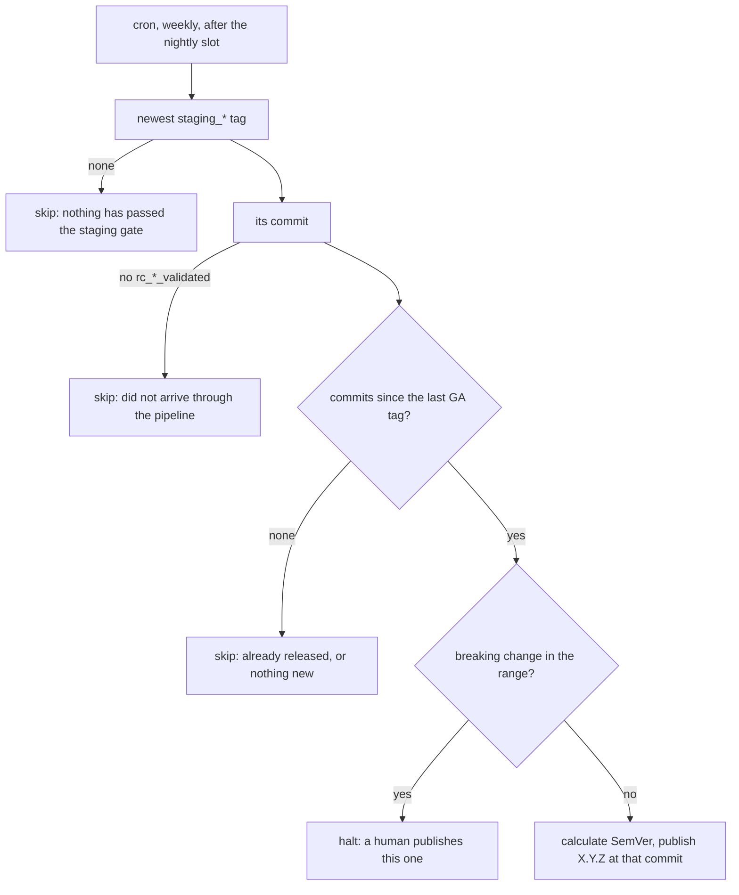

# Weekly release promotion

> **STATUS — plan, not implemented.** The stage above
> [`nightly-environment-and-staging-promotion.md`](nightly-environment-and-staging-promotion.md):
> once a staging tag means something, a GA release is promoted from it on a weekly cadence instead
> of when somebody remembers to click a button. That document is a prerequisite — without its
> staging gate there is no signal to key this off. Verified against `main` at `65a6d1dd`.

## 1. The promotion ladder

Each rung is a tag, and each tag is evidence produced by the rung below it.

| Rung              | Cadence              | Produced by                     | Evidence                                                 |
| ----------------- | -------------------- | ------------------------------- | -------------------------------------------------------- |
| autopush          | every push to `main` | `autopush-redeploy-*.yml`       | none; tracks `main`                                      |
| release candidate | every 3 h            | `rc-release-pipeline.yml`       | `rc_<ts>_<sha>_validated` — passed the narrow `rc` suite |
| staging           | nightly              | `staging-promote.yml` (planned) | `staging_<ts>_<sha>` — passed the full `nightly` matrix  |
| GA                | weekly               | `release-publish.yml`           | `X.Y.Z` — this document                                  |

The tag shapes and why they look like that are §3.3 of the nightly document; do not restate them
here.

## 2. Current state

**A GA release happens when a human opens `release-publish.yml` and clicks "Run workflow".** There
is no schedule. The workflow takes an optional explicit version, an optional target commit, and an
emergency `skip_rc_validation` bypass.

Left alone it resolves the newest commit carrying an `rc_*_validated` tag, computes the next SemVer
from Conventional Commits since the last GA tag (`calculate_next_version.sh`), and refuses to
publish a commit with no `rc_*_validated` tag (`verify_release_eligibility.sh`, exit 1).

Note what that means today: the release gate is the **three-hourly** suite, which is
`test_agent_api_health.py`, `test_agent_fleet_audit.py` and one stockout scenario. Nothing that ships
has been through the full matrix.

## 3. Goal state

**A cron every Thursday, positioned after the nightly run, that releases the newest staging-gated
commit and skips if that commit is already released.**

Thursday because it leaves a working day to react to a bad release, which Friday does not. Weekly
with no rate limiter inside the resolver: the cron is the cadence, so there is no wall-clock
arithmetic anywhere in the decision.

### 3.1 The decision, as three conditions

A new `scripts/release/resolve_scheduled_release.sh` answers the question a human used to answer by
choosing when to click the button. **Every condition that fails is a skip with exit 0** — nothing is
published, the run stays green, and the next run asks again. A red run must mean the machinery is
broken, not that this week had nothing to ship, or nobody will look at a red one.

1. **A candidate has passed the staging gate.** The newest tag matching the `staging_<ts>_<sha>`
   **shape** — not merely the `staging_` prefix, so a hand-made `staging_hotfix` cannot be mistaken
   for a gate result. This is the sole evidence the release requires; see §3.2.
2. **There is something to release.** Commits exist between the newest GA tag and that commit.
3. **Nothing in the range is a breaking change** — `feat!:`, `fix(x)!:`, `BREAKING CHANGE:`. Those
   are a human's call.

Note what is _not_ on the list. "Has this tag already been released?" needs no condition of its own:
if the newest GA tag points at the staging-gated commit, `git log <GA>..<commit>` is empty and
condition 2 already skips. The state lives in the tags, not in a clock or a bookkeeping file. Nor is
there a weekday or elapsed-time check inside the resolver — the cron is the cadence.

**A skip is green; a halt is red.** Conditions 1 and 2 failing mean there is nothing to do this
week, which is ordinary and must not colour the badge. Condition 3 is different: it will recur every
week until somebody publishes by hand, so it **fails the job**. A breaking change waiting to ship is
a thing somebody has to act on, and the red badge in `README.md` is how they find out.

### 3.2 The staging tag is the only evidence

Today `verify_release_eligibility.sh` refuses any commit without an `rc_*_validated` tag. That check
**moves to the staging tag** rather than gaining a second condition beside it: the release depends on
the staging gate and on nothing else.

Nothing is lost by dropping the `rc_*_validated` requirement, because it is implied. A `staging_*`
tag is only ever created by the nightly pipeline, which only ever promotes a candidate that already
carries `rc_*_validated`. Requiring both would re-check a property the first check guarantees, and
would leave two gates to keep in step when one of them changes.

What replaces it as the defence against a fabricated tag is the **shape** match in condition 1. A
`staging_` prefix alone is a trigger anyone can type; `staging_<ts>_<sha>` with the timestamp and
short SHA in the right places is what the pipeline produces.

The emergency path is unchanged and now carries more weight: `workflow_dispatch` with
`skip_rc_validation` is the only way to publish a commit that never reached staging. Rename it with
the gate it now bypasses.

### 3.3 "After the nightly finishes"

The cron is a **poll, not a handoff**. It does not need to know whether the nightly run has finished;
it reads the newest `staging_*` tag, and if that tag is from last week it either releases it (if
unreleased) or skips. So the schedule only needs to be far enough after the nightly slot that a tag
pushed that night is visible — a few hours is ample, and being wrong about it costs latency, never
correctness.

The alternative, `workflow_run` on the nightly pipeline filtered to one weekday, couples the two
workflows to get a property the poll already has. Not worth it.

### 3.4 What a weekly cadence costs, and why it is still right

**A Thursday that produces nothing costs a full week.** Worth knowing rather than discovering: a
release needs a `staging_*` tag that is newer than the last GA tag, and a staging tag needs a new
`rc_*_validated` candidate and a green matrix on the same night. Validated candidates appeared on 4
of the 7 nights to 2026-08-26, and the matrix pass rate is not yet known. So the interval between
releases will sometimes be a fortnight rather than a week.

The alternative — attempt daily, and cap releases to one per week inside the resolver — buys back
that week at the price of a weekday anchor, epoch arithmetic, and an injectable clock so the anchor
can be tested without waiting for a Thursday. That is the only wall-clock reasoning that would exist
anywhere in the design, and it exists purely to undo the cron's own cadence.

Weekly-with-no-limiter is the choice because the artifact decides, not the calendar. Latency is the
cheap failure here: a release that lands a week later is a release that landed. Revisit only if a
fortnightly floor turns out to hurt in practice.

## 4. Plan

Depends on the nightly document's Phase 4 — there must be `staging_*` tags before any of this means
anything.

**Phase R1 — retarget the gate.** Move `verify_release_eligibility.sh` from `rc_*_validated` to the
`staging_<ts>_<sha>` shape, per §3.2, and rename `skip_rc_validation` to name the gate it now
bypasses. No schedule yet; `workflow_dispatch` only, so this is provable by hand before anything runs
unattended.

**Phase R2 — land the resolver.** `resolve_scheduled_release.sh` with §3.1's three conditions, and a
`get_latest_staging_tag` in `common.sh` that matches the shape rather than the prefix. Conditions 1
and 2 skip green; condition 3 fails red.

**Phase R3 — turn on the schedule.** The Thursday cron and an `evaluate-schedule` job gating publish.
Keep the verdict in its own job so it is one condition rather than one per publishing step, and so a
step appended later cannot bypass it. `workflow_dispatch` short-circuits the gate, leaving the
emergency path as it is today.

**Phase R4 — the badge.** The `README.md` release badge, alongside the nightly one from the other
document's §3.4.

## 5. Traps

- **`verify_release_eligibility.sh` exits 1**, not 0, when its gate is not satisfied. On an unattended
  run that is a red week rather than a skip, which is why the resolver checks the same condition
  first and skips green. Any new condition added to the publish path needs the same treatment.
- **"Breaking" is not "MAJOR".** `calculate_next_version.sh` implements SemVer clause 4, so on `0.y.z`
  a breaking change bumps MINOR and the MAJOR digit never moves. A human gate written against MAJOR
  would pass every breaking release through until `1.0.0`.
- **GA tags are immutable and published artifacts.** Unlike every other rung on the ladder, a mistake
  here cannot be fixed by deleting a tag — images are promoted in GHCR and a GitHub Release is
  created. This is the rung that most deserves the skip-rather-than-guess bias the resolver already
  has.
- **Scheduled workflows only run from the default branch**, so none of this can be tested from a
  branch. Exercise the resolver through its unit tests and `workflow_dispatch`.
