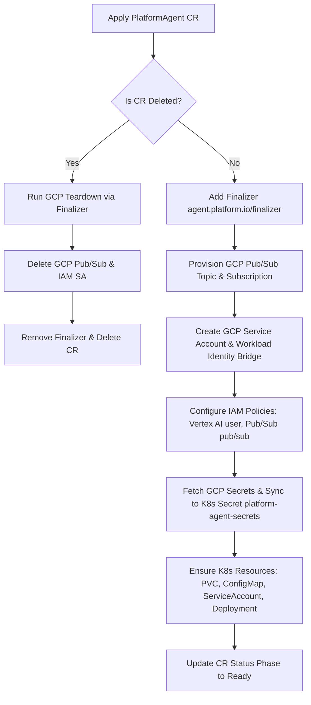

# 🤖 Hermes Operator-based GKE Deployment (`crd`)

This module provides a declarative, **operator-based** approach to provisioning, deploying, and managing the **Hermes Chat Bot Agent** on Google Kubernetes Engine (GKE) Autopilot. 

Instead of relying on local, imperative bash scripts to configure GCP infrastructure and Kubernetes resources, this module leverages a custom Kubernetes Controller (**`platform-agent-operator`**) and a Custom Resource Definition (**`PlatformAgent`**). The operator continuously reconciles the state of your deployment to match your desired configuration.

---


## 📂 Directory Structure

```bash
integrations/gchat/crd/
├── 01_setup_gcp.sh        # Bootstraps core infrastructure (APIs, Artifact Registry, Cluster, Namespace)
├── 02_build_push_image.sh # Packages and builds the Hermes Agent container via Cloud Build
├── 03_teardown.sh         # Clean up core GCP infrastructure (GKE, Repo, Secret Placeholders)
├── platform-agent-bot.yaml  # Sample Custom Resource manifest for deploying your Hermes Agent
├── .env.example           # Example configuration file
└── platform-agent-operator/       # Go-based Kubernetes Operator project (Kubebuilder-scaffolded)
    ├── api/v1alpha1/      # Custom Resource Definition (CRD) Spec types
    ├── internal/          # Controller reconciliation logic
    ├── config/            # Kustomize configurations for installing the CRD and deploying the operator
    ├── Dockerfile         # Containerizes the operator manager
    └── Makefile           # Standard targets for building, testing, and deploying the operator
```

---

## ⚙️ The Reconciliation Lifecycle

When you apply a `PlatformAgent` Custom Resource, the `PlatformAgentReconciler` running inside the operator automatically runs through the following steps to ensure your desired state is achieved:



1. **Finalizer Registration**: Registers `agent.platform.io/finalizer` on the CR to prevent deletion until external GCP resources are safely cleaned up.
2. **GCP Pub/Sub Provisioning**: Automatically creates the target GCP Pub/Sub Topic and Subscription for Google Chat events if they do not already exist.
3. **Identity & Access (Workload Identity)**:
   * Creates a GCP Service Account (GSA) for the bot.
   * Binds the GSA to the Kubernetes Service Account (KSA) using Workload Identity (`roles/iam.workloadIdentityUser`).
   * Binds GCP IAM role `roles/aiplatform.user` to the GSA to enable native, keyless Vertex AI/Gemini API access.
   * Grants the GSA subscriber access to the Pub/Sub subscription and publishes rights for Google Chat systems on the Pub/Sub topic.
4. **Secret Synchronization**: Resolves the latest active version of `GEMINI_API_KEY` from GCP Secret Manager and populates it into a local Kubernetes Secret `platform-agent-secrets` mapped directly to the pod environment.
5. **Workload Deployment**: Deploys the standard Kubernetes workloads (ConfigMap `hermes-config`, PVC `hermes-data`, ServiceAccount, and the Deployment `platform-agent-gateway` container).

---

## 🚀 Getting Started

### ⚡ Quickstart: Run Operator Locally

Here is the fast-track guide to get your local environment configured, your code built, and your operator running in minutes.

#### 1. Environment Configuration

First, navigate to the `crd` directory:
```bash
cd integrations/gchat/crd
```

Clone and copy the example environment file into a local `.env` file:
```bash
cp .env.example .env
```

Update the newly created file with your specific Google Cloud configuration.

> [!IMPORTANT]
> Ensure your target GCP project has an active **Billing Account** linked, as GKE Autopilot and Artifact Registry require billing to be enabled.

#### 2. Bootstrap Infrastructure

Ensure your scripts are executable and run the bootstrap script to provision GKE Autopilot and prepare GCP services:
```bash
chmod +x 01_setup_gcp.sh 02_build_push_image.sh 03_teardown.sh
./01_setup_gcp.sh
```

This script:
* Enables required GCP APIs (Container, Cloud Build, Secret Manager, Pub/Sub, Chat, Vertex AI, etc.).
* Creates a Google Artifact Registry repository for your Hermes Agent image.
* Provisions a GKE Autopilot cluster (this may take a few minutes).
* Populates an empty placeholder secret (`GEMINI_API_KEY`) in Secret Manager.
* Sets up your local `kubectl` connection context and namespace.

#### 3. Populate API Secrets (Optional but Recommended)

If you did not provide `GEMINI_API_KEY` in your local `.env` file before running the bootstrap script, the script will default to creating a placeholder value in Secret Manager. 

In that case, you must open the [GCP Secret Manager Console](https://console.cloud.google.com/security/secret-manager) in your project and update the placeholder value for `GEMINI_API_KEY` with your actual API credential.

#### 4. Package and Push the Hermes Agent Image

Build and publish the main Hermes application container (located in `../app`) to Artifact Registry:
```bash
./02_build_push_image.sh
```

This uses Google Cloud Build to construct and push the container image directly to the newly created registry, bypassing local Docker engines entirely.

#### 5. Local Execution (Requires Two Terminals)

Run and verify your setup by launching the operator locally and deploying the Custom Resource:

* **🖥️ Terminal 1 (Local Operator Host)**: Navigate into the operator directory, register the Custom Resource Definition (CRD), and start the manager process locally:
  ```bash
  # Ensure your shell is authenticated to access GCP services
  gcloud auth application-default login
  
  cd platform-agent-operator
  make install && make run
  ```

* **🖥️ Terminal 2 (Resource Management)**: Stay in the `crd` folder and apply the custom resource manifest to provision your Hermes Agent:
  ```bash
  # From the integrations/gchat/crd directory
  kubectl apply -f platform-agent-bot.yaml
  ```

#### 6. Operational Commands

* **Check Workload Logs**:
  ```bash
  kubectl logs -l app=platform-agent-gateway -n platform-agent --tail=50
  ```

* **Delete the Platform Agent Instance**:
  ```bash
  kubectl delete -f platform-agent-bot.yaml
  ```

---

## 🤖 Deploying the Operator & Custom Resource

Now that your core infrastructure is ready, you can deploy the custom controller into the cluster.

### 1. Install Custom Resource Definition (CRD)

Navigate to the operator directory and install the CRDs into your cluster:

```bash
cd platform-agent-operator
make install
```

### 2. Run or Deploy the Operator

You can choose to run the operator controller locally on your development machine (great for fast iteration) or build and deploy it as a pod directly inside the GKE cluster.

#### Option A: Run the Operator Locally (Recommended for Development)

You can run the controller manager as a local process on your host. It will use your active Kubernetes context (from `~/.kube/config`) to connect to the GKE cluster and manage resources.

> [!TIP]
> The operator relies on GCP APIs to provision infrastructure. When running locally, ensure your terminal is authenticated with Google Cloud Application Default Credentials (ADC) by running `gcloud auth application-default login` first.

```bash
# Authenticate local credentials with GCP
gcloud auth application-default login

# Start the controller locally
make run
```

#### Option B: Build, Push, and Deploy the Operator in the GKE Cluster

If you want the operator to run fully within GKE, build its container image, push it to Artifact Registry, and deploy it:

**1. Build and Push the Operator Image:**

Build and push the controller manager image. Specify your registry path using the `IMG` variable:

```bash
# Example: us-central1-docker.pkg.dev/<project-id>/<repo-name>/platform-agent-operator:latest
make docker-build docker-push IMG=<REGION>-docker.pkg.dev/<PROJECT_ID>/<REPO_NAME>/platform-agent-operator:latest
```

**2. Deploy the Operator Controller:**

Deploy the operator controller manager into the GKE cluster under the namespace `platform-agent-operator-system`:

```bash
make deploy IMG=<REGION>-docker.pkg.dev/<PROJECT_ID>/<REPO_NAME>/platform-agent-operator:latest
```

Confirm the operator is running inside the cluster:

```bash
kubectl get deployments -n platform-agent-operator-system
```

---

## 🚀 Deploying your Hermes Agent Instance

With the operator active, you can provision Hermes Agents declaratively.

### 1. Prepare the Custom Resource Manifest

Navigate back to the `crd` folder:

```bash
cd ..
```

Open `platform-agent-bot.yaml` and configure it to match your deployment:

```yaml
apiVersion: agent.platform.io/v1alpha1
kind: PlatformAgent
metadata:
  name: platform-agent-gateway
  namespace: platform-agent
spec:
  projectId: "your-project-id"
  imageUri: "us-central1-docker.pkg.dev/your-project-id/platform-agent-repo/platform-agent:latest"
  chatTopicName: "platform-agent-chat-events"
  chatSubName: "platform-agent-chat-events-sub"
  gsaName: "platform-agent-chat-bot"
  ksaName: "platform-agent-chat-bot"
  googleChatAllowedUsers: "your-email@google.com"
  googleChatHomeChannel: "spaces/your-default-chat-space-id"
```

### 2. Apply the Custom Resource

Apply the manifest to the cluster:

```bash
kubectl apply -f platform-agent-bot.yaml
```

Monitor the reconciliation:

```bash
kubectl get platformagent -n platform-agent
# Check status phase (should progress from Provisioning to Ready)
kubectl get platformagent platform-agent-gateway -n platform-agent -o jsonpath='{.status.phase}'
```

### 3. Verify Provisioned Workloads

Check that the operator successfully deployed all requested resources under the `platform-agent` namespace:

```bash
kubectl get pods,pvc,secret,configmap,serviceaccount -n platform-agent
```

---

## 🔌 Access and Administration

### 1. Access the Local Dashboard

Port-forward the dashboard to your local machine:

```bash
kubectl port-forward -n platform-agent deployment/platform-agent-gateway 9119:9119
```

Open your browser and navigate to `http://localhost:9119` to view the Hermes Visual Dashboard.

### 2. Approve Google Chat Integrations

To approve a pairing code and complete Google Chat setup:

```bash
kubectl exec -it deploy/platform-agent-gateway -n platform-agent -- hermes pairing approve google_chat <PAIRING_CODE>
```

---

## 🧹 Clean Up & Teardown

The operator leverages Kubernetes Finalizers. When you delete the `PlatformAgent` Custom Resource, it dynamically deletes the associated GCP Pub/Sub Topic/Subscription and GCP Service Account to prevent resource leaks or ongoing billing.

### Step 1: Delete the Hermes Agent CR

```bash
kubectl delete -f platform-agent-bot.yaml
```

*Verify that the GCP Service Account and Pub/Sub resources have been deleted via the GCP Console.*

### Step 2: Uninstall the Operator

```bash
cd platform-agent-operator
make undeploy
make uninstall
cd ..
```

### Step 3: Teardown Core GKE & GCP Infrastructure

Safely destroy the Artifact Registry, Secret Manager secrets, and GKE Autopilot Cluster:

```bash
./03_teardown.sh
```
