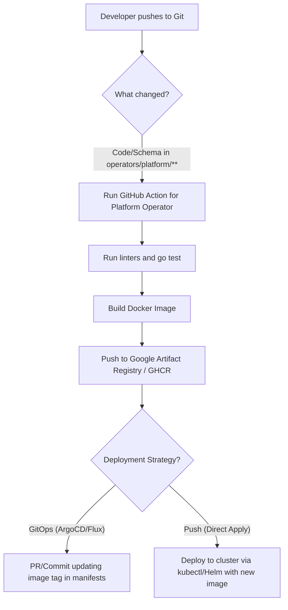

# Kubernetes Operators in kube-agents

This directory is designed to centralize all Kubernetes operators and controllers used within the `kube-agents` project. Currently, it describes the general concept of the structure, CI/CD processes, and open architectural questions.

## 🏗️ Recommended Structure of the `operators/` Folder

The following layout is proposed:

```directory
integrations/operators/
├── README.md                       # This file (general standards and guidelines)
└── platform/                       # The Platform Operator
    ├── api/                        # API / CRD definitions (Kubebuilder)
    ├── cmd/                        # Entry point (main.go)
    ├── internal/                   # Business logic and controllers
    ├── config/                     # Deployment manifests (Kustomize)
    ├── Dockerfile                  # Build of the operator
    └── Makefile                    # Build/code generation commands
```

---

## 🚀 CI/CD Pipeline Concept (GitHub Actions)

Automation scheme for building and deploying the operator when its code or CRD schemas change:



### 1. Tracking Changes (Triggering)

GitHub Actions are configured using `paths` filters to run the build only when the platform operator changes:

```yaml
on:
  push:
    branches: [main]
    paths:
      - "integrations/operators/platform/**"
      - ".github/workflows/deploy-platform-operator.yml"
```

### 2. Image Build and Publication

- **Dockerfile:** Use multi-stage `Dockerfile` builds (e.g., compile on `golang:alpine`, run on `gcr.io/distroless/static` for security).
- **Image Tagging:** We recommend tagging with the Git commit SHA (`hermes-operator:sha-a1b2c3d`) and the `latest` tag for the `main` branch.
- **Build Engine (Recommended Option):** We highly recommend **offloading all image compilation to Google Cloud Build** (using `gcloud builds submit`) inside your GitHub Actions workflow, rather than compiling natively on the GitHub shared runner using `docker/build-push-action`.
  *   **Why it is better:**
      1.  **Concurrent Compilation:** Cloud Build builds all containers (Operator, Platform, DevTeam) in parallel natively inside GCP.
      2.  **Speed & Cache:** It utilizes high-performance GCP builder nodes and fast layer caching.
      3.  **Zero Network Upload Lag:** Since the build happens inside Google Cloud next to Google Artifact Registry, there is zero latency uploading multi-gigabyte container layers over the public internet.

### 3. Operator Redeployment


There are two main approaches to redeployment:

- **Push Model (Direct Deploy):** GitHub Action uses `google-github-actions/auth` (Workload Identity) to connect to the GKE cluster and executes:
  ```bash
  make deploy IMG=us-central1-docker.pkg.dev/my-project/operators/platform:sha-a1b2c3d
  ```
- **Pull Model (GitOps):** GitHub Action updates the configuration file (e.g., `config/manager/kustomization.yaml` or Helm chart) with the new image tag and commits to the repository. An external tool (ArgoCD or Flux in the cluster) synchronizes the changes. _This is a more secure approach as GitHub does not require direct access to the Kubernetes API server._

---

## ❓ Discussion Points and Decisions

### 1. Shared Go Workspace (`go.work`) vs Independent Modules

Each operator has its own `go.mod` (standard for Kubebuilder).

- _Question:_ Should we add `go.work` to the root of the `kube-agents` repository or in `integrations/operators/` for local development convenience (so the IDE can resolve dependencies across modules)?
- _Recommendation:_ Yes, add `go.work` locally (add it to `.gitignore` to avoid committing it, or commit it as `integrations/operators/go.work`).

### 2. Security and Access (Secrets Management)

- _Question:_ How will GitHub Actions authenticate to GCP Artifact Registry and GKE?
- _Recommendation:_ Use **GCP Workload Identity Federation**. This eliminates the need to store secret JSON keys for service accounts in the GitHub repository.

### 3. Sharing Common APIs (Shared CRDs)

If operators need shared CRDs or common data types in the future:

- _Question:_ How to organize their import to avoid duplicating Go struct generation code?
- _Options:_ Create a local module `integrations/operators/shared/apis` and import it via `go.mod` (using the `replace` directive for local paths before publication).

### 4. `hermes-operator` Migration Process

The `hermes-operator` will be migrated to become the single `platform` operator.

- _Plan:_
  1. Prepare the `integrations/operators/platform` directory.
  2. Copy/move the `hermes-operator` contents directly into `integrations/operators/platform/`.
  3. Update paths in deployment and build scripts (`01_setup_gcp.sh`, `02_build_push_image.sh`, etc.) currently located in `integrations/gchat/crd/` to point to the new `platform` directory.
  4. Write GitHub Actions workflows to automate the build.

### 5. Local Testing of Operators

- _Question:_ How will developers test operator changes locally before pushing to Git?
- _Recommendation:_ Use tools like **Tilt or Skaffold**, which can track local code changes, automatically rebuild the image, and deploy it to a local cluster (KinD / Minikube).

### 6. Dedicated Operator Cloud Build Configuration

- _Question:_ Can we utilize `integrations/git_ops/config_sync/cloudbuild.yaml` to work with only the operator image?
- _Recommendation:_ While the unified parallel `cloudbuild.yaml` is highly efficient for bootstrapping the entire project (building both the Agent and the Operator at the same time), **it is a best practice to decouple them for CI/CD pipelines**.
  
  When migrating to the new unified layout, we recommend creating a **dedicated Cloud Build configuration** specifically for the platform operator:
  *   **New File:** `integrations/operators/platform/cloudbuild.yaml`
  *   **Content:**
      ```yaml
      steps:
        - name: 'gcr.io/cloud-builders/docker'
          args:
            - 'build'
            - '-t'
            - 'us-central1-docker.pkg.dev/$PROJECT_ID/hermes-agent-repo/hermes-operator:latest'
            - '.'
      images:
        - 'us-central1-docker.pkg.dev/$PROJECT_ID/hermes-agent-repo/hermes-operator:latest'
      ```
  *   **Why this is better:**
      1.  **Speed & Resource Savings:** Triggering a GHA push to the operator folder will only build the operator, skipping the chatbot agent rebuild completely.
      2.  **Separation of Concerns:** Changes to the bot application logic will not trigger operator builds or redeployments, and vice versa.
      3.  **Simpler Pipelines:** The workflow `.github/workflows/release-operator-gitops.yml` can simply invoke the local `cloudbuild.yaml` in the operator folder.

