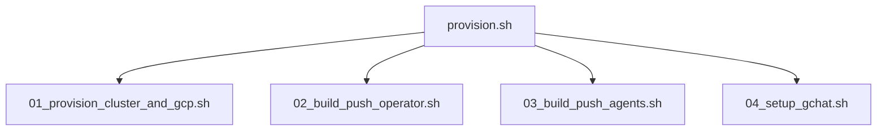
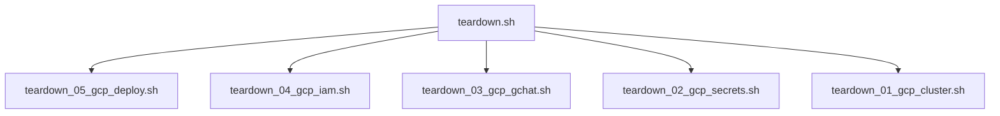

# Kubernetes Agentic Harness Operator

This directory contains the Kubernetes Operator for the `kube-agents` harness. The operator defines and manages the lifecycle of agent custom resources:

- **PlatformAgent**: Manages platform-level configuration and capabilities.
- **DevTeamAgent**: Manages developer-team-specific configurations and workspaces.
- **OperatorAgent**: Manages operational policies and task execution.

The operator is built using the Kubebuilder framework and is written in Go.

---

## Prerequisites

Before building or deploying the operator, ensure you have the following installed:

- [Go](https://go.dev/doc/install) (version 1.24+)
- [Docker](https://docs.docker.com/get-docker/) or Podman (for building container images)
- [kubectl](https://kubernetes.io/docs/tasks/tools/) (configured to access your Kubernetes/GKE cluster)
- Access to a running Kubernetes/GKE cluster
- [gcloud](https://cloud.google.com/sdk/docs/install) (for GKE cluster access)

---

## Bootstrapping GCP & GKE Infrastructure

To simplify development and testing in a real GKE/GCP environment, you can use the automated provisioning and teardown workflow. This infrastructure is fully modularized and idempotent.

### 1. The Provisioning Pipeline

To bootstrap GCP APIs, a GKE Standard cluster, Artifact Registry, Secrets, Google Chat Pub/Sub resources, build and push containers, and apply the Custom Resource (CR) in one command:

```bash
make provision
```

Or execute the master script directly from the scripts folder:

```bash
./scripts/provision.sh [--force-build] [--dry-run]
```

#### How it Works & Modular Sub-scripts

The master `provision.sh` script orchestrates four modular sub-scripts sequentially. Each sub-script is idempotent: it verifies the state of its resources before executing any action. If a resource already exists or a step was already completed, it is skipped.



1. **[01_provision_cluster_and_gcp.sh](file:///usr/local/google/home/mplakhtiy/repos/fork/kube-agents/k8s-operator/scripts/provision_01_cluster_and_gcp.sh)**:
   - Sets up configuration state (prompts for GCP Project ID, region, cluster name, GChat allowed user, default model configuration) and writes parameters to [scripts/vars.sh](file:///usr/local/google/home/mplakhtiy/repos/fork/kube-agents/k8s-operator/scripts/vars.sh).
   - Enables all necessary GCP Service APIs.
   - Creates a Google Artifact Registry docker repository.
   - Provisions a GKE Standard Cluster with Workload Identity.
   - Configures `kubectl` credentials and creates the target namespace.
   - Creates empty placeholders in GCP Secret Manager (e.g. `GEMINI_API_KEY`) if they do not exist.
   - Synchronizes secret keys to the GKE Namespace as Kubernetes Secrets (`platform-agent-secrets`).
   - Deploys the LiteLLM Gateway in the GKE cluster.

2. **[02_build_push_operator.sh](file:///usr/local/google/home/mplakhtiy/repos/fork/kube-agents/k8s-operator/scripts/provision_02_build_push_operator.sh)**:
   - Builds the operator controller manager Docker image via Google Cloud Build.
   - Pushes the image to Google Artifact Registry.

3. **[03_build_push_agents.sh](file:///usr/local/google/home/mplakhtiy/repos/fork/kube-agents/k8s-operator/scripts/provision_03_build_push_agents.sh)**:
   - Checks the required Hermes agent version from `tags.env`.
   - Builds the GChat Platform Agent gateway container via Google Cloud Build.
   - Pushes the image to Google Artifact Registry.

4. **[04_setup_gchat.sh](file:///usr/local/google/home/mplakhtiy/repos/fork/kube-agents/k8s-operator/scripts/provision_04_setup_gchat.sh)**:
   - Creates a Google Service Account (GSA) for the Platform Agent bot.
   - Creates the Pub/Sub Chat Event Topic and Subscriber Subscription.
   - Binds IAM policy permissions to the GSA (Pub/Sub subscription access, Vertex AI user, container viewer) and Google Chat APIs.
   - Registers operator CRDs onto the GKE cluster.
   - Generates [scripts/platform-agent.yaml](file:///usr/local/google/home/mplakhtiy/repos/fork/kube-agents/k8s-operator/scripts/platform-agent.yaml) from its template and applies the Custom Resource (CR) to deploy the Platform Agent.

---

### 2. The Teardown Pipeline

To cleanly tear down and delete all provisioned GCP and GKE resources:

```bash
make teardown
```

Or run the master teardown script directly:

```bash
./scripts/teardown.sh
```

#### Modular Teardown Sub-scripts



1. **[teardown_05_gcp_deploy.sh](file:///usr/local/google/home/mplakhtiy/repos/fork/kube-agents/k8s-operator/scripts/teardown_05_gcp_deploy.sh)**:
   - Deletes the applied `PlatformAgent` Custom Resource (safely handling finalizer blocks if they timeout).
   - Deletes the local generated `platform-agent.yaml` manifest.

2. **[teardown_04_gcp_iam.sh](file:///usr/local/google/home/mplakhtiy/repos/fork/kube-agents/k8s-operator/scripts/teardown_04_gcp_iam.sh)**:
   - Removes GSA project-level IAM bindings (`roles/aiplatform.user`, `roles/container.clusterViewer`) and GKE Workload Identity binding from the Agent GSA.

3. **[teardown_03_gcp_gchat.sh](file:///usr/local/google/home/mplakhtiy/repos/fork/kube-agents/k8s-operator/scripts/teardown_03_gcp_gchat.sh)**:
   - Deletes Google Chat Pub/Sub subscriptions, topics, and the agent bot GSA.

4. **[teardown_02_gcp_secrets.sh](file:///usr/local/google/home/mplakhtiy/repos/fork/kube-agents/k8s-operator/scripts/teardown_02_gcp_secrets.sh)**:
   - Deletes the GKE secret `platform-agent-secrets` and Google Secret Manager secrets (`GEMINI_API_KEY`).

5. **[teardown_01_gcp_cluster.sh](file:///usr/local/google/home/mplakhtiy/repos/fork/kube-agents/k8s-operator/scripts/teardown_01_gcp_cluster.sh)**:
   - Deletes the GKE Standard Cluster and local state files (`scripts/vars.sh`).

---

### 3. Sourcing Variables & Configuration State

On the first execution of `make provision` (or `provision_01_cluster_and_gcp.sh`), you will be prompted for target values. These are saved to **[scripts/vars.sh](file:///usr/local/google/home/mplakhtiy/repos/fork/kube-agents/k8s-operator/scripts/vars.sh)**.

Subsequent script runs will skip the interactive configuration and automatically load variables from `vars.sh`. To re-configure or customize settings, you can edit `vars.sh` directly or delete it to be prompted again.

---

### 4. Advanced Execution Options

- **Dry-Run Mode**: To print the actions that would be executed without modifying any cloud resources, pass `ARGS="--dry-run"`:
  ```bash
  make provision ARGS="--dry-run"
  ```
- **Force Rebuild**: To force rebuilding and pushing new container images even if they already exist in Google Artifact Registry, pass `ARGS="--force-build"`:
  ```bash
  make provision ARGS="--force-build"
  ```

---

### 5. Running Individual Steps with `make`

Each sub-step in the pipeline is standalone, idempotent, and automatically sources its configuration from `scripts/vars.sh`. Instead of running the entire pipeline or invoking scripts directly, you can execute individual steps using specialized `make` targets.

#### Provisioning Targets

You can execute individual provisioning steps in order:

1. **Step 1: Provision GKE & GCP Resources**
   ```bash
   make provision-gcp-cluster
   ```
2. **Step 2: Build & Push Operator Image** (supports `ARGS="--force-build"`)
   ```bash
   make provision-operator-image [ARGS="--force-build"]
   ```
3. **Step 3: Build & Push Agent Image** (supports `ARGS="--force-build"`)
   ```bash
   make provision-agent-image [ARGS="--force-build"]
   ```
4. **Step 4: Setup GChat & Apply Platform Agent CR**
   ```bash
   make provision-gchat
   ```

#### Teardown Targets

You can clean up specific layers of the deployment:

1. **Step 1: Tear Down GChat Bot & Integration Resources (Steps 5, 4, 3)**
   ```bash
   make teardown-gchat
   ```
2. **Step 2: Tear Down GKE Cluster, Secrets & Local State (Steps 2, 1)**
   ```bash
   make teardown-gcp-cluster
   ```

---

## Local Development (Fast Iteration)

For local development and testing, you can run the operator controller as a local Go process on your machine, while pointing it to a remote GKE or local Kubernetes cluster. This bypasses the need to build and push container images on every code change.

### Step 1: Set Active Kubernetes Context

Ensure your `kubectl` is pointed to the correct cluster:

```bash
# Check the active context
kubectl config current-context

# If needed, authenticate and switch to your GKE cluster
gcloud container clusters get-credentials <CLUSTER_NAME> --zone <ZONE> --project <PROJECT_ID>
```

### Step 2: Install the Custom Resource Definitions (CRDs)

Register the operator's Custom Resource Definitions (CRDs) with the cluster:

```bash
make install
```

> [!NOTE]
> This command uses `controller-gen` to generate the CRD manifests from Go structs and applies them to the cluster via `kustomize`.

### Step 3: Run the Operator Locally

Start the operator controller process. Because admission webhooks require TLS certificates (typically managed by cert-manager when running inside the cluster), you should run the operator locally with webhooks disabled by setting the `ENABLE_WEBHOOKS=false` environment variable:

```bash
ENABLE_WEBHOOKS=false make run
```

Or directly run the main entry point:

```bash
ENABLE_WEBHOOKS=false go run ./cmd/main.go
```

> [!TIP]
> This compiles and runs the entry point [main.go](file:///usr/local/google/home/fatoshoti/playground/kube-agents/k8s-operator/cmd/main.go) with webhooks disabled. The process runs in the foreground, prints reconciliation logs, and watches for custom resource events in the cluster.

### Step 4: Apply Sample Custom Resources

In another terminal window, apply the sample custom resources to test the controllers:

```bash
kubectl apply -f examples/platformagent.yaml
kubectl apply -f examples/clusteroperatoragent.yaml
kubectl apply -f examples/devteamagent.yaml
```

Verify that the resources are created and recognized:

```bash
kubectl get platformagents,operatoragent,devteamagent --all-namespaces
```

You should see reconciliation logs printed in the terminal where the operator process is running.

### Step 5: Clean Up Local Resources

To stop the operator, press `Ctrl+C` in the terminal where it is running.
To uninstall the CRDs from the cluster:

```bash
make uninstall
```

---

## Building and Deploying to GKE

When you are ready to deploy the operator as a deployment inside the cluster, use the following steps.

### Step 1: Build and Push the Docker Image

Build the container image and push it to a container registry (e.g., Google Artifact Registry) accessible by your GKE cluster.

#### 1. Authenticate Docker with the Registry

Before pushing, ensure your local Docker client is authenticated with Google Cloud's container registries. Run the command matching your registry domain:

```bash
# For Google Artifact Registry (recommended, e.g. us-central1 region)
gcloud auth configure-docker us-central1-docker.pkg.dev

# For Google Container Registry (legacy)
gcloud auth configure-docker gcr.io
```

#### 2. Build and Push

Set the image target URL and run the build/push targets:

```bash
# Replace with your actual registry and image tag
export IMG=us-central1-docker.pkg.dev/ai-platform-1-464114/k8s-harness-poc/kube-agents-operator:latest

# Build the image
make docker-build IMG=$IMG

# Push the image to the registry
make docker-push IMG=$IMG
```

### Step 2: Deploy the Operator Controller

Deploy the operator deployment, RBAC permissions, and CRDs into the cluster:

```bash
make deploy IMG=$IMG
```

### Step 3: Verify the Deployment

Check the status of the operator deployment:

```bash
kubectl get deployments -n kubeagents-system
kubectl get pods -n kubeagents-system
```

---

## Deploying LiteLLM Integration

LiteLLM gateway can be deployed to the Kubernetes cluster using the `kustomize` targets in the Makefile.

### Prerequisites

To successfully deploy LiteLLM, you must have:

1. The `platform-agent-secrets` Secret created in your destination namespace (containing `GEMINI_API_KEY`).

### Step-by-Step Deployment

Run the `make deploy-litellm` target, passing the required environment variables:

```bash
# 1. Define the destination namespace, model provider, and default model name:
export NAMESPACE=kubeagents-system
export MODEL_PROVIDER=gemini
export MODEL_DEFAULT_NAME=gemini-3.1-flash

# 2. Deploy LiteLLM:
make deploy-litellm
```

To uninstall/remove the LiteLLM integration:

```bash
make undeploy-litellm
```

---

## Deploying GitHub Integration

The GitHub Token Broker (Minty) can be deployed to the Kubernetes cluster using the `kustomize` targets in the Makefile.

### Prerequisites

Before deploying the GitHub integration, ensure you have:

1. Created the `github-app-credentials` Secret containing your GitHub App ID in the destination namespace.
2. Completed the Workload Identity and GCP Cloud KMS setup (see [integrations/github/README.md](integrations/github/README.md) for details).

### Step-by-Step Deployment

Run the `make deploy-github` target, passing the required environment variables:

```bash
# 1. Define the destination namespace and GCP/GitHub parameter variables:
export NAMESPACE=kubeagents-system
export PROJECT_ID=your-gcp-project-id
export REGION=your-gcp-region
export CLUSTER=your-gke-cluster-name
export KEYRING=your-kms-keyring
export KEY=your-kms-key
export KEY_VERSION=your-kms-key-version
export GITHUB_ORG=your-github-org
export GITHUB_REPO=your-github-repo

# 2. Deploy GitHub:
make deploy-github
```

To uninstall/remove the GitHub integration:

```bash
make undeploy-github
```

---

## Makefile Reference

The [Makefile](file:///usr/local/google/home/mplakhtiy/repos/fork/kube-agents/k8s-operator/Makefile) provides several targets to automate development workflows:

| Target                          | Description                                                               |
| :------------------------------ | :------------------------------------------------------------------------ |
| `make provision`                | Bootstraps all GCP, GKE resources, build/push images & deploys agent.     |
| `make provision-gcp-cluster`    | Step 1: Provisions GCP APIs, GKE cluster, Secret Manager & LiteLLM.       |
| `make provision-operator-image` | Step 2: Builds and pushes the operator image via Cloud Build.             |
| `make provision-agent-image`    | Step 3: Builds and pushes the platform agent image via Cloud Build.       |
| `make provision-gchat`          | Step 4: Configures GChat Pub/Sub, IAM policies, and applies agent CR.     |
| `make teardown`                 | Cleans up and deletes all provisioned GKE/GCP integration resources.      |
| `make teardown-gchat`           | Steps 5-3: Tears down PlatformAgent CR, GChat bot GSA, Pub/Sub topic/sub. |
| `make teardown-gcp-cluster`     | Steps 2-1: Tears down Secrets, GKE Cluster & local state.                 |
| `make manifests`                | Generates WebhookConfiguration, ClusterRole, and CRDs.                    |
| `make generate`                 | Generates code containing DeepCopy implementations.                       |
| `make fmt`                      | Formats Go source code using `go fmt`.                                    |
| `make vet`                      | Examines Go source code and reports suspect constructs.                   |
| `make test`                     | Runs unit/integration tests with `setup-envtest`.                         |
| `make build`                    | Compiles the manager binary to `bin/manager`.                             |
| `make run`                      | Runs the controller locally from your host (with webhooks disabled).      |
| `make docker-build`             | Builds the Docker image.                                                  |
| `make docker-push`              | Pushes the Docker image to the registry.                                  |
| `make install`                  | Installs the generated CRDs into the cluster.                             |
| `make uninstall`                | Removes the CRDs from the cluster.                                        |
| `make deploy`                   | Deploys the controller to the cluster.                                    |
| `make undeploy`                 | Removes the controller deployment from the cluster.                       |

---

## Key Files & Code Pointers

- **Main Entrypoint**: [main.go](file:///usr/local/google/home/mplakhtiy/repos/fork/kube-agents/k8s-operator/cmd/main.go)
- **Controllers**:
  - [PlatformAgent Controller](file:///usr/local/google/home/mplakhtiy/repos/fork/kube-agents/k8s-operator/internal/controller/platformagent_controller.go)
  - [DevTeamAgent Controller](file:///usr/local/google/home/mplakhtiy/repos/fork/kube-agents/k8s-operator/internal/controller/devteamagent_controller.go)
  - [OperatorAgent Controller](file:///usr/local/google/home/mplakhtiy/repos/fork/kube-agents/k8s-operator/internal/controller/operatoragent_controller.go)
- **Example Resource**: [platformagent.yaml](file:///usr/local/google/home/mplakhtiy/repos/fork/kube-agents/k8s-operator/examples/platformagent.yaml)
- **Makefile**: [Makefile](file:///usr/local/google/home/mplakhtiy/repos/fork/kube-agents/k8s-operator/Makefile)
