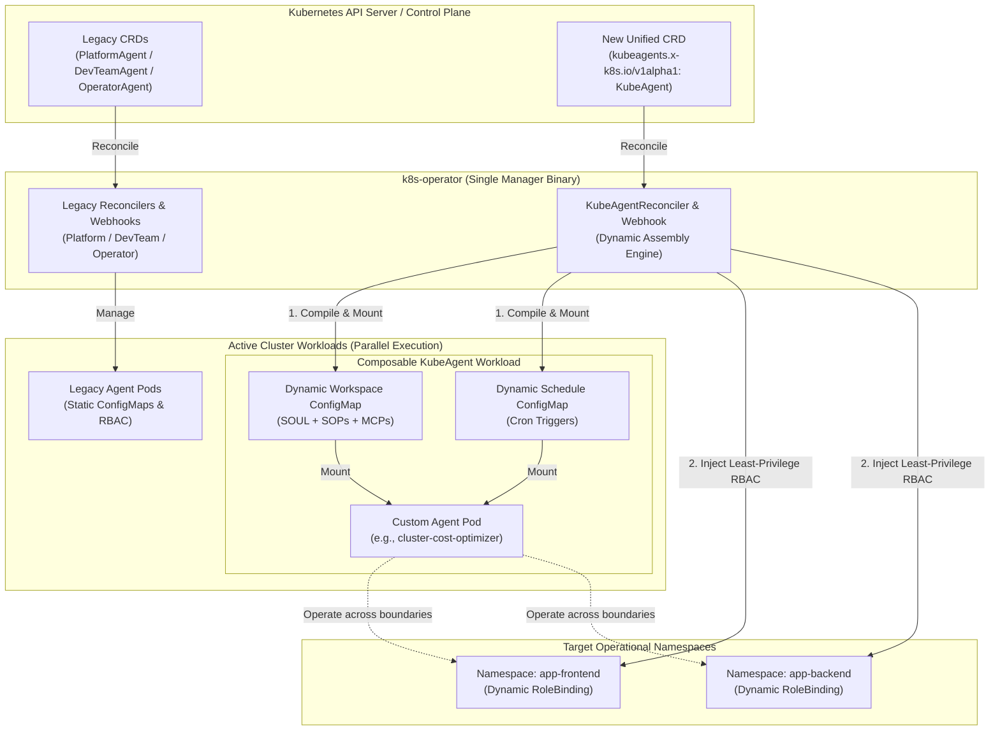
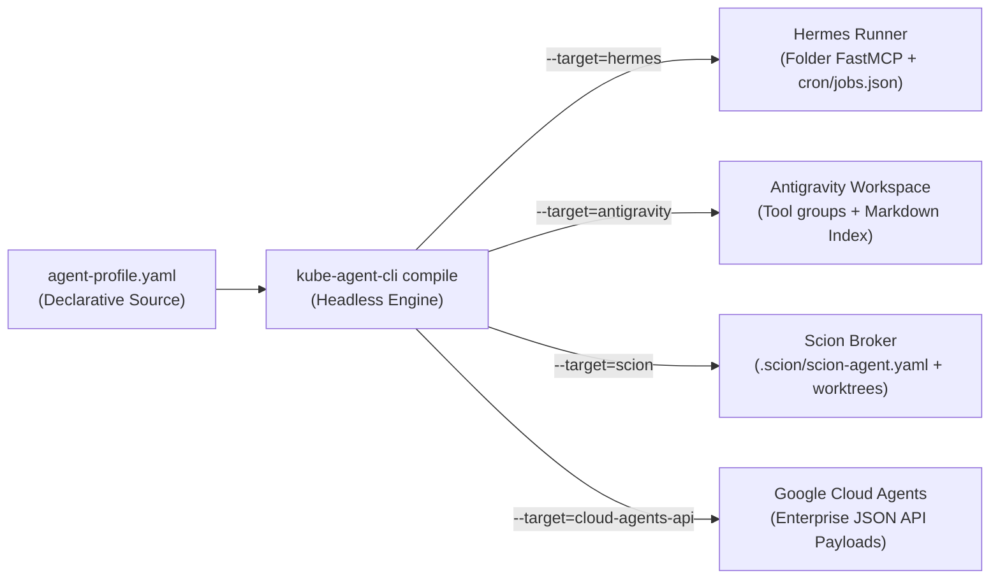

# GKE Agent Blueprints & Dynamic Assembly (DASP) Migration Roadmap

> [!IMPORTANT]
> **Core Operational Directive: Zero-Downtime Parallel Migration**
> This roadmap governs the architectural transition of the `kube-agents` repository from a rigid three-role layout (`PlatformAgent`, `DevTeamAgent`, `OperatorAgent`) to a fully composable **Dynamic Assembly Specification (DASP)** centered around a single unified **`KubeAgent` CRD**.
>
> Throughout Phases 1 through 4, **all existing code, CRDs, controllers, webhooks, and agent directories must remain untouched and fully operational**. New capabilities are introduced strictly in parallel. Deprecation and removal of legacy infrastructure occur exclusively in Phase 5 after comprehensive verification and cutover.

---

## 1. Executive Summary & Strategic Objectives

The target architecture transforms `kube-agents` into a dynamic, composable multi-agent operating system for Kubernetes and GKE. By decoupling agent identities, capabilities, and governance into discrete modular building blocks—**Personas**, **Skills**, **Procedures**, and **Schedules**—administrators can dynamically assemble specialized operational agents on-the-fly.

### Why Collapse into a Single `KubeAgent` CRD?

In the legacy architecture, agent roles were hardcoded into separate Kubernetes Custom Resource Definitions (`PlatformAgent`, `DevTeamAgent`, and `OperatorAgent`) and separate controller reconciliation loops. Under the DASP model:

- **Role is defined by Composition**: An agent's behavior, tone, and operational boundaries are determined entirely by the attached Persona archetype, selected Skills, and assigned Standard Operating Procedures (SOPs).
- **Single Reconciler Loop**: Maintaining separate Custom Resources is redundant. Collapsing all agent types into a single `KubeAgent` CRD simplifies the Go operator, unifies ConfigMap and Secret assembly, and streamlines multi-namespace RBAC injection.
- **Standalone & Composable**: Any custom agent profile (e.g., `frugal-cost-optimizer`, `paranoid-security-auditor`, or `platform-orchestrator`) can be deployed as an autonomous, self-contained workload without depending on a monolithic centralized gateway or platform cluster.
- **API Group Continuity (`kubeagents.x-k8s.io`)**: The unified `KubeAgent` CRD is permanently introduced under the existing `kubeagents.x-k8s.io/v1alpha1` API group alongside legacy types. This maintains full continuity with existing operator tooling, RBAC configurations, and generated scheme builders without multi-group complexity.

### Composable Workflow Run Modes (`spec.workflowMode`)

To accommodate varying governance and deployment requirements across different environments, `KubeAgent` supports three distinct operational workflow modes:

- **`Direct` Mode**: The agent mutates cluster state directly via the Kubernetes API using its bound least-privilege `ServiceAccount` credentials without human intervention.
- **`GitOps` Mode**: The agent never mutates the cluster API directly; instead, it generates git branches and pull requests against the target repository (configured in `spec.integration.github.gitRepo`), deferring deployment to GitOps controllers (e.g., ArgoCD, Flux).
- **`Hybrid` Mode**: The agent proposes changes and enters a gating state (e.g., reporting `WAITING_FOR_APPROVAL` in `.gemini-status.json` or emitting Kubernetes Events), requiring human verification via `kube-agent-cli approve` before applying direct mutations or merging PRs.

---

## 2. Comparative Architecture Analysis

| Architectural Dimension           | Legacy Architecture (Current State)                                                                                                                  | Target DASP Architecture (`KubeAgent`)                                                                                                                                                                                              | Parallel Migration Strategy                                                                                                                       |
| :-------------------------------- | :--------------------------------------------------------------------------------------------------------------------------------------------------- | :---------------------------------------------------------------------------------------------------------------------------------------------------------------------------------------------------------------------------------- | :------------------------------------------------------------------------------------------------------------------------------------------------ |
| **Kubernetes CRDs**               | 3 distinct CRDs (`PlatformAgent`, `DevTeamAgent`, `OperatorAgent`) in `k8s-operator/api/v1alpha1/`.                                                  | 1 unified CRD (`KubeAgent`) in `kubeagents.x-k8s.io/v1alpha1` supporting modular `personaRef`, `skills`, `procedures`, `schedules`, `namespaces`, `model`, `workflowMode`, `harness`, and `integration`.                            | Add `kubeagent_types.go` and generate new CRD manifests alongside existing types without modifying legacy files.                                  |
| **Go Operator Reconcilers**       | 3 separate controllers (`*agent_controller.go`) with duplicated manifest building logic.                                                             | 1 unified `KubeAgentReconciler` with dynamic assembly engine, multi-namespace RBAC injection, and finalizer cleanup.                                                                                                                | Add `kubeagent_controller.go` and `kubeagent_manifests.go` (reusing `manifest_helpers.go` and `remote_client.go`), and register in `cmd/main.go`. |
| **Admission Webhooks**            | 3 separate webhooks (`*agent_webhook.go`) enforcing strict cardinality (1 operator per cluster, 1 platform per project, 1 devteam per namespace).    | 1 unified `KubeAgent` webhook (`kubeagent_webhook.go`) without any agent quantity or cardinality enforcement. It only reuses existing valid syntax, schema, and parameter checks, enabling unlimited specialized standalone agents. | Add `kubeagent_webhook.go` and register `SetupKubeAgentWebhookWithManager` in `cmd/main.go` without altering legacy webhooks.                     |
| **Repository Layout (`agents/`)** | Siloed folders (`agents/platform/`, `agents/devteam/`, `agents/operator/`, and `agents/shared/`), trapping scripts and SOPs inside role hierarchies. | Universal root building blocks: `personas/`, `skills/` (with `mcp_servers/` and `scripts/`), `procedures/`, `schedules/`, and `templates/`.                                                                                         | Create root directories from scratch; copy and refactor reusable assets into root blocks while leaving all `agents/*` folders intact.             |
| **Assembly & Tooling**            | No interactive assembly CLI or headless transpiler; reliance on static YAML overlays.                                                                | Go-based Bubble Tea TUI Studio (`cli/`) for interactive assembly, status approval, and headless multi-target compilation.                                                                                                           | Build `cli/` as an independent module with its own binary (`kube-agent-cli`) and container multi-stage build targets.                             |
| **Workload RBAC & Scope**         | Static cluster-wide or single-namespace service account bindings.                                                                                    | Dynamic Multi-Namespace RBAC: Reconciler automatically provisions a `ServiceAccount`, `Role`, and `RoleBinding` across all namespaces listed in `spec.namespaces`.                                                                  | Implemented cleanly within `KubeAgentReconciler` without affecting legacy RBAC generation.                                                        |
| **Pre-flight Screening**          | No pre-flight gating; LLM wakes up on every cron schedule, consuming API tokens even when cluster state is unchanged.                                | Fast, non-cognitive pre-flight screening scripts (`preflight.sh`) executed by the container cron engine before waking the LLM.                                                                                                      | Embed pre-flight hooks in root skill scripts and implement hook checking in the container runtime wrapper.                                        |

---

## 3. Target Repository Layout & Taxonomy

To support headless compilation and clear separation of concerns, the repository structure will expand to include the following modular directories:

```text
kube-agents/
├── k8s-operator/               # Kubernetes Operator (Kubebuilder)
│   ├── api/v1alpha1/           # Adds kubeagent_types.go alongside legacy types
│   ├── internal/controller/    # Adds kubeagent_controller.go & kubeagent_manifests.go
│   └── internal/webhook/       # Adds kubeagent_webhook.go & kubeagent_webhook_test.go
├── cli/                        # [NEW] Go-based CLI/TUI Agent Builder (Bubble Tea)
│   ├── main.go                 # Entrypoint for kube-agent-cli
│   ├── pkg/tui/                # Interactive terminal studio & approval wizard
│   └── pkg/compiler/           # Headless DASP transpiler & remote git resolver
├── personas/                   # [NEW] Reusable SOUL.md & IDENTITY.md archetypes
│   ├── standard-operator/      # Calm, analytical infrastructure auditor
│   ├── paranoid-security/      # Strict RBAC & network boundary scanner
│   └── frugal-optimizer/       # Resource right-sizing and waste mitigation expert
├── skills/                     # [EXPANDED] Universal composable tools & MCP servers
│   ├── common/                 # Shared utilities (migrated from agents/shared/defaults/)
│   │   └── scripts/            # Contains agent_common_server.py and shared helpers
│   ├── gke-cost-analysis/
│   │   ├── mcp_servers/        # Python FastMCP server implementations
│   │   └── scripts/            # Bash/Python standalone scripts (including preflight.sh)
│   ├── gke-workload-security/
│   ├── gke-observability/
│   └── kube-agents-observability/ # Migrated from agents/shared/skills/
├── procedures/                 # [NEW] Root-level Standard Operating Procedures (SOPs)
│   ├── cve_scan_sop.md
│   ├── compliance_audit_sop.md
│   └── weekly_cost_report_sop.md
├── schedules/                  # [NEW] Reusable cron triggers & prompt loops (YAML)
│   ├── weekly-cost-audit.yaml
│   └── compliance-check.yaml
├── templates/                  # [NEW] Seed DASP agent-profile.yaml blueprints
│   ├── platform/
│   ├── operator/
│   └── devteam/
└── agents/                     # [LEGACY] Preserved during Phases 1-4 for parallel operation
    ├── platform/
    ├── devteam/
    ├── operator/
    └── shared/                 # [LEGACY] Shared skills and default scripts
```

---

## 4. Parallel Migration Architecture & Co-existence Model

During Phases 1 through 4, the Kubernetes control plane operates with **Dual Reconciler Co-existence**. The diagram below illustrates how existing workloads continue functioning seamlessly while new composable `KubeAgent` workloads are provisioned and dynamically bound across namespaces.



### Resource Naming & Cardinality Collision Prevention

During Phases 1 through 4, legacy agents and new `KubeAgent` resources operate concurrently in the same cluster. To prevent resource collisions during parallel testing:

1. **ConfigMap Separation**: `KubeAgentReconciler` generates ConfigMaps named `<agent-name>-workspace-config` and `<agent-name>-schedule-config` (instead of legacy `<agent-name>-config` and `<agent-name>-cron-config`), completely eliminating naming overlap even if agent names are similar.
2. **Workload Metadata Naming**: When testing a `KubeAgent` in a namespace where a legacy agent is actively running (e.g., `agent-system`), administrators must use a distinct `metadata.name` (e.g., `cluster-cost-optimizer` or `kube-operator-v2` instead of `operator-agent`) to prevent Kubernetes Deployment, Service, and PVC name collisions.
3. **No Agent Quantity Enforcement**: Because `KubeAgent` represents composable, specialized operational profiles rather than monolithic cluster-wide roles, the new admission webhook (`kubeagent_webhook.go`) enforces no limits on the number of agent instances. Unlike legacy webhooks which enforced strict cardinality (e.g., 1 `OperatorAgent` per cluster or 1 `PlatformAgent` per project via GCS locks), `KubeAgent` only reuses existing valid syntax, parameter, and reference checks.

---

## 5. Detailed Phase-by-Phase Roadmap

### Phase 1: Repository Restructuring & Modular Building Block Foundation

**Objective**: Establish the root-level modular directories (`personas/`, `procedures/`, `schedules/`, `templates/`) and consolidate shared skills into `skills/` without modifying or deleting any files inside legacy `agents/` directories.

#### Step-by-Step Execution Tasks:

1. **Establish Persona Archetypes (`personas/`)**:
   - Create root directory `personas/`.
   - Extract and generalize identity traits from legacy files (`agents/operator/SOUL.md` & `IDENTITY.md`, `agents/platform/SOUL.md` & `ROUTING.md`, `agents/devteam/SOUL.md` & `IDENTITY.md`) into modular archetypes:
     - `personas/standard-operator/SOUL.md` & `IDENTITY.md`
     - `personas/paranoid-security-auditor/SOUL.md` & `IDENTITY.md`
     - `personas/frugal-cost-optimizer/SOUL.md` & `IDENTITY.md`
2. **Establish Root Standard Operating Procedures (`procedures/`)**:
   - Create root directory `procedures/`.
   - Copy and standardize existing governance and operational guides into universal SOP markdown documents:
     - Copy `agents/operator/procedures/cve_scan_sop.md` $\rightarrow$ `procedures/cve_scan_sop.md`
     - Copy `agents/operator/procedures/weekly_cost_report_sop.md` $\rightarrow$ `procedures/weekly_cost_report_sop.md`
     - Copy `agents/devteam/procedures/deployment_failure_resolver_sop.md` $\rightarrow$ `procedures/deployment_failure_resolver_sop.md`
     - Copy ALL 9 governance SOPs from `agents/platform/governance/` (`compliance_audit_sop.md`, `blueprint_sync_sop.md`, `fleet_wide_cost_analysis_sop.md`, `global_capacity_orchestrator_sop.md`, `lifecycle_deprecation_manager_sop.md`, `obtainability_audit_sop.md`, `policy_propagation_sop.md`, `security_patch_orchestrator_sop.md`, `standardization_validator_sop.md`) $\rightarrow$ `procedures/`.
3. **Expand Composable Skills (`skills/`)**:
   - Copy `agents/shared/skills/kube-agents-observability/` $\rightarrow$ `skills/kube-agents-observability/` (leaving the legacy directory untouched during Phases 1–4 to preserve zero-downtime co-existence).
   - Copy `agents/shared/defaults/scripts/agent_common_server.py` $\rightarrow$ `skills/common/scripts/agent_common_server.py` so that MCP servers can continue importing shared utilities.
   - Reorganize and consolidate root `skills/` directories (e.g., `skills/gke-workload-security/`, `skills/gke-cost-analysis/`, `skills/gke-observability/`), deduplicating skills that were previously copied across both `devteam/` and `operator/`:
     - `mcp_servers/`: Place Python FastMCP scripts (e.g., copying `agents/platform/scripts/platform_mcp_server.py` $\rightarrow$ `skills/gke-cluster-creator/mcp_servers/cluster_mcp_server.py`).
     - `scripts/`: Place standalone utility and bash auditing scripts (e.g., copying `agents/devteam/skills/gke-workload-security/scripts/audit_cluster.sh` $\rightarrow$ `skills/gke-workload-security/scripts/audit_cluster.sh`).
4. **Create Seed DASP Blueprints (`templates/`)**:
   - Create declarative `agent-profile.yaml` manifests under `templates/platform/`, `templates/operator/`, and `templates/devteam/` illustrating the Polymorphic Reference Model.
5. **PR Hygiene & Validation**:
   - Run `npx prettier --check .` to ensure all newly created YAML, JSON, and Markdown files conform to project formatting rules.
   - Verify zero diffs or mutations inside legacy `agents/`, `k8s-operator/`, or `deploy/` paths.

---

### Phase 2: Go Operator Expansion - The Unified `KubeAgent` CRD

**Objective**: Implement the unified `KubeAgent` Custom Resource Definition, its dynamic assembly reconciler, and its admission webhook in `k8s-operator/` running concurrently with legacy controllers.

#### Step-by-Step Execution Tasks:

1. **Define API Schema (`k8s-operator/api/v1alpha1/kubeagent_types.go`)**:
   - Create `kubeagent_types.go` in package `v1alpha1` (`kubeagents.x-k8s.io`) defining `KubeAgentSpec`, `KubeAgentStatus`, `KubeAgentList`, and supporting polymorphic reference structs:

     ```go
     type PersonaReference struct {
         Name    string `json:"name,omitempty"`
         Ref     string `json:"ref,omitempty"`
         Content string `json:"content,omitempty"`
     }

     type SkillReference struct {
         Name       string   `json:"name"`
         Ref        string   `json:"ref,omitempty"`
         MCPServers []string `json:"mcpServers,omitempty"`
         Scripts    []string `json:"scripts,omitempty"`
     }

     type ProcedureReference struct {
         Name    string `json:"name"`
         Ref     string `json:"ref,omitempty"`
         Content string `json:"content,omitempty"`
     }

     type ScheduleReference struct {
         Name          string `json:"name"`
         Cron          string `json:"cron,omitempty"`
         TriggerPrompt string `json:"triggerPrompt,omitempty"`
         Ref           string `json:"ref,omitempty"`
     }

     type ModelSpec struct {
         Provider string `json:"provider,omitempty"`
         Default  string `json:"default,omitempty"`
     }

     type KubeAgentIntegrationSpec struct {
         IntegrationSpec `json:",inline"`
         GoogleChat      *GoogleChatSpec `json:"googleChat,omitempty"`
     }

     type KubeAgentSpec struct {
         AgentSpec    `json:",inline"`
         Harness      *HarnessSpec              `json:"harness,omitempty"`
         Integration  *KubeAgentIntegrationSpec `json:"integration,omitempty"`
         PersonaRef   *PersonaReference         `json:"personaRef,omitempty"`
         Skills       []SkillReference          `json:"skills,omitempty"`
         Procedures   []ProcedureReference      `json:"procedures,omitempty"`
         Schedules    []ScheduleReference       `json:"schedules,omitempty"`
         Namespaces   []string                  `json:"namespaces,omitempty"`
         Model        *ModelSpec                `json:"model,omitempty"`
         WorkflowMode string                    `json:"workflowMode,omitempty"` // GitOps, Direct, Hybrid
         ProfileRef   string                    `json:"profileRef,omitempty"`
     }

     type KubeAgentStatus struct {
         AgentStatus `json:",inline"`
     }

     // +kubebuilder:object:root=true
     // +kubebuilder:subresource:status
     // +kubebuilder:resource:scope=Namespaced
     // +kubebuilder:printcolumn:name="Phase",type=string,JSONPath=`.status.phase`
     // +kubebuilder:printcolumn:name="Address",type=string,JSONPath=`.status.address`
     // +kubebuilder:printcolumn:name="Age",type="date",JSONPath=".metadata.creationTimestamp"

     type KubeAgent struct {
         metav1.TypeMeta   `json:",inline"`
         metav1.ObjectMeta `json:"metadata,omitempty"`

         Spec   KubeAgentSpec   `json:"spec"`
         Status KubeAgentStatus `json:"status,omitempty"`
     }

     // +kubebuilder:object:root=true

     type KubeAgentList struct {
         metav1.TypeMeta `json:",inline"`
         metav1.ListMeta `json:"metadata,omitempty"`
         Items           []KubeAgent `json:"items"`
     }
     ```

2. **Generate CRD Base Manifests & Deepcopy**:
   - Run `make generate` and `make manifests` within `k8s-operator/`.
   - Verify generation of `k8s-operator/config/crd/bases/kubeagents.x-k8s.io_kubeagents.yaml` and updates to `zz_generated.deepcopy.go`.
   - Register the new CRD in Kustomize by adding `- bases/kubeagents.x-k8s.io_kubeagents.yaml` to `k8s-operator/config/crd/kustomization.yaml`.
3. **Implement Dynamic Assembly Reconciler (`internal/controller/kubeagent_controller.go` & `kubeagent_manifests.go`)**:
   - Implement `KubeAgentReconciler.Reconcile()` with dynamic manifest compilation, reusing shared logic in `manifest_helpers.go` and `remote_client.go`:
     - **Finalizer & Deletion Interception**: Add finalizer `kubeagents.x-k8s.io/finalizer`. Implement `handleDeletion` to cleanly remove cluster-scoped resources (`ClusterRoleBinding`, `ClusterRole`, or remote cluster bindings) upon agent deletion.
     - **ServiceAccount, PVC, & Service Reconciliation**: Reconcile the `ServiceAccount` (injecting Workload Identity annotations from `spec.security.serviceAccountAnnotations`), the `PersistentVolumeClaim` for `/opt/data` storage, and the Kubernetes `Service` for communication/endpoints.
     - **ConfigMap & Fluent Bit Synthesis**: Merge referenced or inlined `SOUL.md`, `IDENTITY.md`, procedure SOPs, and skill scripts into `<agent-name>-workspace-config` and `<agent-name>-schedule-config` ConfigMaps. Dynamically generate `SETTINGS.md` from `spec.harness` (cluster, location, and namespace context) and `spec.integration` (git repo), and populate `config.yaml` by injecting selected MCP servers and script execution paths from resolved `spec.skills`. Reconcile Fluent Bit and Settings ConfigMaps as required by the runtime.
     - **Multi-Namespace RBAC Injection**: Iterate over `spec.namespaces`. For each target namespace, dynamically reconcile a `Role` and `RoleBinding` granting least-privilege access to the agent's `ServiceAccount`. If `spec.namespaces` contains `*` or cluster-wide scope is declared, reconcile a `ClusterRoleBinding`. If `spec.harness.clusterName` and `spec.harness.projectId` are specified for remote execution, leverage `remote_client.go` to connect via Workload Identity and apply these `Role`, `RoleBinding`, or `ClusterRoleBinding` resources on the remote target cluster rather than the local control-plane cluster.
     - **Deployment Reconciler**: Build and update the Kubernetes Deployment, mounting the assembled ConfigMaps into `/opt/data/workspace` and setting environment variables (`WORKFLOW_MODE`, `MODEL_PROVIDER`, `MODEL_DEFAULT`).
4. **Implement Admission Webhook (`internal/webhook/kubeagent_webhook.go`)**:
   - Create `kubeagent_webhook.go` and `kubeagent_webhook_test.go` implementing `admission.CustomValidator` and `admission.CustomDefaulter` for `KubeAgent`.
   - Enforce modular validation rules (reusing existing valid syntax, parameter, and schema checks) without any agent quantity or cardinality enforcement, allowing unlimited standalone composable agents to coexist.
5. **Register Controller & Webhook in Manager (`k8s-operator/cmd/main.go`)**:
   - Register `&controller.KubeAgentReconciler{Client: mgr.GetClient(), Scheme: mgr.GetScheme()}` in `main.go` alongside legacy controllers.
   - Register `agentwebhook.SetupKubeAgentWebhookWithManager(mgr)` inside the `ENABLE_WEBHOOKS` block alongside legacy webhooks.
6. **Testing & Verification**:
   - Add unit tests in `internal/controller/kubeagent_manifests_test.go` and golden file integration tests in `testing/golden_test.go` ensuring `KubeAgent` reconciliation produces exact expected ConfigMap, RoleBinding, and Deployment specifications without altering legacy test results.

---

### Phase 3: Interactive CLI/TUI Studio & Headless DASP Transpiler Engine

**Objective**: Construct the `cli/` package (`kube-agent-cli`) featuring a terminal UI wizard (Bubble Tea) for interactive assembly and a deterministic headless transpiler for CI/CD pipelines and multi-harness target generation.

#### Step-by-Step Execution Tasks:

1. **Scaffold CLI Project (`cli/`)**:
   - Initialize Go module structure under `cli/` with `cmd/main.go` using `spf13/cobra` for subcommand routing (`studio`, `compile`, `approve`).
2. **Build Interactive TUI Studio (`cli/pkg/tui/`)**:
   - Implement Bubble Tea model (`tea.Model`) with Lipgloss styling:
     - **Section 1**: Persona archetype selector scanning `personas/` in real-time.
     - **Section 2**: Interactive multi-select checklist scanning `skills/`.
     - **Section 3**: Target scope input (comma-separated namespaces) and procedure selector scanning `procedures/`.
     - **Section 4**: Workflow mode selector (`Hybrid`, `GitOps`, `Direct`).
   - Add **One-Click Deployment Hub**: Upon pressing `[Enter]`, compile the selected components into an in-memory `KubeAgent` YAML manifest (importing `k8s-operator/api/v1alpha1` for type safety) and execute `client-go` apply against the active Kubeconfig context.
3. **Implement Status Monitor & Approver (`kube-agent-cli approve <agent-name>`)**:
   - Build an interactive approver command that watches target agent Pods for `.gemini-status.json` reporting `WAITING_FOR_APPROVAL` or watches Kubernetes Event logs.
   - Present a rich diff-preview in the terminal and allow the SRE to approve or reject direct cluster mutations with a single keystroke.
4. **Implement Headless DASP Transpiler (`cli/pkg/compiler/`)**:
   - Define Go schema types representing `agent-profile.yaml` and build `kube-agent-cli compile --profile <path> --output <dir> --target <harness>`:
     - **Polymorphic Resolver**: Parse `agent-profile.yaml`, resolve relative file references (`ref: "./personas/..."`), and inline content blocks.
     - **Remote Git Registry Caching Engine**:
       - Detect remote URIs (e.g., `github.com/google/skills/cloud/gke-security-scans@v1.4.0`).
       - Use `go-git` to clone version-locked tags/branches into local cache directory `~/.kube-agents/cache/`.
       - Verify file integrity against `skills-lock.json` checksums before extraction.
     - **Multi-Harness Target Transpiler**:



5. **Testing & Verification**:
   - Create comprehensive unit tests verifying DASP schema parsing, remote git caching mock servers, and deterministic file generation across all four runtime harness targets.

---

### Phase 4: Pre-flight Screening Hooks & Parallel Integration Testing

**Objective**: Implement non-cognitive pre-flight screening scripts to eliminate unnecessary LLM waking costs, establish container pre-bake execution vectors, and validate the system via side-by-side parallel deployment in test clusters.

#### Step-by-Step Execution Tasks:

1. **Standardize Pre-flight Screening Protocol**:
   - Define execution contract for pre-flight scripts:
     - **Exit Code `0`**: Cluster state is synchronized or no anomaly detected. Silent exit; container cron runner terminates without initializing the cognitive LLM client.
     - **Exit Code `1` (or non-zero)**: Drift, anomaly, or optimization opportunity detected. Script prints structured metrics to `stdout` (`OVERPROVISIONING_METRICS: ...`), triggering the container cron runner to wake the LLM and pass the stdout payload into the initial prompt context.
2. **Author Reference Pre-flight Hooks (`skills/*/scripts/preflight.sh`)**:
   - Create `skills/gke-cost-analysis/scripts/preflight.sh`: Fast bash script utilizing `kubectl get deployment,hpa,node` and `jq` to calculate resource requests vs. utilization drift without LLM overhead.
   - Create `skills/gke-workload-security/scripts/preflight.sh`: Fast scanner checking for pods missing `NetworkPolicy` bounds or running with privileged security contexts.
3. **Implement Docker Pre-Bake Execution Vector (`deploy/docker/`)**:
   - Add multi-stage Dockerfile targets in `deploy/docker/Dockerfile` (e.g., `kubeagent` or `dasp-agent`) that build `kube-agent-cli`, copy seed DASP manifests, and execute `kube-agent-cli compile` headlessly to create immutable, pre-compiled agent container images.
4. **Parallel Integration Walkthroughs (`docs/m2-dasp-migration-demos.md`)**:
   - Author detailed SRE walkthrough documentation demonstrating side-by-side operation in a Kind or GKE cluster:
     - Deploy legacy `PlatformAgent` in `agent-system`.
     - Deploy composable `KubeAgent` (`frugal-cost-optimizer`) in `agent-system` targeting `app-frontend` and `app-backend` namespaces using a distinct metadata name to prevent resource collision.
     - Verify both operators reconcile independently without RBAC or CRD collision.
     - Demonstrate TUI approval (`kube-agent-cli approve frugal-cost-optimizer`) in Hybrid workflow mode.

---

### Phase 5: Cutover, Deprecation & Legacy Code Cleanup (Final Phase)

**Objective**: Decommission the legacy three-role architecture, remove deprecated CRDs, controllers, and webhooks, and establish `KubeAgent` as the exclusive operational standard. **This phase is executed only after all production workflows and CI/CD pipelines have cut over.**

#### Step-by-Step Execution Tasks:

1. **Documentation & Deployment Template Cutover**:
   - Update `README.md`, `INSTALL.md`, and `GKE_SETUP.md` to reference `KubeAgent` and `kube-agent-cli` studio as the primary onboarding path.
   - Refactor Kustomize overlays in `deploy/kustomize/` (`devteam`, `operator`, `platform`) and any Helm charts to deploy `KubeAgent` custom resources by default.
2. **Decommission Legacy Controllers, Webhooks & Types (`k8s-operator/`)**:
   - Remove legacy API type definitions: `platformagent_types.go`, `devteamagent_types.go`, `operatoragent_types.go` from `api/v1alpha1/`.
   - Remove legacy controllers and manifest builders: `platformagent_controller.go`, `platformagent_manifests.go`, `devteamagent_controller.go`, `devteamagent_manifests.go`, `operatoragent_controller.go`, `operatoragent_manifests.go` from `internal/controller/`.
   - Remove legacy webhooks and tests: `platformagent_webhook.go`, `platformagent_webhook_test.go`, `operatoragent_webhook.go`, `operatoragent_webhook_test.go`, `devteamagent_webhook.go`, `devteamagent_webhook_test.go` from `internal/webhook/`.
   - Remove legacy CRD base YAMLs from `config/crd/bases/` and remove their entries from `config/crd/kustomization.yaml`.
   - Unregister legacy controllers and webhooks in `cmd/main.go`.
   - Run `make generate` and `make manifests` to purge legacy references from generated code and Kustomize overlays.
3. **Decommission Legacy Agent Directories (`agents/`)**:
   - Delete legacy siloed directories: `agents/platform/`, `agents/devteam/`, `agents/operator/`, and `agents/shared/`.
   - Retain only the clean root-level modular taxonomy: `personas/`, `skills/`, `procedures/`, `schedules/`, `templates/`, and `cli/`.
   - Update root `Makefile` skill path validation (`BAD_SKILLS`) to validate against the new root `/skills/` directory structure instead of legacy `agents/*/defaults/skills/*`.
4. **Refactor Dockerfile (`deploy/docker/Dockerfile`)**:
   - Remove the legacy `devteam`, `operator`, and `platform` multi-stage build targets (which depend on the deleted `agents/*` directories) and replace them with unified DASP compilation targets using `kube-agent-cli compile`.
5. **Final Verification & Repository Scrub**:
   - Execute full test suites across all components:
     - Run `npx prettier --check .` for documentation and schema formatting.
     - Run `make test` and `make lint` inside `k8s-operator/`.
     - Run `go test ./...` inside `cli/`.
     - Build all Docker image targets to ensure zero broken dependencies or dangling references.

---

## 6. Technical Specifications & Reference Snippets

### A. Unified `KubeAgent` Custom Resource Manifest (Hybrid Mode Example)

```yaml
apiVersion: kubeagents.x-k8s.io/v1alpha1 # Standardized on existing API group for continuity
kind: KubeAgent
metadata:
  name: cluster-cost-optimizer
  namespace: agent-system
spec:
  # 1. Harness & Integration Settings (Optional, inherits cluster defaults)
  harness:
    clusterName: "gke-production-us-central1"
    location: "us-central1"
    projectId: "enterprise-gke-ops"

  # 2. Base Identity Archetype
  personaRef:
    name: frugal-cost-optimizer
    ref: "./personas/frugal-cost-optimizer/SOUL.md"

  # 3. Selectable Operational Capabilities (Local & Remote Git)
  skills:
    - name: gke-cost-analysis
      ref: "./skills/gke-cost-analysis"
    - name: gke-cloud-security
      ref: "github.com/google/skills/cloud/gke-security-scans@v1.4.0"

  # 4. Attached Governance Procedures
  procedures:
    - name: weekly_cost_report_sop.md
      ref: "./procedures/weekly_cost_report_sop.md"

  # 5. Target Operational Boundaries (Dynamic RBAC Injection)
  namespaces:
    - "app-frontend"
    - "app-backend"
    - "staging-cluster-scoped"

  # 6. Model Provider & Tier Configuration
  model:
    provider: "gemini"
    default: "gemini-1.5-pro"

  # 7. Operational Run Mode
  workflowMode: "Hybrid" # Supports: GitOps, Direct, Hybrid
```

### B. Pre-flight Screening Script Protocol (`skills/gke-cost-analysis/scripts/preflight.sh`)

```bash
#!/usr/bin/env bash
# Pre-flight Screening Hook: skills/gke-cost-analysis/scripts/preflight.sh
# Protocol: Exit 0 = Silent termination (No LLM wake); Exit 1 = Wake LLM with stdout payload

set -euo pipefail

TARGET_NS="${1:-default}"

# Perform rapid, non-cognitive checks using kubectl and jq
OVERPROVISIONED_CPU=$(kubectl get pods -n "$TARGET_NS" -o json | jq -r '
  [.items[] | .spec.containers[] | select(.resources.requests.cpu != null) |
  ( .resources.requests.cpu | ltrimstr("0.") | tonumber )] | add // 0
')

# Threshold check (e.g., alert if requested CPU units exceed idle baseline)
if [ "$OVERPROVISIONED_CPU" -lt 5000 ]; then
  # Cluster resource allocation is within optimal parameters. Exit silently.
  exit 0
else
  # Waste detected! Emit metrics payload to stdout and exit 1 to wake cognitive agent.
  echo "OVERPROVISIONING_METRICS: Detected ${OVERPROVISIONED_CPU}m CPU requested without corresponding load."
  echo "RECOMMENDED_ACTION: Initiate cognitive evaluation of HorizontalPodAutoscaler targets in namespace ${TARGET_NS}."
  exit 1
fi
```

---

## 7. Verification & Pull Request Hygiene Checklist

To prevent CI failures and ensure strict adherence to repository guidelines during parallel migration, every PR across Phases 1 through 5 must satisfy the following checks before submission:

- [ ] **Scope Integrity**: Ensure PR changes are strictly additive during Phases 1–4. Never modify or delete legacy `PlatformAgent`, `DevTeamAgent`, `OperatorAgent`, or `shared` code until Phase 5.
- [ ] **Formatting Validation**: Run `npx prettier --write <changed-files>` on all Markdown, YAML, and JSON files. Verify formatting globally via `npx prettier --check .`.
- [ ] **Go Operator Compilation & Tests**: Inside `k8s-operator/`, run `make test` and `go build ./...` to ensure all reconcilers compile and pass golden tests.
- [ ] **CRD & Manifest Generation**: Run `make generate` and `make manifests` whenever `kubeagent_types.go` is edited. Ensure generated CRD YAMLs are checked into git.
- [ ] **CLI Module Validation**: Inside `cli/`, execute `go test ./...` and verify the Bubble Tea UI compiles cleanly without external runtime dependencies.
- [ ] **Docker Target Verification**: Validate container builds locally using `docker build -f deploy/docker/Dockerfile --target platform .` (and corresponding compiler targets).
- [ ] **Commit Convention**: Use Conventional Commits (e.g., `feat(operator): introduce unified KubeAgent CRD and reconciler`) and fill out `.github/PULL_REQUEST_TEMPLATE.md` thoroughly without `--fill`.
