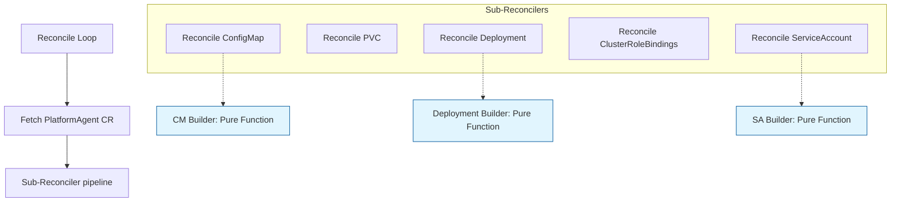

# Platform Agent Operator Migration Plan (Cloud-Agnostic)

This document outlines the detailed refactoring and migration plan for the `PlatformAgent` controller from the GChat implementation ([integrations/gchat/crd/platform-agent-operator/internal/controller/platformagent_controller.go](file:///usr/local/google/home/mplakhtiy/repos/fork/kube-agents/integrations/gchat/crd/platform-agent-operator/internal/controller/platformagent_controller.go)) to the new structure ([k8s-operator/internal/controller/platformagent_controller.go](file:///usr/local/google/home/mplakhtiy/repos/fork/kube-agents/k8s-operator/internal/controller/platformagent_controller.go)).

This plan removes any direct GCP API SDK calls and GKE Config Connector (KCC) dependencies, keeping the operator strictly cloud-agnostic.

---

## 1. Architectural Strategy: Pure Kubernetes Workload Reconciliation

Instead of provisioning GCP-specific resources (Service Accounts, Pub/Sub topics, subscriptions) inside the operator, the operator assumes these cloud resources are **externally managed** (e.g. via Terraform, Crossplane, or pre-provisioned by platform administrators).

The operator's role is strictly limited to reconciling standard Kubernetes resources:
- `ServiceAccount` (with Workload Identity annotations mapping to pre-existing GSAs/roles)
- `ConfigMap` (containing the agent's application config)
- `PersistentVolumeClaim` (data volume)
- `Deployment` (the compute payload running the agent)
- `ClusterRoleBinding` (for cluster visibility)

### Key Benefits:
- **100% Cloud Agnostic**: Zero dependency on Google Cloud SDK or GKE-specific CRDs at compile or run time.
- **Simplified Security**: The operator does not need GCP IAM permissions to create service accounts or policy bindings.
- **High Testability**: Since the operator only manages core Kubernetes resources, unit tests can run offline against standard controller-runtime fake clients or envtest with zero mocks required.

---

## 2. Spec Field Mapping & Workload Identity Annotation

The operator reads cloud-specific parameters from the `PlatformAgent` CR and translates them to standard Kubernetes workload configurations:

### 2.1 Workload Identity
Instead of calling GCP APIs to bind a Google Service Account (GSA) to the Kubernetes Service Account (KSA), the operator simply annotates the KSA based on the spec:
```go
func buildServiceAccount(agent *agentv1alpha1.PlatformAgent) *corev1.ServiceAccount {
	sa := &corev1.ServiceAccount{
		TypeMeta: metav1.TypeMeta{
			APIVersion: "v1",
			Kind:       "ServiceAccount",
		},
		ObjectMeta: metav1.ObjectMeta{
			Name:      agent.Spec.Security.ServiceAccountName,
			Namespace: agent.Namespace,
			Annotations: make(map[string]string),
		},
	}

	// Cloud-agnostic Workload Identity mapping
	if spec := agent.Spec.Security.WorkloadIdentity; spec != nil {
		if gcp := spec.Gcp; gcp != nil && gcp.GSAName != "" && gcp.ProjectID != "" {
			// Annotate KSA for GKE Workload Identity
			gsaEmail := fmt.Sprintf("%s@%s.iam.gserviceaccount.com", gcp.GSAName, gcp.ProjectID)
			sa.Annotations["iam.gke.io/gcp-service-account"] = gsaEmail
		}
	}

	return sa
}
```

### 2.2 Integration Environment Variables
For integrations like Google Chat, the operator maps spec values directly to container environment variables inside `buildDeployment`:

```go
func buildDeployment(agent *agentv1alpha1.PlatformAgent, configHash string) *appsv1.Deployment {
	// Safe nil-checks to prevent nil-pointer panics
	homeDir := "/opt/data"
	if agent.Spec.Harness != nil && agent.Spec.Harness.Hermes != nil && agent.Spec.Harness.Hermes.PlatformAgentHome != "" {
		homeDir = agent.Spec.Harness.Hermes.PlatformAgentHome
	}

	envVars := []corev1.EnvVar{
		{Name: "PLATFORM_AGENT_HOME", Value: homeDir},
		// ...
	}

	if integration := agent.Spec.Integration; integration != nil {
		if gchat := integration.GoogleChat; gchat != nil && ptr.Deref(gchat.Enabled, false) {
			envVars = append(envVars, []corev1.EnvVar{
				{Name: "GOOGLE_CHAT_PROJECT_ID", Value: gchat.ProjectID},
				{Name: "GOOGLE_CHAT_SUBSCRIPTION_NAME", Value: fmt.Sprintf("projects/%s/subscriptions/%s", gchat.ProjectID, gchat.SubscriptionName)},
				{Name: "GOOGLE_CHAT_ALLOWED_USERS", Value: strings.Join(gchat.AllowedUsers, ",")},
				{Name: "GOOGLE_CHAT_HOME_CHANNEL", Value: gchat.HomeChannel},
			}...)
		}
	}
	// ...
}
```

---

## 3. Recommended Refactoring Blueprint

To ensure maximum testability, we separate **Pure Manifest Generation** from **Kubernetes API client calls**:



### 3.1 Pure Manifest Builders (No Client/API Dependencies)
Define helper functions that take a `*agentv1alpha1.PlatformAgent` (and optional state, such as ConfigMap hash) and return the structured resource manifest. These functions do NOT call any API and are easily testable.

```go
// k8s-operator/internal/controller/manifests.go

package controller

import (
	corev1 "k8s.io/api/core/v1"
	appsv1 "k8s.io/api/apps/v1"
	metav1 "k8s.io/apimachinery/pkg/apis/meta/v1"
	agentv1alpha1 "github.com/gke-labs/kube-agents/k8s-operator/api/v1alpha1"
)

// buildConfigMap generates the ConfigMap manifest containing config.yaml
// Note: TypeMeta must be explicitly populated to support Server-Side Apply (SSA)
func buildConfigMap(agent *agentv1alpha1.PlatformAgent) *corev1.ConfigMap {
    return &corev1.ConfigMap{
        TypeMeta: metav1.TypeMeta{
            APIVersion: "v1",
            Kind:       "ConfigMap",
        },
        ObjectMeta: metav1.ObjectMeta{
            Name:      agent.Name + "-config",
            Namespace: agent.Namespace,
        },
        Data: map[string]string{
            "config.yaml": renderConfigYAML(agent),
        },
    }
}
```

---

## 4. Production-Grade Refinement Practices

### 4.1 Deterministic Naming for Cluster-Scoped Resources
Because `ClusterRoleBindings` live at the cluster root, their names must be globally unique to avoid collisions (e.g. if two namespaces deploy a `PlatformAgent` named `analytics-agent`).
*   **Implementation Rule**: Construct the binding name using both namespace and resource name:
    ```go
    bindingName := fmt.Sprintf("kubeagents:%s:%s", agent.Namespace, agent.Name)
    ```

### 4.2 Pod Template ConfigMap Hash Injection & Deployment Deadlock
Ensure that the `configMapHash` is injected inside the **Pod Template Spec** metadata (`spec.template.metadata.annotations`), rather than just the Deployment-level metadata.
*   **Implementation Rule**:
    ```go
    PodTemplate: corev1.PodTemplateSpec{
        ObjectMeta: metav1.ObjectMeta{
            Annotations: map[string]string{
                "kubeagents.x-k8s.io/config-hash": configHash,
            },
        },
        Spec: // ...
    }
    ```
*   **Deployment Strategy (Recreate)**: Because the Deployment utilizes a ReadWriteOnce (RWO) Persistent Volume Claim, standard rolling updates will deadlock (new pod cannot mount storage locked by terminating pod). The Deployment strategy must be explicitly configured as `Recreate`:
    ```go
    Spec: appsv1.DeploymentSpec{
        Strategy: appsv1.DeploymentStrategy{
            Type: appsv1.RecreateDeploymentStrategyType,
        },
    }
    ```

### 4.3 The Cross-Scope OwnerReference Trap
Kubernetes strictly forbids cross-scope `OwnerReferences`. You cannot set a namespace-scoped resource (your `PlatformAgent`) as the owner of a cluster-scoped resource (the `ClusterRoleBinding`).
*   **Implementation Rule**: 
    - For SA, PVC, ConfigMap, and Deployment: Use `SetControllerReference`.
    - For ClusterRoleBinding: **Do not** set an owner reference. Let the finalizer delete the resources during the deletion flow.

### 4.4 PersistentVolumeClaim (PVC) Immutability
PVC storage sizes and configurations are mostly immutable. Altering them on the `PlatformAgent` CR will trigger API validation failures, causing a hot-loop crash in reconciliation.
*   **Implementation Rule**: Reconcile PVC strictly as a "Create if not exists" action, or catch immutable update validation errors and write a user-facing warning to the `PlatformAgent` Conditions Status rather than returning an error.

### 4.5 Server-Side Apply (SSA) with Force Ownership
When patching resources using pure manifests with Server-Side Apply, the operator must overwrite any manual configuration edits.
*   **Implementation Rule**: Always pass the `client.ForceOwnership` and `client.FieldOwner` options to prevent conflicts with other users or tools (like manual `kubectl edit` actions):
    ```go
    err := r.Patch(ctx, resource, client.Apply, client.FieldOwner("kubeagents-operator"), client.ForceOwnership)
    ```

---

## 5. Testability Strategy: Table-Driven Testing

Because the manifest generation functions are **pure**, we can write unit tests verifying that all environment variables, volume mounts, annotations, and hashes are correctly computed without needing mock clients or a running API server:

```go
// k8s-operator/internal/controller/manifests_test.go

package controller

import (
	"testing"
	agentv1alpha1 "github.com/gke-labs/kube-agents/k8s-operator/api/v1alpha1"
)

func TestBuildServiceAccount(t *testing.T) {
	tests := []struct {
		name     string
		agent    *agentv1alpha1.PlatformAgent
		verify   func(*testing.T, *corev1.ServiceAccount)
	}{
		{
			name: "adds Workload Identity annotation when GCP config is present",
			agent: &agentv1alpha1.PlatformAgent{
				Spec: agentv1alpha1.PlatformAgentSpec{
					Security: &agentv1alpha1.SecuritySpec{
						ServiceAccountName: "test-sa",
						WorkloadIdentity: &agentv1alpha1.WorkloadIdentitySpec{
							Gcp: &agentv1alpha1.GcpWorkloadIdentitySpec{
								GSAName:   "my-gsa",
								ProjectID: "my-project",
							},
						},
					},
				},
			},
			verify: func(t *testing.T, sa *corev1.ServiceAccount) {
				expectedAnnotation := "my-gsa@my-project.iam.gserviceaccount.com"
				actual := sa.Annotations["iam.gke.io/gcp-service-account"]
				if actual != expectedAnnotation {
					t.Errorf("expected annotation %q, got %q", expectedAnnotation, actual)
				}
			},
		},
	}
	
	for _, tc := range tests {
		t.Run(tc.name, func(t *testing.T) {
			result := buildServiceAccount(tc.agent)
			tc.verify(t, result)
		})
	}
}
```

---

## 6. Complete Reconciler Structure with Finalizer & RBAC Markers

Below is the complete controller structural boilerplate, containing correct finalizer return routines, subresource status updates, and watches:

```go
// k8s-operator/internal/controller/platformagent_controller.go

package controller

import (
	"context"
	"fmt"
	"strings"

	appsv1 "k8s.io/api/apps/v1"
	corev1 "k8s.io/api/core/v1"
	rbacv1 "k8s.io/api/rbac/v1"
	"k8s.io/apimachinery/pkg/api/errors"
	metav1 "k8s.io/apimachinery/pkg/apis/meta/v1"
	"k8s.io/apimachinery/pkg/runtime"
	"k8s.io/apimachinery/pkg/types"
	ctrl "sigs.k8s.io/controller-runtime"
	"sigs.k8s.io/controller-runtime/pkg/client"
	"sigs.k8s.io/controller-runtime/pkg/controller/controllerutil"
	"sigs.k8s.io/controller-runtime/pkg/handler"
	logf "sigs.k8s.io/controller-runtime/pkg/log"
	"sigs.k8s.io/controller-runtime/pkg/reconcile"

	agentv1alpha1 "github.com/gke-labs/kube-agents/k8s-operator/api/v1alpha1"
)

const platformAgentFinalizer = "kubeagents.x-k8s.io/finalizer"

// PlatformAgentReconciler reconciles a PlatformAgent object
type PlatformAgentReconciler struct {
	client.Client
	Scheme *runtime.Scheme
}

// +kubebuilder:rbac:groups=kubeagents.x-k8s.io,resources=platformagents,verbs=get;list;watch;create;update;patch;delete
// +kubebuilder:rbac:groups=kubeagents.x-k8s.io,resources=platformagents/status,verbs=get;update;patch
// +kubebuilder:rbac:groups=kubeagents.x-k8s.io,resources=platformagents/finalizers,verbs=update
// +kubebuilder:rbac:groups="",resources=serviceaccounts;configmaps;persistentvolumeclaims,verbs=get;list;watch;create;update;patch;delete
// +kubebuilder:rbac:groups=apps,resources=deployments,verbs=get;list;watch;create;update;patch;delete
// +kubebuilder:rbac:groups=rbac.authorization.k8s.io,resources=clusterrolebindings,verbs=get;list;watch;create;update;patch;delete
// +kubebuilder:rbac:groups=rbac.authorization.k8s.io,resources=clusterroles,verbs=bind

func (r *PlatformAgentReconciler) Reconcile(ctx context.Context, req ctrl.Request) (ctrl.Result, error) {
	log := logf.FromContext(ctx)

	instance := &agentv1alpha1.PlatformAgent{}
	if err := r.Get(ctx, req.NamespacedName, instance); err != nil {
		return ctrl.Result{}, client.IgnoreNotFound(err)
	}

	// 1. Intercept Deletion
	if !instance.ObjectMeta.DeletionTimestamp.IsZero() {
		return r.handleDeletion(ctx, instance)
	}

	// 2. Add Finalizer if not present
	if !controllerutil.ContainsFinalizer(instance, platformAgentFinalizer) {
		controllerutil.AddFinalizer(instance, platformAgentFinalizer)
		if err := r.Update(ctx, instance); err != nil {
			return ctrl.Result{}, err
		}
		// Return immediately after update to fetch the fresh ResourceVersion, preventing OptimisticLockErrors
		return ctrl.Result{}, nil
	}

	// 3. Reconcile K8s Service Account (with Workload Identity annotation)
	if err := r.reconcileServiceAccount(ctx, instance); err != nil {
		return ctrl.Result{}, err
	}

	// 4. Reconcile ClusterRoleBindings for Cluster View privileges
	if err := r.reconcileRBAC(ctx, instance); err != nil {
		return ctrl.Result{}, err
	}

	// 5. Reconcile PVC for agent persistent data
	if err := r.reconcilePVC(ctx, instance); err != nil {
		return ctrl.Result{}, err
	}

	// 6. Reconcile ConfigMap (config.yaml content)
	configMapHash, err := r.reconcileConfigMap(ctx, instance)
	if err != nil {
		return ctrl.Result{}, err
	}

	// 7. Reconcile Deployment (with pod template hash annotation)
	if err := r.reconcileDeployment(ctx, instance, configMapHash); err != nil {
		return ctrl.Result{}, err
	}

	// 8. Update status phase to Ready
	return ctrl.Result{}, r.updateStatusReady(ctx, instance)
}

func (r *PlatformAgentReconciler) handleDeletion(ctx context.Context, agent *agentv1alpha1.PlatformAgent) (ctrl.Result, error) {
	if controllerutil.ContainsFinalizer(agent, platformAgentFinalizer) {
		// Use the deterministic name from your design plan
		bindingName := fmt.Sprintf("kubeagents:%s:%s", agent.Namespace, agent.Name)
		crb := &rbacv1.ClusterRoleBinding{
			ObjectMeta: metav1.ObjectMeta{Name: bindingName},
		}

		// Attempt to delete the cluster-scoped resource and ignore already-gone errors
		err := r.Delete(ctx, crb)
		if err := client.IgnoreNotFound(err); err != nil {
			return ctrl.Result{}, err
		}

		// Resource is deleted. Safe to remove finalizer and update.
		controllerutil.RemoveFinalizer(agent, platformAgentFinalizer)
		if err := r.Update(ctx, agent); err != nil {
			return ctrl.Result{}, err
		}
	}
	
	// Stop reconciliation as the item is being deleted
	return ctrl.Result{}, nil
}

func (r *PlatformAgentReconciler) updateStatusReady(ctx context.Context, agent *agentv1alpha1.PlatformAgent) error {
	agent.Status.Phase = "Ready"
	// Always use Status().Update() to update /status subresources
	return r.Status().Update(ctx, agent)
}

// SetupWithManager sets up the controller with the Manager.
func (r *PlatformAgentReconciler) SetupWithManager(mgr ctrl.Manager) error {
	return ctrl.NewControllerManagedBy(mgr).
		For(&agentv1alpha1.PlatformAgent{}).
		Owns(&appsv1.Deployment{}).
		Owns(&corev1.ServiceAccount{}).
		Owns(&corev1.PersistentVolumeClaim{}).
		Owns(&corev1.ConfigMap{}).
		// Map changes in unowned cluster-scoped ClusterRoleBindings back to owner PlatformAgent
		Watches(
			&rbacv1.ClusterRoleBinding{},
			handler.EnqueueRequestsFromMapFunc(func(ctx context.Context, obj client.Object) []reconcile.Request {
				parts := strings.Split(obj.GetName(), ":") // format: kubeagents:<namespace>:<name>
				if len(parts) == 3 && parts[0] == "kubeagents" {
					return []reconcile.Request{{NamespacedName: types.NamespacedName{Namespace: parts[1], Name: parts[2]}}}
				}
				return nil
			}),
		).
		Complete(r)
}
```

---

## 7. Step-by-Step Migration Checklist

1. [ ] **Clean imports & RBAC**: Remove all GCP Cloud SDK packages (`cloud.google.com/go/pubsub`, `google.golang.org/api/iam/v1`, etc.) from imports. Remove the old KCC RBAC rules from the reconciler headers and replace them with standard cloud-agnostic rules, including the `bind` verb for `clusterroles`.
2. [ ] **Create Manifest Generator**: Create `manifests.go` containing pure functions to build `ServiceAccount`, `ConfigMap`, `Deployment` (with pod template hash injection and Recreate strategy), and `PVC`. Populate `TypeMeta` for all resources to support Server-Side Apply.
3. [ ] **Implement Workload Identity Annotation**: In `buildServiceAccount`, translate the Workload Identity fields to GKE metadata annotations. Ensure nil-safe checks.
4. [ ] **Implement Integration Env Mapping**: In `buildDeployment`, join allowed users string slices and inject Google Chat variables as env vars.
5. [ ] **Implement Sub-Reconcilers**: Add standard controller-runtime reconciliation functions (`reconcileServiceAccount`, `reconcileDeployment` with SSA `Apply` patch, etc.).
6. [ ] **Add ClusterRoleBinding Finalizer & Watch**: Implement deterministic named binding (`kubeagents:<namespace>:<name>`), watches mapping in setup, and graceful finalizer return routines.
7. [ ] **Write Pure Unit Tests**: Verify spec mappings and environment variable setups under `manifests_test.go`.
